# Phase 1: 개발 환경 + 한투 API 기반 — 실행 계획

> **Status**: 계획 수립 완료 (2026-03-29)
> **ROADMAP 참조**: `ROADMAP.md` Phase 1
> **검토 리포트**:
> - `phase1-po-review.md` (정프로, PO)
> - `phase1-risk-review.md` (최리스크, 리스크관리)
> - `phase1-trader-review.md` (김단타, 단타 전문가)
> - `phase1-api-review.md` (윤에이피, API 개발자)
> - `phase1-quant-review.md` (박퀀트, 퀀트 전문가)

---

## 개요

Docker Compose 기반 개발 환경을 구축하고, 한투 API(REST + WebSocket) 연동 기반을 확립한다. 모의/실전 전환 구조를 설계하고, Phase 2 이후의 데이터 수집/매매 엔진을 위한 DB 스키마와 설정 구조를 마련한다.

Phase 0.5에서 검증한 API 스펙과 에러 패턴을 프로덕션 품질 코드로 재구현한다. exploration/ 탐색 코드는 참조만 하고 완전히 재작성한다.

```mermaid
graph TB
    subgraph Phase1["Phase 1 아키텍처"]
        subgraph S1["Sprint 1: 인프라 기반"]
            subgraph DC["Docker Compose"]
                FastAPI["FastAPI :8000<br/>(스켈레톤)"]
                NextJS["Next.js :3000<br/>(빈 앱)"]
                PG["PostgreSQL :5432"]
                Redis["Redis :6379"]
            end
            DB["DB: settings + stocks + market_data 테이블"]
            RedisCache["Redis: 연결 + 기본 캐시 구조"]
            Alembic["Alembic: 마이그레이션 기반"]
        end

        S1 -->|의존| S2

        subgraph S2["Sprint 2: 한투 API 연동"]
            REST["KIS REST Client<br/>core/clients/kis_rest.py"]
            REST_1["OAuth 토큰 발급/갱신 (Redis 캐싱)"]
            REST_2["시세 조회 (현재가/호가)"]
            REST_3["주문 기본 구조 (실행/취소/조회)"]
            REST_4["에러 핸들링 (5가지 시나리오)"]

            WS["KIS WebSocket Client<br/>core/clients/kis_ws.py"]
            WS_1["연결/인증/구독/수신"]
            WS_2["자동 재연결 + 재구독"]

            RateLimit["Rate Limit 스로틀러 (토큰 버킷)"]
            EnvSwitch["모의/실전 전환 (환경변수 → DB 계층)"]
        end
    end

    style Phase1 fill:#1a1a2e,stroke:#16213e
    style S1 fill:#0f3460,stroke:#533483
    style S2 fill:#0f3460,stroke:#533483
    style DC fill:#1a1a3e,stroke:#e94560
```



---

## 검토팀 확정 파라미터 (2026-03-29)

> **검토 참여**: 정프로(PO), 최리스크(리스크관리), 김단타(단타 전문가), 윤에이피(API 개발자), 박퀀트(퀀트 전문가) — 5명

### PRD 미확정 항목 확정 결과 (6건)

| # | 미확정 항목 | 원래 설계 | 확정값 | 확정 근거 | 담당 전문가 |
|---|-----------|----------|--------|----------|------------|
| 1 | 데이트레이딩 vs 스윙 | 미정 | **데이트레이딩 전용 (당일 청산 원칙)** | 오버나이트 리스크 회피, 1인 운영 한계. 스윙은 Phase 5 이후 검토 | 김단타 + 최리스크 |
| 2 | 운영 시간대 | 미정 | **07:30~16:00 (본매매 09:30~14:30)** | 시초가(09:00~09:30) 매매 금지, 15:00~15:20 단계적 강제 청산 | 김단타 |
| 3 | 사전 정보수집 타이밍 | 미정 | **08:00 공공데이터포털 → 08:05 1차 스크리닝 → 08:10 한투 REST → 08:40 동시호가** | 장전 30분 내 후보 종목 확정 | 김단타 + 윤에이피 |
| 4 | 백테스팅 필요성/시점 | 미정 | **MVP 제외, Phase 5 이후 도입** | 전략 미확정 상태에서 프레임워크 선투자 비효율. market_data 시계열 구조로 대비 | 박퀀트 |
| 5 | 손절/익절 기준값 | 미정 | **손절 -2%, 익절 +3%, 트레일링 스탑 고점 -1%** | 손익비 1:1.5, 단타 표준. 레버리지 ETF는 손절 -1.5% | 최리스크 + 김단타 |
| 6 | 승인 타임아웃 | 미정 | **장중 30초, 마감 전 15초, 기타 60초** | 단타 타이밍 특성. 타임아웃 시 자동 만료(거부) | 김단타 |

### 리스크 관리 파라미터 확정

| 항목 | 확정값 | 근거 |
|------|--------|------|
| 건당 손절 | -2% | 단타 표준, 회복 가능 범위 (최리스크) |
| 건당 익절 | +3% (기본) | 손익비 1:1.5 유지 (최리스크) |
| 트레일링 스탑 | 고점 대비 -1% | 수익 극대화, 단타 핵심 (김단타) |
| 일일 최대 손실 | 총 투자금의 -3% | 초과 시 당일 매매 전면 중단 (최리스크) |
| 월간 최대 손실 | 총 투자금의 -10% | 초과 시 해당 월 매매 전면 중단 (최리스크) |
| 건당 투자 비율 | 총 투자금의 10% | 최대 동시 5포지션 = 50% (최리스크) |
| 최대 동시 포지션 | 5개 | 관리 가능 범위 + 집중도 (최리스크) |
| 레버리지 ETF 손절 | -1.5% | 변동성 2~3배 보정, 일반 대비 25% 축소 (최리스크) |
| 레버리지 ETF 투자 비율 | 7% | 일반 대비 30% 축소 (최리스크) |
| 강제 청산 시각 | 15:00~15:20 (단계적) | 시장가 슬리피지 최소화 (김단타) |

### 운영 시간대 확정

| 시간대 | 이름 | 활동 | 매매 허용 |
|--------|------|------|----------|
| 07:30~08:00 | 시스템 기동 | 헬스체크, 서비스 준비 | 불가 |
| 08:00~08:30 | 장전 수집 | 공공데이터포털 일괄 수집 → 1차 스크리닝 → 한투 REST 후보 시세 | 불가 |
| 08:30~09:00 | 장전 대기 | 뉴스 센티멘트 배치, 동시호가 모니터링 | 불가 |
| 09:00~09:30 | 시초가 구간 | 모니터링만, **신규 진입 금지** | **금지** |
| 09:30~14:30 | 장중 본매매 | 2차 스크리닝 + 매매 신호 + 주문 실행 | **허용** |
| 14:30~15:00 | 장마감 준비 | 신규 진입 제한, 포지션 정리 시작 | 제한적 |
| 15:00~15:20 | 강제 청산 | 잔여 포지션 단계적 청산 (50% → 75% → 100%) | 청산만 |
| 15:30~16:00 | 장후 정산 | 체결 내역 확인, 일일 리포트 | 불가 |

### 한투 API 기술 파라미터 확정

| 항목 | 확정값 | 근거 |
|------|--------|------|
| REST Rate Limit (모의) | 1.5초 간격 | Phase 0.5 실측 + 안전 마진 (윤에이피) |
| REST Rate Limit (실전) | 초당 14건 (공식의 70%) | 윤에이피 원칙: 공식 한도 70~80% |
| 토큰 갱신 주기 | 6시간마다 체크, 만료 2시간 전 갱신 | 24시간 유효 (윤에이피) |
| 토큰 발급 재시도 | 1분 대기 후 재시도 | 발급 Rate Limit 1분당 1회 (Phase 0.5) |
| 에러 재시도 | 최대 3회, 지수 백오프 | 과도한 재시도 방지 (윤에이피) |
| WS 재연결 | 자동 + 재구독 | 재연결 0.016초 (Phase 0.5) |
| 설정 계층 | 환경변수 > DB (환경변수 우선) | 안전장치 이중화 (윤에이피 + 최리스크) |

---

## Sprint 분할 계획

| Sprint | 주제 | 주요 작업 | 의존성 |
|--------|------|----------|--------|
| 1 ✅ | Docker Compose + DB/Redis + 백엔드 스켈레톤 | Docker 4컨테이너, FastAPI 구조, DB 스키마(3테이블), Redis, Alembic, 헬스체크 | 없음 |
| 2 ✅ | 한투 API 연동 + 토큰 관리 + 모의/실전 전환 | KIS REST/WS 클라이언트, 토큰 자동 갱신, Rate Limit 스로틀러, 환경 전환, 에러 핸들링 | Sprint 1 |

---

## Sprint 1 상세 ✅ 완료 — Docker Compose + DB/Redis + 백엔드 스켈레톤

> 완료: PR #2 (phase1-sprint1 → develop), 2026-03-29. 24개 테스트 전체 통과.

### 백엔드

| 파일 | 내용 |
|------|------|
| `docker-compose.yml` | FastAPI(:8000) + Next.js(:3000) + PostgreSQL(:5432) + Redis(:6379) 4컨테이너 |
| `backend/Dockerfile` | Python 3.12, FastAPI, 의존성 설치 |
| `frontend/Dockerfile` | Node.js, Next.js App Router 빈 프로젝트 |
| `backend/requirements.txt` | FastAPI, uvicorn, SQLAlchemy 2.0, alembic, asyncpg, redis, httpx, websockets, APScheduler, pydantic-settings |
| `backend/main.py` | FastAPI 앱 팩토리, 라우터 등록, lifespan 이벤트 |
| `backend/core/config.py` | pydantic-settings 기반 환경변수 관리 (TRADING_ENV, DB, Redis, KIS, Telegram 등) |
| `backend/core/database.py` | SQLAlchemy 2.0 async 엔진 + 세션 팩토리 |
| `backend/core/redis.py` | aioredis 연결 풀 + 기본 get/set/delete |
| `backend/core/models/__init__.py` | Base 모델 정의 |
| `backend/core/models/settings.py` | settings 테이블 — 리스크 파라미터, 운영 시간, 승인 타임아웃 등 |
| `backend/core/models/stock.py` | stocks 테이블 — 종목 마스터 (코드, 이름, 시장유형, 종목유형) |
| `backend/core/models/market_data.py` | market_data 테이블 — OHLCV + 시총 + JSON 확장 |
| `backend/alembic/` | Alembic 마이그레이션 설정 + 초기 마이그레이션 |
| `backend/api/routes/health.py` | 헬스체크 API (`/health` — DB/Redis 연결 상태) |
| `backend/api/deps.py` | 의존성 주입 (DB 세션, Redis 클라이언트) |

### 프론트엔드

| 파일 | 내용 |
|------|------|
| `frontend/package.json` | Next.js App Router 기본 의존성 |
| `frontend/app/page.tsx` | "StockBot Dashboard — Coming Soon" 플레이스홀더 |
| `frontend/app/layout.tsx` | 다크 모드 기본 레이아웃 |

### DB 스키마 (Phase 1 최소 범위)

**settings 테이블** (정프로 + 최리스크 + 김단타 합의):

```
settings
├── id: SERIAL PRIMARY KEY
├── key: VARCHAR(100) UNIQUE NOT NULL
├── value: TEXT NOT NULL
├── value_type: VARCHAR(20) NOT NULL  -- int, float, string, bool, json
├── category: VARCHAR(50) NOT NULL    -- risk, trading, schedule, system
├── description: TEXT
├── updated_at: TIMESTAMPTZ
└── created_at: TIMESTAMPTZ
```

> key-value 구조 채택 (박퀀트 typed columns 의견 vs 정프로 유연성 의견 충돌 → **보수적 방향: key-value + value_type 검증**으로 절충. 핵심 파라미터 추가 시 마이그레이션 불필요.)

초기 시드 데이터:

| key | value | category | description |
|-----|-------|----------|-------------|
| trading_env | paper | system | 거래 환경 (paper/live) |
| max_loss_per_trade_pct | -2.0 | risk | 건당 손절 (%) |
| max_profit_per_trade_pct | 3.0 | risk | 건당 익절 (%) |
| trailing_stop_pct | -1.0 | risk | 트레일링 스탑 (고점 대비 %) |
| daily_max_loss_pct | -3.0 | risk | 일일 최대 손실 (%) |
| monthly_max_loss_pct | -10.0 | risk | 월간 최대 손실 (%) |
| position_size_pct | 10.0 | risk | 건당 투자 비율 (%) |
| max_position_count | 5 | risk | 최대 동시 포지션 수 |
| leverage_etf_loss_pct | -1.5 | risk | 레버리지 ETF 손절 (%) |
| leverage_etf_size_pct | 7.0 | risk | 레버리지 ETF 투자 비율 (%) |
| force_close_start | 15:00 | trading | 강제 청산 시작 시각 |
| force_close_end | 15:20 | trading | 강제 청산 완료 시각 |
| trading_start | 09:30 | trading | 본매매 시작 시각 |
| trading_end | 14:30 | trading | 본매매 종료 시각 |
| no_entry_start | 09:00 | trading | 신규 진입 금지 시작 |
| no_entry_end | 09:30 | trading | 신규 진입 금지 종료 |
| approval_timeout_trading | 30 | trading | 장중 승인 타임아웃 (초) |
| approval_timeout_closing | 15 | trading | 마감 전 승인 타임아웃 (초) |
| approval_timeout_default | 60 | trading | 기본 승인 타임아웃 (초) |
| emergency_stop_enabled | true | risk | 비상 정지 활성화 |
| data_collection_start | 08:00 | schedule | 장전 수집 시작 시각 |

**stocks 테이블**:

```
stocks
├── id: SERIAL PRIMARY KEY
├── stock_code: VARCHAR(10) UNIQUE NOT NULL
├── stock_name: VARCHAR(100) NOT NULL
├── market: VARCHAR(10) NOT NULL      -- kr (향후 us 확장)
├── market_type: VARCHAR(10) NOT NULL -- KOSPI, KOSDAQ
├── stock_type: VARCHAR(20) NOT NULL  -- common, etf, leveraged_etf, inverse_etf
├── is_active: BOOLEAN DEFAULT true
├── listed_shares: BIGINT
├── extra_data: JSONB DEFAULT '{}'
├── updated_at: TIMESTAMPTZ
└── created_at: TIMESTAMPTZ
```

**market_data 테이블** (박퀀트 설계 반영):

```
market_data
├── id: BIGSERIAL PRIMARY KEY
├── stock_code: VARCHAR(10) NOT NULL (FK -> stocks.stock_code)
├── data_date: DATE NOT NULL
├── open_price: DECIMAL(12,0)
├── high_price: DECIMAL(12,0)
├── low_price: DECIMAL(12,0)
├── close_price: DECIMAL(12,0)
├── volume: BIGINT
├── market_cap: BIGINT
├── listed_shares: BIGINT
├── change_rate: DECIMAL(8,4)
├── extra_data: JSONB DEFAULT '{}'
├── source: VARCHAR(20) NOT NULL      -- data_go_kr, kis_rest, kis_ws
├── collected_at: TIMESTAMPTZ DEFAULT NOW()
├── UNIQUE(stock_code, data_date, source)
└── INDEX: (data_date), (stock_code, data_date)
```

### 재사용 자산

| 자산 | 위치 | 활용 방법 |
|------|------|----------|
| .env.example | 프로젝트 루트 | 환경변수 구조 참조 (Phase 0.5에서 이미 업데이트) |
| exploration/ | 프로젝트 루트 | 한투 API 응답 구조/에러 패턴 참조용 (코드 재사용 금지) |
| docs/phase/phase0.5/api-test-report.md | docs/ | API 응답 필드, Rate Limit 수치 참조 |
| docs/phase/phase0.5/architecture-decisions.md | docs/ | 모의/실전 전환 매핑, 에러 핸들링 전략 참조 |

---

## Sprint 2 상세 ✅ 완료 — 한투 API 연동 + 토큰 관리 + 모의/실전 전환

> 완료: PR #3 (phase1-sprint2 → develop), 2026-03-29. 95개 테스트 전체 통과.

### 백엔드

| 파일 | 내용 |
|------|------|
| `backend/core/clients/__init__.py` | 클라이언트 패키지 |
| `backend/core/clients/kis_rest.py` | 한투 REST 클라이언트 — 인증, 시세 조회, 주문 기본, 계좌 조회 |
| `backend/core/clients/kis_ws.py` | 한투 WebSocket 클라이언트 — 연결/인증/구독/수신/재연결 기본 프레임 |
| `backend/core/clients/kis_config.py` | KIS 환경 설정 — 모의/실전 매핑 (도메인, 포트, tr_id, Rate Limit) |
| `backend/core/clients/throttler.py` | 토큰 버킷 Rate Limit 스로틀러 (asyncio 기반) |
| `backend/core/clients/token_manager.py` | 토큰 자동 발급/갱신 (Redis 캐싱, APScheduler 주기 체크) |
| `backend/api/routes/settings.py` | settings CRUD API (조회/수정) |
| `backend/api/routes/kis.py` | KIS API 테스트 엔드포인트 (시세 조회, 연결 상태) |
| `backend/tests/test_kis_rest.py` | KIS REST 클라이언트 단위 테스트 (mock 기반) |
| `backend/tests/test_kis_ws.py` | KIS WebSocket 클라이언트 단위 테스트 |
| `backend/tests/test_throttler.py` | 스로틀러 단위 테스트 |
| `backend/tests/test_token_manager.py` | 토큰 매니저 단위 테스트 |

### KIS REST 클라이언트 인터페이스

```python
class KISRestClient:
    # 인증
    async def get_access_token(self) -> str
    async def get_hashkey(self, body: dict) -> str

    # 시세
    async def get_stock_price(self, stock_code: str) -> StockPrice
    async def get_orderbook(self, stock_code: str) -> Orderbook

    # 주문 (기본 구조)
    async def place_order(self, order: OrderRequest) -> OrderResponse
    async def cancel_order(self, order_no: str, order: CancelRequest) -> dict
    async def get_order_status(self, order_no: str) -> dict

    # 계좌
    async def get_balance(self) -> Balance
    async def get_positions(self) -> list[Position]
```

### KIS WebSocket 클라이언트 (Phase 1 범위 한정)

```python
class KISWebSocketClient:
    async def connect(self) -> None
    async def disconnect(self) -> None
    async def subscribe(self, stock_code: str, data_type: str) -> None
    async def unsubscribe(self, stock_code: str, data_type: str) -> None
    async def _on_message(self, message: str) -> None   # 기본 수신 + 로그
    async def _reconnect(self) -> None                    # 자동 재연결 + 재구독
```

> **Phase 1 한정**: 데이터 파싱(시세/호가/체결 -> 구조체), 구독 관리(종목 동적 추가/제거), 체결강도 계산은 **Phase 2**에서 구현.

### 모의/실전 전환 매핑

```python
@dataclass(frozen=True)
class KISEnvironment:
    name: str                    # paper / live
    rest_domain: str
    ws_url: str
    order_tr_prefix: str         # V(모의) / T(실전)
    app_key_env: str
    app_secret_env: str
    account_env: str
    rate_limit_interval: float   # 초

PAPER = KISEnvironment(
    name="paper",
    rest_domain="openapivts.koreainvestment.com:29443",
    ws_url="ws://ops.koreainvestment.com:31000",
    order_tr_prefix="V",
    app_key_env="KIS_MOCK_APP_KEY",
    app_secret_env="KIS_MOCK_APP_SECRET",
    account_env="KIS_MOCK_ACCOUNT_NO",
    rate_limit_interval=1.5,
)

LIVE = KISEnvironment(
    name="live",
    rest_domain="openapi.koreainvestment.com:9443",
    ws_url="ws://ops.koreainvestment.com:21000",
    order_tr_prefix="T",
    app_key_env="KIS_APP_KEY",
    app_secret_env="KIS_APP_SECRET",
    account_env="KIS_ACCOUNT_NO",
    rate_limit_interval=0.07,
)
```

### 에러 핸들링 (Phase 0.5 발견 사항 반영)

| 에러 | 감지 방법 | 대응 |
|------|----------|------|
| 잘못된 종목 (HTTP 200 빈 데이터) | `stck_prpr == "0"` 체크 | 종목 마스터 이중 검증, 로그 경고 |
| 만료 토큰 (HTTP 500, EGW00121) | 에러코드 매칭 | 자동 재발급 -> 재시도 (1회) |
| Rate Limit 초과 | 메시지 `"초당 거래건수를 초과"` | 지수 백오프 (기본간격 x2, x4, x8) |
| 장외 주문 거부 (rt_cd=1) | rt_cd 체크 | 장상태 사전 확인, 사용자 알림 |
| 웹소켓 끊김 | on_close 이벤트 | 자동 재연결 + 구독 목록 복원 |
| 응답 필드 누락 | `.get()` 방어 코드 | KeyError 방지, 기본값 반환 |

### 재사용 자산

| 자산 | 위치 | 활용 방법 |
|------|------|----------|
| Sprint 1 core/ 모듈 | backend/core/ | config, database, redis 직접 사용 |
| Sprint 1 settings 테이블 | DB | Rate Limit, 환경 설정 조회 |
| Phase 0.5 exploration/kis/ | exploration/ | API 응답 구조 참조 (코드 복사 금지) |

---

## 미해결 사항 / 리스크

| # | 항목 | 출처 | 심각도 | 대응 | 배치 Sprint |
|---|------|------|--------|------|------------|
| 1 | ~~Sprint 2 범위 과다 우려~~ | 정프로 | 중간 | WS 파싱/구독관리를 Phase 2로 이동하여 범위 축소 | Sprint 2 ✅ 해결 |
| 2 | 모의거래 주문 테스트는 평일 장중에만 가능 | 윤에이피 | 중간 | KIS 토큰 발급 확인 (paper 환경). 실제 주문 체결 테스트는 평일 장중 수동 검증 필요 | Sprint 2 (수동 미완) |
| 3 | WS 40종목 구독 제한 | 윤에이피 | 낮음 | Phase 2에서 복수 세션 또는 우선순위 로테이션 검토. Phase 1에서는 인지만 | Phase 2 |
| 4 | ~~DB 스키마 조기 설계 변경 리스크~~ | 정프로 | 낮음 | 최소 3테이블만. Alembic으로 마이그레이션 관리 | Sprint 1 ✅ 해결 |
| 5 | 모의거래 체결 로직이 실전과 다름 | 김단타 | 높음 | 코드 주석/문서에 반복 명시. Phase 3 모의거래 2주 운영 후 차이 문서화 | Phase 3 |
| 6 | ~~settings key-value vs typed columns 트레이드오프~~ | 박퀀트 | 낮음 | key-value + value_type 검증으로 절충. 필요 시 Phase 3에서 전환 | Sprint 1 ✅ 해결 |
| 7 | ~~Next.js 프로젝트 Phase 4까지 미사용 시 의존성 노후화~~ | 정프로 | 낮음 | 빈 프로젝트 + 헬스체크만. Phase 4 시작 시 의존성 업데이트 | Sprint 1 ✅ 해결 |
| 8 | ~~환경변수 > DB 설정 계층에서 TRADING_ENV 전환 시 Docker 재시작 필요~~ | 최리스크 | 중간 | 환경변수는 안전장치, 런타임 전환은 DB + API 사용. 환경변수 paper면 DB live여도 paper 강제 | Sprint 2 ✅ 해결 |
| 9 | WebSocket 데이터 파싱 (시세/호가/체결 → 구조체) | Sprint 2 제외 범위 | 중간 | Sprint 2에서 WS 기본 프레임만 구현, 파싱은 Phase 2 | Phase 2 |
| 10 | WebSocket 구독 관리 (종목 동적 추가/제거, 40종목 제한 대응) | Sprint 2 제외 범위 | 중간 | 기본 subscribe/unsubscribe만 구현, 고급 관리는 Phase 2 | Phase 2 |
| 11 | 체결강도 계산 | Sprint 2 제외 범위 | 낮음 | 실시간 데이터 파싱 이후 가능, Phase 2 | Phase 2 |
| 12 | 장 상태 관리 (시초가/장마감 시간대 로직) | Sprint 2 제외 범위 | 중간 | 운영 시간대 파라미터는 DB에 존재, 로직 구현은 Phase 2 | Phase 2 |

---

## 완료 기준 (Phase 전체)

| # | 항목 | 기준 | 상태 |
|---|------|------|------|
| 1 | Docker Compose | 4컨테이너(FastAPI, Next.js, PostgreSQL, Redis) 정상 기동 | ✅ 완료 |
| 2 | FastAPI 스켈레톤 | modules/, core/, api/ 디렉토리 구조 + 헬스체크 API 동작 | ✅ 완료 |
| 3 | DB 스키마 | settings + stocks + market_data 3테이블 생성 + Alembic 마이그레이션 | ✅ 완료 |
| 4 | Redis | 연결 + 기본 get/set/delete 동작 확인 | ✅ 완료 |
| 5 | settings 시드 데이터 | 리스크/매매/스케줄 파라미터 21개 항목 초기 적재 | ✅ 완료 |
| 6 | KIS REST 클라이언트 | 토큰 발급 + 시세 조회(현재가/호가) + 주문 기본 구조 | ✅ 완료 |
| 7 | KIS WebSocket 클라이언트 | 연결/인증/구독/수신/재연결 기본 프레임 동작 | ✅ 완료 |
| 8 | 토큰 자동 갱신 | Redis 캐싱 + APScheduler 6시간 주기 체크 + 만료 2시간 전 갱신 | ✅ 완료 |
| 9 | Rate Limit 스로틀러 | 토큰 버킷 동작 (모의 1.5초, 실전 0.07초) + 에러 시 지수 백오프 | ✅ 완료 |
| 10 | 모의/실전 전환 | TRADING_ENV 전환 시 도메인/키/tr_id/WS포트/Rate Limit 일괄 변경 | ✅ 완료 |
| 11 | 에러 핸들링 | 5가지 에러 시나리오 대응 코드 + 단위 테스트 | ✅ 완료 |
| 12 | settings CRUD API | 조회/수정 엔드포인트 동작 | ✅ 완료 |
| 13 | 단위 테스트 | KIS REST/WS, 스로틀러, 토큰 매니저 테스트 통과 | ✅ 완료 (95 passed) |
| 14 | 모의거래 시세 조회 | 한투 모의거래 환경에서 실제 시세 데이터 조회 성공 | ⬜ 수동 (평일 장중) |
