# Phase 2.5: ETF 데이터 수집 파이프라인 완성 — 실행 계획

> **Status**: 계획 수립 완료 (2026-03-30)
> **ROADMAP 참조**: `ROADMAP.md` Phase 2.5
> **검토 리포트**:
> - `phase2.5-po-review.md` (정프로, PO)
> - `phase2.5-risk-review.md` (최리스크, 리스크관리)
> - `phase2.5-api-review.md` (윤에이피, API 개발자)

---

## 개요

Phase 2에서 구축한 데이터 수집 파이프라인의 ETF 공백을 메우는 패치성 Phase이다. 공공데이터포털(GetStockSecuritiesInfoService)이 일반 주식만 제공하고 ETF를 미포함하여, stocks 테이블에 ETF 종목이 없는 상태에서 기존 `KISCollector.collect_etf_prices()`가 수집 대상 0건으로 동작하는 문제를 해결한다.

Phase 0.5 아키텍처 결정 "ETF는 한투 REST로 직접 조회 (수십 종목이므로 Rate Limit 문제 없음)"를 실현하기 위해, ETF 종목 마스터 적재 단계를 구현한다.

**핵심 접근**: KIS 종목 마스터파일(.mst) HTTP 다운로드 → ETP 필드로 ETF/ETN 필터링 → stocks 테이블 적재

```mermaid
graph TD
    subgraph Phase2_5["Phase 2.5: ETF 마스터 적재"]
        MST["KIS mst 파일 다운로드<br/>KOSPI + KOSDAQ"]
        PARSE["CP949 파싱<br/>ETP 필드 필터링"]
        UPSERT["stocks 테이블 upsert<br/>stock_type=ETF/ETN"]
        SANITY["무결성 검증<br/>최소 200종목 + spot-check"]
    end

    MST --> PARSE
    PARSE --> SANITY
    SANITY -->|통과| UPSERT
    SANITY -->|실패| FALLBACK["기존 DB 유지<br/>+ 알림 발송"]

    UPSERT --> EXISTING["기존 파이프라인 정상 동작"]

    subgraph EXISTING_PIPE["기존 (Phase 2)"]
        ETF_PRICE["KISCollector<br/>ETF 시세 수집<br/>08:15"]
        SCREEN["1차 스크리닝<br/>ETF 포함"]
    end

    EXISTING --> ETF_PRICE
    ETF_PRICE --> SCREEN

    style Phase2_5 fill:#1a1a2e,stroke:#e94560
    style EXISTING_PIPE fill:#0f3460,stroke:#533483
```



---

## 검토팀 확정 파라미터 (2026-03-30)

> **검토 참여**: 정프로(PO), 최리스크(리스크관리), 윤에이피(API 개발자) — 3명

### 스케줄 파라미터

| 항목 | 원래 설계 | 확정값 | 근거 | 확정자 |
|------|----------|--------|------|--------|
| ETF 마스터 갱신 시각 | 08:02 | **08:10** | mst 파일 갱신 완료 여유 확보 (신규 상장 당일 새벽 06~07시 추가, 08:10이면 확실) | 윤에이피 |
| ETF 시세 수집 시각 | 08:05 | **08:15** | 마스터 갱신 완료 + DB write 완료 대기 | 윤에이피 |
| mst 다운로드 타임아웃 | 30초 | **60초** | KOSDAQ mst ~20MB, Railway 네트워크 불확실성 | 전원 합의 |
| 다운로드 재시도 | (미정) | **3회, 10초 간격** | 일시적 502 대응 | 윤에이피 |
| 갱신 주기 | 매일 장전 | **매일 유지** | 신규 상장/폐지 비정기적, 무인증 URL이라 비용 0 | 정프로 |

### ETF 분류 파라미터

| 항목 | 원래 설계 | 확정값 | 근거 | 확정자 |
|------|----------|--------|------|--------|
| ETF 분류 | leverage/inverse/normal | **leverage/inverse/normal + leverage_ratio 필드** | 2X/3X 배수 없이 Phase 3 리스크 한도 적용 불가 | 최리스크 |
| ETN 처리 | ETF에 포함 | **stock_type='ETN' 별도 분류** | ETN은 발행사 신용 리스크, 매매 대상 제외 가능 | 최리스크 |
| extra_data 필수 필드 | etf_type만 | **etf_type + leverage_ratio + underlying_index** | Phase 3 매매 전략 연결에 필수 | 최리스크 |

### 무결성 검증 파라미터

| 항목 | 원래 설계 | 확정값 | 근거 | 확정자 |
|------|----------|--------|------|--------|
| ETF 최소 종목 수 경고 | 100 | **200** | 국내 ETF 700+종, 100은 파싱 오류 감지 불가 | 전원 합의 |
| spot-check | (없음) | **주요 ETF 5종목 존재 확인** | 파싱 오류로 전체가 STOCK으로 분류되는 케이스 감지 | 최리스크 |
| 전일 대비 변동 경고 | (없음) | **+-10% 초과 시 경고** | 급격한 변동은 파싱 오류 신호 | 최리스크 |

### 폴백 파라미터

| 항목 | 원래 설계 | 확정값 | 근거 | 확정자 |
|------|----------|--------|------|--------|
| 폴백 전략 | 시드 30종목 | **3단계 계층형** | 시드 단독 폴백은 "동작하는 것처럼 보이지만 절반 누락" 위험 | 전원 합의 |
| 시드 역할 | 운영 폴백 | **최초 설치 전용** | 시드는 신규 상장 반영 불가 | 최리스크 |
| 시드 종목 수 | 30 | **50** | KODEX/TIGER/KBSTAR/ARIRANG/HANARO 계열 커버 | 정프로 |
| mst URL 관리 | 하드코딩 | **환경변수 KIS_MST_BASE_URL** | URL 변경 전례 있음, 코드 수정 없이 대응 | 윤에이피 |

### 확정 폴백 계층

```
1순위: mst 다운로드 성공 → ETF 필터링 → sanity check 통과 → DB upsert
2순위: mst 실패 또는 sanity check 실패 → 기존 stocks 테이블 ETF 유지 + 알림 발송
3순위: DB에도 ETF 없음 (최초 설치) → 시드 데이터 50종목 적재
```

---

## Sprint 분할 계획

| Sprint | 주제 | 주요 작업 | 의존성 |
|--------|------|----------|--------|
| 1 | ETF 마스터 수집 + 스케줄러 통합 | mst 파싱, DB 적재, 스케줄러, API, 시드, 통합 테스트 | 없음 |

> Phase 2.5는 단일 Sprint로 구성. 소규모 패치성 Phase이며, 모든 작업이 하나의 모듈(kis_master.py)에 집중된다.

---

## Sprint 1 상세 — ETF 마스터 수집 + 스케줄러 통합

### 백엔드

| 파일 | 작업 | 신규/수정 |
|------|------|----------|
| `backend/modules/collector/sources/kis_master.py` | KIS mst 파일 다운로드 + CP949 파싱 + ETF/ETN 필터링 + DB upsert | 신규 |
| `backend/modules/collector/scheduler.py` | 08:10 ETF 마스터 갱신 job 추가, 08:05→08:15 ETF 시세 수집 시간 조정 | 수정 |
| `backend/api/routes/collector.py` | `/collector/trigger/etf-master` 수동 트리거 엔드포인트 | 수정 |
| `backend/core/config.py` | `KIS_MST_BASE_URL` 환경변수 추가 | 수정 |
| `backend/scripts/seed_etf.py` | 최초 설치용 시드 ETF 50종목 | 신규 |
| `backend/tests/test_kis_master.py` | mst 파싱 + DB 적재 + 폴백 + sanity check 테스트 | 신규 |

### 프론트엔드

해당 없음 (백엔드 전용 Phase)

### 재사용 자산

| 기존 모듈 | 재사용 방법 |
|----------|------------|
| `core/models/stock.py` (Stock 모델) | ETF 레코드 저장에 그대로 사용. stock_type='ETF'/'ETN', extra_data에 etf_type/leverage_ratio/underlying_index 저장 |
| `core/config.py` (Settings) | KIS_MST_BASE_URL 환경변수 추가 |
| `modules/collector/sources/kis_collector.py` | _get_etf_codes()가 정상 동작하게 됨 (수정 불필요) |
| `modules/collector/scheduler.py` | 기존 스케줄러 구조에 job 추가 |
| `api/routes/collector.py` | 기존 트리거 패턴 재사용 |

### kis_master.py 핵심 설계

```python
class KISMasterCollector:
    """KIS 종목 마스터파일(.mst) 기반 ETF 종목 수집기."""

    MST_URLS = {
        "kospi": "{base_url}/kospi_code.mst.zip",
        "kosdaq": "{base_url}/kosdaq_code.mst.zip",
    }

    async def download_mst(self, market: str) -> bytes:
        """mst.zip 다운로드 + 압축 해제. 재시도 3회, 10초 간격."""

    def parse_kospi_mst(self, data: bytes) -> list[dict]:
        """KOSPI mst CP949 파싱. KIS GitHub kis_kospi_code_mst.py 참조."""

    def parse_kosdaq_mst(self, data: bytes) -> list[dict]:
        """KOSDAQ mst CP949 파싱. KOSPI와 필드 구조 다름에 주의."""

    def filter_etf(self, records: list[dict]) -> list[dict]:
        """ETP 필드로 ETF/ETN 필터링. ETF→stock_type='ETF', ETN→stock_type='ETN'."""

    def enrich_etf_metadata(self, records: list[dict]) -> list[dict]:
        """종목명 파싱으로 etf_type, leverage_ratio, underlying_index 추출."""

    def sanity_check(self, etf_list: list[dict], prev_count: int) -> bool:
        """무결성 검증: 최소 200종목 + spot-check 5종목 + 전일 대비 +-10%."""

    async def sync_to_db(self, etf_list: list[dict], db: AsyncSession) -> int:
        """stocks 테이블 upsert. stock_type='ETF'/'ETN' scope 제한."""
```

### leverage_ratio 추출 로직 (종목명 기반)

```
종목명 패턴 → leverage_ratio 매핑:
- "레버리지" 포함 → 2
- "2X" 또는 "2배" 포함 → 2
- "3X" 또는 "3배" 포함 → 3 (현재 국내 3X ETF 없음, 미래 대비)
- "인버스2X" 또는 "곱버스" 포함 → -2
- "인버스" 포함 (2X 아닌) → -1
- 그 외 → 1 (일반 ETF)
```

### extra_data 구조

```json
{
  "etf_type": "leverage",
  "leverage_ratio": 2,
  "underlying_index": "KOSPI200",
  "source": "kis_mst",
  "mst_updated_at": "2026-03-30T08:10:00+09:00"
}
```

### sanity check 대상 ETF (spot-check 5종목)

| 종목코드 | 종목명 | 비고 |
|----------|--------|------|
| 069500 | KODEX 200 | 국내 최대 ETF |
| 122630 | KODEX 레버리지 | 레버리지 대표 |
| 114800 | KODEX 인버스 | 인버스 대표 |
| 252670 | KODEX 200선물인버스2X | 인버스2X 대표 |
| 102110 | TIGER 200 | TIGER 시리즈 대표 |

---

## 미해결 사항 / 리스크

### ⚠️ mst URL 접근 가능성 (HIGH)

- `https://new.real.download.dws.co.kr/common/master/` URL은 KIS 공식 GitHub에서 참조하지만 SLA 보장 엔드포인트가 아님
- URL 구조 변경 전례 있음
- **대응**: Sprint 1 Task 1 착수 전 `curl -I URL` 수동 검증 필수. 환경변수화로 코드 수정 없이 URL 변경 대응
- **Plan B**: mst URL 접근 불가 시 KRX 데이터마켓(data.krx.co.kr) ETF 목록 활용 또는 KIS REST API 건별 조회 검토

### ⚠️ KOSPI/KOSDAQ mst 파일 포맷 차이 (MEDIUM)

- 필드 순서와 offset이 다르므로 단일 파서로 처리하면 오파싱
- KIS 공식 GitHub의 `kis_kospi_code_mst.py`, `kis_kosdaq_code_mst.py`를 각각 참조하여 파서 분리 구현

### ⚠️ mst 파일 포맷 예고 없는 변경 (MEDIUM)

- 고정길이 파싱은 KIS 내부 포맷에 의존
- **대응**: 파싱 실패 시 sanity check에서 감지 → 기존 DB 유지 + 알림

### ⚠️ leverage_ratio 명칭 기반 추론의 한계 (LOW)

- 종목명 패턴이 100% 정확하지 않을 수 있음
- **대응**: 수동 override 테이블 지원 (seed_etf.py에 포함)

---

## 완료 기준 (Phase 전체)

| 항목 | 기준 | 상태 |
|------|------|------|
| mst 다운로드 + 파싱 | KOSPI/KOSDAQ 양쪽 ETF 종목 200개 이상 적재 | ⬜ |
| stocks 테이블 ETF 적재 | stock_type='ETF', extra_data에 etf_type/leverage_ratio/underlying_index | ⬜ |
| ETN 별도 분류 | stock_type='ETN'으로 구분 저장 | ⬜ |
| sanity check | 최소 200종목 + spot-check 5종목 + 전일 대비 +-10% 검증 | ⬜ |
| 폴백 계층 | mst 실패 → 기존 DB 유지 + 알림, 최초 설치 → 시드 50종목 | ⬜ |
| 스케줄러 통합 | 08:10 ETF 마스터 갱신 job, 08:15 ETF 시세 수집 | ⬜ |
| 기존 파이프라인 정상 | KISCollector.collect_etf_prices()가 ETF 시세 수집 성공 | ⬜ |
| 수동 트리거 | /collector/trigger/etf-master API 동작 | ⬜ |
| 테스트 | mst 파싱 + DB 적재 + 폴백 + sanity check 테스트 전체 통과 | ⬜ |
| 회귀 테스트 | 기존 Phase 2 테스트 전체 통과 | ⬜ |
