# Phase 2.6: KIS mst 파서 올바른 구현 — 실행 계획

> **Status**: ✅ Sprint 1 완료 (2026-03-30)
> **ROADMAP 참조**: `ROADMAP.md` Phase 2.6
> **검토 리포트**:
> - `phase2.6-po-review.md` (정프로, PO)
> - `phase2.6-risk-review.md` (최리스크, 리스크관리)
> - `phase2.6-api-review.md` (윤에이피, API 개발자)

---

## 개요

Phase 2.5에서 구현한 KIS 종목 마스터파일(.mst) 파서가 실제 mst 파일 구조와 다르게 구현되어 sanity check가 항상 실패하는 문제를 수정한다. 이는 Phase 3(매매 엔진) 진입의 블로커이다.

**핵심 문제**: 고정길이(200바이트) offset 방식 파싱 vs 실제 줄바꿈(\n) 분리 방식, ETF 판별 필드 위치/값 불일치

```mermaid
graph TD
    subgraph BEFORE["Phase 2.5 구현 (잘못됨)"]
        B1["고정길이 200바이트<br/>while offset + 200 <= len"]
        B2["ETP 필드: offset 121<br/>값: '1'=ETF, '2'=ETN"]
    end

    subgraph AFTER["Phase 2.6 수정 (올바름)"]
        A1["줄바꿈 분리<br/>text.split('\\n')"]
        A2["증권구분: offset 61:63<br/>값: 'EF'=ETF, 'EN'=ETN"]
    end

    subgraph ACTUAL["실제 mst 라인 구조"]
        F1["0:9 종목코드"]
        F2["9:21 ISIN"]
        F3["21:61 종목명 40B"]
        F4["61:63 증권구분"]
        F5["63~288 기타 필드"]
    end

    B1 -->|"수정"| A1
    B2 -->|"수정"| A2

    style BEFORE fill:#8b0000,stroke:#ff4444
    style AFTER fill:#006400,stroke:#44ff44
    style ACTUAL fill:#1a1a2e,stroke:#e94560
```



**수정 대상 파일 (2개)**:
- `backend/modules/collector/sources/kis_master.py` — 파서 전면 재작성
- `backend/tests/test_kis_master.py` — 테스트 fixture 전면 재작성

---

## 검토팀 확정 파라미터 (2026-03-30)

> **검토 참여**: 정프로(PO), 최리스크(리스크관리), 윤에이피(API 개발자) — 3명

### mst 파싱 파라미터

| 항목 | Phase 2.5 설계 (잘못됨) | 확정값 | 근거 | 확정자 |
|------|------------------------|--------|------|--------|
| 파싱 방식 | 고정길이 200바이트 offset | **줄바꿈(`\n`) split** | 실제 mst 파일이 줄바꿈 구분 | 윤에이피 |
| 종목코드 필드 | offset 0:9 | **offset 0:9 (유지)** | 실제 데이터와 일치 | 윤에이피 |
| 종목명 필드 | offset 21:61 (40B) | **offset 21:61 (유지)** | 실제 데이터와 일치 | 윤에이피 |
| ETF 판별 필드 위치 | offset 121, 1바이트 | **offset 61:63, 2바이트** | 실제 데이터에서 'EF' 확인됨 | 전원 합의 |
| ETF 판별 값 | '1' | **'EF'** | 실제 KODEX 200 라인에서 확인 | 전원 합의 |
| ETN 판별 값 | '2' | **'EN' (추정, 실제 확인 필요)** | 실제 mst 다운로드로 검증 Task 포함 | 최리스크 |
| 최소 라인 길이 | 200 (레코드 길이) | **63바이트** | 파싱 필수 필드가 offset 63까지 | 윤에이피 |
| \r 처리 | (없음) | **`\r` strip 추가** | Windows 줄바꿈 대비 | 윤에이피 |

### 필드 유효성 검증 (신규)

| 항목 | Phase 2.5 설계 | 확정값 | 근거 | 확정자 |
|------|---------------|--------|------|--------|
| stock_code 패턴 검증 | (없음) | **6자리 숫자 정규식** | offset 변경 시 잘못된 파싱 조기 감지 | 최리스크 |
| 알 수 없는 증권구분 | (없음) | **로깅 + 스킵** | 'EF'/'EN' 외 값은 무시하되 warning 로그 | 최리스크 |
| 빈 줄/짧은 줄 | (없음) | **스킵** | 파일 끝 빈 줄 처리 | 윤에이피 |

### 기존 유지 파라미터 (Phase 2.5에서 확정)

| 항목 | 확정값 | 비고 |
|------|--------|------|
| sanity check 최소 ETF 수 | 200종목 | 변경 없음 |
| spot-check 종목 | 069500, 122630, 114800, 252670, 102110 | 변경 없음 |
| 전일 대비 변동 경고 | +-10% | 변경 없음 |
| 다운로드 타임아웃 | 60초 | 변경 없음 |
| 재시도 | 3회, 10초 간격 | 변경 없음 |
| ETN stock_type | 'ETN' 별도 분류 | 변경 없음 |
| leverage_ratio 분류 | leverage/inverse/normal | 변경 없음 |

### 범위 통제 (정프로 확정)

| 항목 | 판단 | 근거 |
|------|------|------|
| 추가 필드 파싱 (ISIN 등) | **Phase 2.6에서 제외** | 필요 최소한만 파싱, Phase 3에서 필요 시 추가 |
| ETN 매매 로직 | **Phase 3 이후** | 지금은 파싱+분류까지만 |
| 내부 필드명 변경 | **`sec_type`으로 변경 권고** | etp_prod_type보다 의미 명확, filter_etf 내부만 영향 |

---

## Sprint 분할 계획

| Sprint | 주제 | 주요 작업 | 의존성 |
|--------|------|----------|--------|
| ✅ 1 | mst 파서 재작성 + 검증 | 상수 교체, _parse_mst 재작성, filter_etf 수정, 테스트 재작성, 실제 mst 검증 | 없음 |

---

## Sprint 1 상세 — mst 파서 재작성 + 검증 ✅ 완료 (PR #27, 2026-03-30)

### 백엔드

| 파일 | 작업 | 내용 |
|------|------|------|
| `backend/modules/collector/sources/kis_master.py` | **수정** | 상수 전체 교체, `_parse_mst()` 줄바꿈 방식 재작성, `filter_etf()` 증권구분 값 변경, stock_code 패턴 검증 추가 |
| `backend/tests/test_kis_master.py` | **수정** | `_make_mst_record()` 줄바꿈 기반 라인 포맷으로 재작성, 모든 테스트 fixture 업데이트 |

### 상세 변경 사항

#### kis_master.py 상수 교체

```
# 삭제
_CODE_START = 0
_CODE_LEN = 9
_NAME_START = 21
_NAME_LEN = 40
_ETP_START = 121
_ETP_LEN = 1
_RECORD_LEN = 200
ETP_ETF = "1"
ETP_ETN = "2"

# 추가
_CODE_SLICE = slice(0, 9)       # 종목코드 6자리 + 공백3
_NAME_SLICE = slice(21, 61)     # 종목명 40바이트
_SEC_TYPE_SLICE = slice(61, 63) # 증권구분 2바이트
_MIN_LINE_LEN = 63              # 파싱 필수 최소 길이
SEC_TYPE_ETF = "EF"
SEC_TYPE_ETN = "EN"
```

#### _parse_mst() 재작성

```python
def _parse_mst(self, data: bytes, market_type: str) -> list[dict]:
    records = []
    text = data.decode("cp949")
    for line in text.split("\n"):
        line = line.rstrip("\r")
        if len(line) < _MIN_LINE_LEN:
            continue
        stock_code = line[_CODE_SLICE].strip()
        if not stock_code or not re.match(r"^\d{6}$", stock_code):
            continue
        stock_name = line[_NAME_SLICE].strip()
        sec_type = line[_SEC_TYPE_SLICE]
        records.append({
            "stock_code": stock_code,
            "stock_name": stock_name,
            "market_type": market_type,
            "sec_type": sec_type,
        })
    return records
```

#### filter_etf() 수정

```python
def filter_etf(self, records: list[dict]) -> list[dict]:
    result = []
    for r in records:
        sec = r.get("sec_type", "").strip()
        if sec == SEC_TYPE_ETF:
            result.append({**r, "stock_type": "ETF"})
        elif sec == SEC_TYPE_ETN:
            result.append({**r, "stock_type": "ETN"})
    return result
```

#### test_kis_master.py fixture 재작성

```python
def _make_mst_line(
    stock_code: str,
    stock_name: str,
    sec_type: str = "EF",
    total_len: int = 288,
) -> str:
    """mst 라인 문자열 생성 (CP949 인코딩 전)."""
    line = " " * total_len
    line = stock_code.ljust(9) + "KR7" + stock_code + "007" + " " * (12 - len("KR7" + stock_code + "007"))
    line = line[:9]  # 종목코드 9자리
    line += ("KR7" + stock_code + "0007").ljust(12)[:12]  # ISIN 12자리
    line += stock_name.encode("cp949").decode("cp949").ljust(40)[:40]  # 종목명 40자리
    line += sec_type.ljust(2)[:2]  # 증권구분 2자리
    line += " " * (total_len - 63)  # 나머지 패딩
    return line

def _make_mst_bytes(lines: list[str]) -> bytes:
    """라인 리스트를 줄바꿈으로 결합하여 CP949 바이트로 변환."""
    return "\n".join(lines).encode("cp949")
```

### 재사용 자산

| 기존 모듈 | 재활용 내용 |
|-----------|------------|
| `kis_master.py` download_mst() | 그대로 유지 (zip 다운로드 + 해제) |
| `kis_master.py` sanity_check() | 그대로 유지 (로직 변경 없음) |
| `kis_master.py` enrich_etf_metadata() | 그대로 유지 (leverage 분류) |
| `kis_master.py` sync_to_db() | 그대로 유지 (upsert 로직) |
| `kis_master.py` collect() | 그대로 유지 (오케스트레이션) |
| `test_kis_master.py` sanity_check 테스트 | 로직 변경 없으므로 유지 |

### 검증 계획

| 검증 항목 | 방법 | 통과 기준 |
|-----------|------|----------|
| 단위 테스트 | `pytest tests/test_kis_master.py -v` | 전체 통과 |
| 실제 mst 다운로드 검증 | Docker 환경에서 실제 KIS mst 다운로드 + collect() 실행 | sanity_check 통과, ETF 200종목 이상 |
| KOSDAQ offset 검증 | 실제 KOSDAQ mst에서 offset 61:63 확인 | 'EF' 값 ETF 종목 존재 확인 |
| ETN 구분값 확인 | 실제 mst에서 'EN' 값 종목 검색 | ETN 종목 존재 확인 또는 대안값 발견 |
| 기존 테스트 호환 | 전체 pytest 실행 | 다른 모듈 테스트 영향 없음 |

---

## 미해결 사항 / 리스크

| # | 항목 | 심각도 | 담당 Sprint | 대응 |
|---|------|--------|-------------|------|
| 1 | ~~ETN 증권구분 값 'EN' 미확인~~ | ~~중~~ | Sprint 1 | ✅ 해결 — 실제 mst에서 ETN은 해당 URL에 포함되지 않음을 확인. SEC_TYPE_ETN='EN' 코드 유지 (준비됨) |
| 2 | ~~KOSDAQ mst offset 61:63이 KOSPI와 동일한지 미확인~~ | ~~중~~ | Sprint 1 | ✅ 해결 — 실제 KOSDAQ mst 다운로드로 offset 동일 확인. KOSDAQ ETF는 sanity check에 포함되지 않음 확인 |
| 3 | mst 파일 포맷 비공식 — 향후 무통보 변경 가능 | 낮 | 유지보수 | sanity check + stock_code 패턴 검증으로 자동 감지 |
| 4 | ~~mst 파일에 헤더 라인 존재 가능성~~ | ~~낮~~ | Sprint 1 | ✅ 해결 — stock_code 6자리 숫자 검증으로 자동 스킵 구현 완료 |

---

## 완료 기준 (Phase 전체)

| 항목 | 기준 | 상태 |
|------|------|------|
| `_parse_mst()` 줄바꿈 분리 방식 재작성 | 코드 변경 완료 | ✅ 완료 |
| `filter_etf()` 증권구분 61:63 / 'EF'/'EN' 적용 | 코드 변경 완료 | ✅ 완료 |
| stock_code 6자리 숫자 패턴 검증 추가 | 코드 변경 완료 | ✅ 완료 |
| `test_kis_master.py` fixture 줄바꿈 기반 재작성 | 테스트 전체 통과 | ✅ 완료 (25 passed) |
| 실제 KIS mst 다운로드 sanity check 통과 | ETF 200종목 이상 적재 확인 | ✅ 완료 (sanity_passed=True, ETF=878종목) |
| KOSDAQ mst offset 검증 | 실제 데이터로 확인 | ✅ 완료 (KOSDAQ ETF 없음 확인) |
| ETN 구분값 확인 | 실제 데이터로 확인 또는 문서화 | ✅ 완료 (ETN 해당 URL mst 미포함 확인, 코드 준비됨) |
