# Phase 2: 데이터 수집 + 종목 스크리닝 — 실행 계획

> **Status**: 계획 수립 완료 (2026-03-29)
> **ROADMAP 참조**: `ROADMAP.md` Phase 2
> **검토 리포트**:
> - `phase2-po-review.md` (정프로, PO)
> - `phase2-risk-review.md` (최리스크, 리스크관리)
> - `phase2-quant-review.md` (박퀀트, 퀀트 전문가)
> - `phase2-api-review.md` (윤에이피, API 개발자)
> - `phase2-trader-review.md` (김단타, 단타 전문가)

---

## 개요

장전 전 종목 일괄 수집(공공데이터포털) + 장중 실시간 수집(한투 WS/REST) 2단계 데이터 수집 체계를 구축하고, 수집된 데이터를 기반으로 1차(정적) + 2차(동적) 종목 스크리닝 엔진과 팩터 기반 스코어링 시스템을 구현한다. 보조 데이터(DART 재무, 네이버 센티멘트)는 핵심 수집/스크리닝과 분리하여 독립 배포 가능하도록 설계한다.

Phase 1에서 구축한 한투 API 클라이언트(REST/WS), 토큰 매니저, Rate Limit 스로틀러, DB 스키마(stocks, market_data, settings)를 직접 활용한다.

```mermaid
graph TD
    subgraph S1["Sprint 1: 핵심 데이터 수집"]
        SCHED["수집 스케줄러\nAPScheduler"] --> DGK["공공데이터포털\n장전 08:00 일괄"]
        SCHED --> KIS_RT["한투 WS 수집\n체결/호가 파싱"]
        KIS_RT --> CS["체결강도 계산\n매수/매도 누적"]
        KIS_RT --> WS_MGR["WS 구독 매니저\n동적 추가/제거"]
        SCHED --> KIS_ETF["한투 REST\nETF 개별 조회"]
    end

    S1 -->|의존| S2

    subgraph S2["Sprint 2: 종목 스크리닝"]
        SCR1["1차 스크리닝\nDB 정적 필터"] --> SCORER["팩터 스코어링\n순위 백분위"]
        SCR2["2차 스크리닝\n실시간 동적 필터"] --> SCORER
        SCORER --> API_SCR["스크리닝 API\n결과 조회"]
    end

    S2 -->|의존| S3

    subgraph S3["Sprint 3: 보조 데이터 + 통합"]
        DART["DART 재무\ncorp_code 매핑"] --> INT["통합 테스트\n전체 파이프라인"]
        NAVER["네이버 뉴스\n센티멘트 수집"] --> INT
    end

    style S1 fill:#0f3460,stroke:#533483
    style S2 fill:#0f3460,stroke:#533483
    style S3 fill:#0f3460,stroke:#533483
```



---

## 검토팀 확정 파라미터 (2026-03-29)

> **검토 참여**: 정프로(PO), 최리스크(리스크관리), 김단타(단타 전문가), 윤에이피(API 개발자), 박퀀트(퀀트 전문가) — 5명

### 데이터 수집 파라미터

| 항목 | 원래 설계 | 확정값 | 근거 | 담당 |
|------|----------|--------|------|------|
| 공공데이터포털 수집 타이밍 | 08:00 | **08:00** (유지) | Phase 1 확정 스케줄 준수 | 윤에이피 |
| 공공데이터포털 응답 형식 | 미명시 | **JSON (resultType=json)** | 파싱 편의, XML 대비 처리 속도 | 윤에이피 |
| 수집 실패 재시도 | 미설정 | **3회, 30초 간격** | 일시적 장애 대응 | 최리스크 |
| 수집 실패 폴백 | 미설정 | **전일 데이터 재사용 + 텔레그램 경고** | 매매 중단 방지 | 최리스크 |
| ETF 수집 방식 | 한투 REST | **한투 REST 개별 조회** (유지) | 공공데이터포털 ETF 미제공 | 윤에이피 |
| WS 구독 상한 | 40 (한투 제한) | **35종목 (운영 상한)** | 후보 30 + 보유 5 여유분 | 윤에이피 + 최리스크 |
| WS 파싱 우선 | 미정 | **H0STCNT0(체결), H0STASP0(호가)** | 체결/호가 2종 먼저 구현 | 윤에이피 |
| WS 미수신 무효화 | 미설정 | **10초** | 지연 데이터 기반 매매 방지 | 최리스크 |
| WS 미수신 재연결 | 미설정 | **30초** | 연결 장애 대응 | 최리스크 + 윤에이피 |
| 체결강도 최소 누적 | 미설정 | **5분(300초)** | 노이즈 방지, 미달 시 중립(50) | 최리스크 + 박퀀트 |
| APScheduler misfire_grace_time | 미설정 | **60초** | 시스템 부하 시 지연 허용 | 윤에이피 |
| DART corp_code 갱신 주기 | 미설정 | **분기 1회** | 재무제표 발표 시기 | 윤에이피 |
| DART 조회 대상 | 전 종목 | **1차 스크리닝 통과 종목만 (최대 30건)** | 일 10,000건 한도 절약 | 윤에이피 |

### 1차 스크리닝 파라미터 (장전, DB 기반)

| 항목 | 원래 설계 | 확정값 | 근거 | 담당 |
|------|----------|--------|------|------|
| 거래량 (전일 대비) | 150% | **200%** | 단타 최소 기준, 시장 관심 종목 | 김단타 |
| 거래량 (절대값 하한) | 미설정 | **5만주 (주식), 1만주 (ETF)** | 유동성 확보 | 김단타 |
| 시가총액 하한 | 500억 | **500억** (유지) | 소형주 유동성 부족 방지 | 김단타 |
| 등락률 범위 | +-5% | **+1% ~ +7%** | 상승 초기 포착, 과열 제외 | 김단타 |
| 후보 종목 상한 | 미설정 | **30종목** (스코어 상위) | WS 40제한 + 여유분 | 최리스크 |
| 핫 종목 표시 | 미설정 | **거래량 500%+ 별도 플래그** | 시장 관심 종목 강조 | 김단타 |

### 2차 스크리닝 파라미터 (장중, 실시간)

| 항목 | 원래 설계 | 확정값 | 근거 | 담당 |
|------|----------|--------|------|------|
| 체결강도 | 70 | **70** (유지) | 매수 우위 기준 | 김단타 |
| 호가 잔량 비율 | 미설정 | **매수/매도 > 1.2** | 수급 판단 | 김단타 |
| 분봉 기준 | 미설정 | **3분봉** | 노이즈/타이밍 균형 | 김단타 |
| 스크리닝 주기 | 미설정 | **30초** | 단타 적정 주기 | 김단타 |
| 시초가 구간 | 미설정 | **09:00~09:30 수집만, 신호 금지** | Phase 1 확정 운영 시간대 | 김단타 |

### 스코어링 파라미터

| 항목 | 원래 설계 | 확정값 | 근거 | 담당 |
|------|----------|--------|------|------|
| 정규화 방식 | 미명시 | **순위 기반 백분위** | 이상치 강건, 분포 가정 불필요 | 박퀀트 |
| 팩터 수 | 5개 | **5개** (유지) | 과적합 방지, 단순 시작 | 박퀀트 |
| 팩터 (주식) | 거래량, 변동성, 모멘텀, 체결강도, 호가잔량 | **동일** (유지) | 단타 핵심 팩터 | 박퀀트 + 김단타 |
| 팩터 (ETF) | 거래량, 변동성, 모멘텀, 체결강도, 괴리율 | **괴리율만** (NAV 제외) | NAV 실시간 취득 어려움 | 박퀀트 |
| 모멘텀 정의 | 미정의 | **3일 단기 수익률** | 단타 회전율 적합 | 박퀀트 |
| 변동성 정의 | 미정의 | **ATR 5일** | 단타 기회 측정 표준 | 박퀀트 |
| 팩터 가중치 | 동일 가중 | **동일 20%** (유지) | 데이터 부족 시점에서 최선 | 박퀀트 |
| 스코어 통과 임계 | 미설정 | **상위 20% (백분위 80+)** | 보수적 시작 | 박퀀트 |
| 가중치 조정 시점 | 미설정 | **운영 1개월 후** | 충분한 데이터 축적 후 | 박퀀트 |
| 재무 미제공 종목 | 미설정 | **해당 팩터 중립값(50)** | 불이익/이익 없이 중립 | 박퀀트 |

---

## Sprint 분할 계획

| Sprint | 주제 | 주요 작업 | 의존성 |
|--------|------|----------|--------|
| 1 | 핵심 데이터 수집 | 공공데이터포털 일괄 수집, 한투 WS 파싱/체결강도, WS 구독 매니저, ETF 수집, 수집 스케줄러, screening_results 테이블 | Phase 1 완료 |
| 2 | 종목 스크리닝 엔진 | 1차 스크리닝(장전), 2차 스크리닝(장중), 팩터 스코어링, 스크리닝/수집 API, stocks 마스터 관리 | Sprint 1 |
| 3 | 보조 데이터 + 통합 테스트 | DART 재무 수집(corp_code 매핑), 네이버 뉴스 센티멘트, 전체 파이프라인 통합 테스트 | Sprint 2 |

---

## Sprint 1 상세 — 핵심 데이터 수집

### 백엔드

| 파일 | 내용 |
|------|------|
| `backend/modules/collector/__init__.py` | 수집 모듈 초기화 |
| `backend/modules/collector/scheduler.py` | APScheduler 기반 수집 스케줄러 (장전/장중/장후 스케줄) |
| `backend/modules/collector/sources/__init__.py` | 소스 패키지 |
| `backend/modules/collector/sources/data_go_kr.py` | 공공데이터포털 수집기 — 전 종목 일괄 OHLCV/시총/상장주식수 |
| `backend/modules/collector/sources/kis_realtime.py` | 한투 WS 데이터 파서 — H0STCNT0(체결), H0STASP0(호가) 파싱 |
| `backend/modules/collector/sources/kis_collector.py` | 한투 REST 수집기 — ETF 개별 시세 + 분봉 수집 |
| `backend/modules/collector/ws_manager.py` | WS 구독 매니저 — 동적 추가/제거, 35종목 상한, asyncio.Lock |
| `backend/modules/collector/trade_strength.py` | 체결강도 계산 모듈 — 매수/매도 체결 누적 비율 (5분 윈도우) |
| `backend/core/models/screening_result.py` | screening_results 테이블 모델 |
| `backend/alembic/versions/xxx_screening_results_테이블_추가.py` | Alembic 마이그레이션 |
| `backend/api/routes/collector.py` | 수집 상태 조회/수동 트리거 API |
| `backend/tests/test_data_go_kr.py` | 공공데이터포털 수집기 테스트 |
| `backend/tests/test_kis_realtime.py` | WS 파서 테스트 |
| `backend/tests/test_ws_manager.py` | WS 구독 매니저 테스트 |
| `backend/tests/test_trade_strength.py` | 체결강도 계산 테스트 |
| `backend/tests/test_scheduler.py` | 스케줄러 테스트 |

### screening_results 테이블

```
screening_results
├── id: BIGSERIAL PRIMARY KEY
├── stock_code: VARCHAR(10) NOT NULL (FK -> stocks.stock_code)
├── screening_type: VARCHAR(20) NOT NULL     -- primary(1차), secondary(2차)
├── score: DECIMAL(5,2)                      -- 종합 스코어 (0~100)
├── rank: INTEGER                            -- 순위
├── factors: JSONB DEFAULT '{}'              -- 팩터별 점수 {"volume": 85, "momentum": 72, ...}
├── is_hot: BOOLEAN DEFAULT false            -- 거래량 500%+ 핫 종목
├── status: VARCHAR(20) DEFAULT 'active'     -- active, expired, filtered
├── screened_at: TIMESTAMPTZ DEFAULT NOW()
├── expires_at: TIMESTAMPTZ                  -- 결과 유효 기한
├── UNIQUE(stock_code, screening_type, screened_at)
└── INDEX: (screening_type, screened_at), (score DESC)
```

### 수집 스케줄러 스케줄

| 시간 | 작업 | 소스 |
|------|------|------|
| 08:00 | 전 종목 일괄 수집 | 공공데이터포털 |
| 08:05 | ETF 시세 수집 | 한투 REST |
| 08:10 | 1차 스크리닝 통과 종목 시세 | 한투 REST |
| 09:00 | WS 구독 시작 (후보 종목) | 한투 WS |
| 09:00~15:30 | 실시간 체결/호가 수신 | 한투 WS |
| 15:30 | WS 구독 해제, 장후 정산 시작 | 한투 REST |

### 재사용 자산

| 자산 | 위치 | 활용 방법 |
|------|------|----------|
| KIS REST 클라이언트 | `core/clients/kis_rest.py` | 시세 조회, ETF 개별 수집 |
| KIS WS 클라이언트 | `core/clients/kis_ws.py` | 실시간 데이터 수신 (파싱은 새로 구현) |
| 토큰 매니저 | `core/clients/token_manager.py` | API 인증 |
| Rate Limit 스로틀러 | `core/clients/throttler.py` | REST 호출 속도 제어 |
| Redis 클라이언트 | `core/redis.py` | 실시간 시세 캐싱 |
| MarketData 모델 | `core/models/market_data.py` | 수집 데이터 저장 |
| Stock 모델 | `core/models/stock.py` | 종목 마스터 |
| Settings 시드 데이터 | DB settings 테이블 | 운영 시간대, 스케줄 설정 |

---

## Sprint 2 상세 — 종목 스크리닝 엔진

### 백엔드

| 파일 | 내용 |
|------|------|
| `backend/modules/screening/__init__.py` | 스크리닝 모듈 초기화 |
| `backend/modules/screening/screener.py` | 1차 스크리닝 엔진 — DB 기반 정적 필터 |
| `backend/modules/screening/realtime_screener.py` | 2차 스크리닝 엔진 — 실시간 동적 필터 |
| `backend/modules/screening/filters.py` | 필터 조건 정의 (거래량, 시총, 등락률, 체결강도, 호가잔량) |
| `backend/modules/screening/scorer.py` | 팩터 스코어링 — 순위 기반 백분위, 5팩터 동일 가중 |
| `backend/modules/screening/factors.py` | 팩터 계산기 — 모멘텀(3일), 변동성(ATR 5일), 체결강도, 호가잔량, 거래량 |
| `backend/modules/screening/etf_factors.py` | ETF 전용 팩터 — 괴리율 계산 |
| `backend/api/routes/screening.py` | 스크리닝 결과 조회 API (1차/2차, 실시간 업데이트) |
| `backend/api/routes/collector.py` | 수집 API 업데이트 (상태, 수동 트리거) |
| `backend/scripts/seed_stocks.py` | stocks 마스터 초기 적재 스크립트 (공공데이터포털 기반) |
| `backend/tests/test_screener.py` | 1차 스크리닝 테스트 |
| `backend/tests/test_realtime_screener.py` | 2차 스크리닝 테스트 |
| `backend/tests/test_scorer.py` | 스코어링 테스트 |
| `backend/tests/test_factors.py` | 팩터 계산 테스트 |
| `backend/tests/test_screening_api.py` | 스크리닝 API 테스트 |

### 1차 스크리닝 로직 (장전)

```python
# 필터 조건 (확정 파라미터)
filters = {
    "volume_ratio": 2.0,          # 전일 대비 200%+
    "volume_min_stock": 50000,     # 주식 최소 5만주
    "volume_min_etf": 10000,       # ETF 최소 1만주
    "market_cap_min": 50_000_000_000,  # 시총 500억+
    "change_rate_min": 1.0,        # 등락률 +1%+
    "change_rate_max": 7.0,        # 등락률 +7% 이하
    "max_candidates": 30,          # 후보 상한 30종목
}
```

### 2차 스크리닝 로직 (장중)

```python
# 필터 조건 (확정 파라미터)
realtime_filters = {
    "trade_strength_min": 70,      # 체결강도 70+
    "orderbook_ratio_min": 1.2,    # 매수/매도 잔량 > 1.2
    "candle_interval": "3min",     # 3분봉 기준
    "screening_interval": 30,      # 30초 주기
    "no_signal_before": "09:30",   # 시초가 구간 신호 금지
}
```

### 스코어링 로직

```python
# 팩터 정의 (확정 파라미터)
factors_stock = {
    "volume": {"weight": 0.2, "desc": "거래량 전일 대비 비율"},
    "volatility": {"weight": 0.2, "desc": "ATR 5일"},
    "momentum": {"weight": 0.2, "desc": "3일 단기 수익률"},
    "trade_strength": {"weight": 0.2, "desc": "체결강도 (매수/매도 누적)"},
    "orderbook_ratio": {"weight": 0.2, "desc": "호가 잔량 비율"},
}

factors_etf = {
    "volume": {"weight": 0.2, "desc": "거래량 전일 대비 비율"},
    "volatility": {"weight": 0.2, "desc": "ATR 5일"},
    "momentum": {"weight": 0.2, "desc": "3일 단기 수익률"},
    "trade_strength": {"weight": 0.2, "desc": "체결강도 (매수/매도 누적)"},
    "tracking_error": {"weight": 0.2, "desc": "괴리율"},
}

# 정규화: 순위 기반 백분위
# score = (rank / total_count) * 100
# 최종 스코어 = sum(factor_score * weight)
# 통과 임계: 상위 20% (백분위 80+)
```

---

## Sprint 3 상세 — 보조 데이터 + 통합 테스트

### 백엔드

| 파일 | 내용 |
|------|------|
| `backend/modules/collector/sources/dart.py` | DART 수집기 — 재무 기초 데이터 (매출/영업이익) |
| `backend/modules/collector/sources/naver.py` | 네이버 수집기 — 뉴스 센티멘트 배치 수집 |
| `backend/core/models/corp_code.py` | corp_codes 테이블 (DART 법인코드 ↔ 종목코드 매핑) |
| `backend/core/models/financial_data.py` | financial_data 테이블 (재무 기초 데이터) |
| `backend/core/models/news_sentiment.py` | news_sentiments 테이블 (뉴스 센티멘트) |
| `backend/alembic/versions/xxx_보조_데이터_테이블_추가.py` | Alembic 마이그레이션 (corp_codes, financial_data, news_sentiments) |
| `backend/scripts/load_corp_codes.py` | corp_code 초기 로드 스크립트 |
| `backend/tests/test_dart.py` | DART 수집기 테스트 |
| `backend/tests/test_naver.py` | 네이버 수집기 테스트 |
| `backend/tests/test_phase2_integration.py` | Phase 2 전체 파이프라인 통합 테스트 |

### 추가 테이블

**corp_codes 테이블**:
```
corp_codes
├── id: SERIAL PRIMARY KEY
├── corp_code: VARCHAR(8) UNIQUE NOT NULL    -- DART 법인코드
├── corp_name: VARCHAR(100) NOT NULL
├── stock_code: VARCHAR(10)                  -- 종목코드 (상장사만)
├── modify_date: DATE
├── updated_at: TIMESTAMPTZ
└── INDEX: (stock_code)
```

**financial_data 테이블**:
```
financial_data
├── id: SERIAL PRIMARY KEY
├── stock_code: VARCHAR(10) NOT NULL (FK -> stocks.stock_code)
├── fiscal_year: INTEGER NOT NULL
├── fiscal_quarter: INTEGER NOT NULL         -- 1, 2, 3, 4
├── revenue: BIGINT                          -- 매출액
├── operating_profit: BIGINT                 -- 영업이익
├── net_income: BIGINT                       -- 당기순이익
├── extra_data: JSONB DEFAULT '{}'
├── source: VARCHAR(20) DEFAULT 'dart'
├── collected_at: TIMESTAMPTZ DEFAULT NOW()
├── UNIQUE(stock_code, fiscal_year, fiscal_quarter)
└── INDEX: (stock_code), (fiscal_year, fiscal_quarter)
```

**news_sentiments 테이블**:
```
news_sentiments
├── id: SERIAL PRIMARY KEY
├── stock_code: VARCHAR(10) NOT NULL (FK -> stocks.stock_code)
├── title: TEXT NOT NULL
├── source_url: TEXT
├── published_at: TIMESTAMPTZ
├── sentiment_score: DECIMAL(4,3)            -- -1.0 ~ +1.0
├── keyword: VARCHAR(100)
├── collected_at: TIMESTAMPTZ DEFAULT NOW()
└── INDEX: (stock_code, published_at)
```

---

## 미해결 사항 / 리스크

| # | 항목 | 출처 | 심각도 | 대응 | 배치 Sprint |
|---|------|------|--------|------|------------|
| 1 | 공공데이터포털 장기 장애 시 폴백 | 최리스크 | 높음 | 전일 데이터 재사용 + 한투 REST 비상 개별 조회 | Sprint 1 |
| 2 | WS 40종목 제한 초과 시 | 윤에이피 + 최리스크 | 중간 | 35종목 운영 상한, 우선순위 기반 로테이션 | Sprint 1 |
| 3 | Phase 1 미해결 #13: WS None 가드 | 윤에이피 | 중간 | subscribe/unsubscribe에 `_ws is None` 체크 추가 | Sprint 1 |
| 4 | 체결강도 계산 정확도 미검증 | 최리스크 | 중간 | 운영 1주간 한투 제공 체결강도와 교차 검증 | Sprint 1~2 |
| 5 | 한투 WS 필드 순서 변경 가능성 | 윤에이피 | 낮음 | 설정 파일에서 매핑 관리, 하드코딩 회피 | Sprint 1 |
| 6 | DART corp_code XML 93MB 파싱 시간 | 윤에이피 | 낮음 | 서버 기동 시 1회 + DB 캐싱, 분기 갱신 | Sprint 3 |
| 7 | 거래량 200% 기준으로 후보 부족 가능성 | 김단타 | 낮음 | 운영 후 적응형 임계값 고려 (Phase 5) | 모니터링 |
| 8 | 팩터 간 상관관계 (거래량-체결강도) | 박퀀트 | 낮음 | 운영 1개월 후 상관분석 → 가중치 조정 | 모니터링 |
| 9 | 네이버 뉴스 센티멘트 정확도 | 박퀀트 | 낮음 | 보조 팩터로만 활용, 단독 신호 생성 금지 | Sprint 3 |
| 10 | 모의거래 체결 로직 실전 차이 | 김단타 (Phase 1 #5) | 높음 | 코드 주석/문서에 반복 명시, Phase 3 운영 후 차이 문서화 | 지속 |
| 11 | Phase 1 미해결 #9: WS 데이터 파싱 | Phase 1 제외 범위 | 중간 | Sprint 1에서 해결 (kis_realtime.py) | Sprint 1 |
| 12 | Phase 1 미해결 #10: WS 구독 관리 | Phase 1 제외 범위 | 중간 | Sprint 1에서 해결 (ws_manager.py) | Sprint 1 |
| 13 | Phase 1 미해결 #11: 체결강도 계산 | Phase 1 제외 범위 | 낮음 | Sprint 1에서 해결 (trade_strength.py) | Sprint 1 |
| 14 | Phase 1 미해결 #12: 장 상태 관리 | Phase 1 제외 범위 | 중간 | Sprint 1 스케줄러에서 시간대별 로직 구현 | Sprint 1 |

---

## 완료 기준 (Phase 전체)

| # | 항목 | 기준 | 상태 |
|---|------|------|------|
| 1 | 장전 일괄 수집 | 08:00 공공데이터포털 → ~2,880종목 DB 저장 (6회 호출 / 5초 이내) | ⬜ |
| 2 | ETF 수집 | 한투 REST → 대상 ETF ~20종목 시세 DB 저장 | ⬜ |
| 3 | 실시간 수집 | 한투 WS → 후보 종목 체결/호가 Redis 캐싱 (TTL 5초) | ⬜ |
| 4 | WS 데이터 파싱 | H0STCNT0(체결), H0STASP0(호가) → 구조체 변환 | ⬜ |
| 5 | 체결강도 계산 | 매수/매도 체결 누적 비율 → 5분 윈도우 기반 | ⬜ |
| 6 | WS 구독 매니저 | 동적 추가/제거, 35종목 상한, 경쟁 조건 방지 | ⬜ |
| 7 | 수집 스케줄러 | 장전/장중/장후 스케줄 자동 실행 | ⬜ |
| 8 | 수집 실패 폴백 | 3회 재시도 + 전일 데이터 + 텔레그램 경고 | ⬜ |
| 9 | 1차 스크리닝 | DB 기반 정적 필터 → 후보 30종목 이내 | ⬜ |
| 10 | 2차 스크리닝 | 실시간 동적 필터 → 30초 주기 업데이트 | ⬜ |
| 11 | 팩터 스코어링 | 순위 기반 백분위, 5팩터 동일 가중, 상위 20% 통과 | ⬜ |
| 12 | ETF 전용 팩터 | 괴리율 팩터 적용 | ⬜ |
| 13 | 스크리닝 API | 1차/2차 결과 조회, 수집 상태 모니터링 | ⬜ |
| 14 | stocks 마스터 | 공공데이터포털 기반 전 종목 + ETF 적재 | ⬜ |
| 15 | DART 재무 수집 | corp_code 매핑 + 재무 기초 데이터 DB 저장 | ⬜ |
| 16 | 네이버 센티멘트 | 뉴스 센티멘트 배치 수집 DB 저장 | ⬜ |
| 17 | 통합 테스트 | 수집 → 1차 스크리닝 → WS 구독 → 2차 스크리닝 전체 파이프라인 | ⬜ |
| 18 | Phase 1 미해결 해소 | #9, #10, #11, #12, #13 해결 | ⬜ |
| 19 | 수집 지연 | 스케줄 대비 < 30초 | ⬜ |
| 20 | 단위 테스트 | 수집기, 파서, 스크리닝, 스코어링 테스트 전체 통과 | ⬜ |
