# Phase 3: 매매 엔진 + 기본 알림 -- 실행 계획

> **Status**: 계획 수립 완료 (2026-03-30)
> **ROADMAP 참조**: `ROADMAP.md` Phase 3
> **검토 리포트**:
> - `phase3-po-review.md` (정프로, PO)
> - `phase3-risk-review.md` (최리스크, 리스크관리)
> - `phase3-trader-review.md` (김단타, 단타 전문가)
> - `phase3-quant-review.md` (박퀀트, 퀀트 전문가)
> - `phase3-api-review.md` (윤에이피, API 개발자)

---

## 개요

Phase 2에서 구축한 데이터 수집 + 종목 스크리닝 파이프라인 위에 매매 엔진을 구축한다. 리스크/자금 관리 모듈을 선행 구현한 후, 모멘텀 브레이크아웃 전략 기반 매매 신호 생성, 한투 API 주문 실행, 포지션 관리, 텔레그램 봇 기반 반자동 승인까지 전체 매매 사이클을 완성한다.

Phase 1/2에서 구축한 자산을 적극 재활용한다: KIS REST 클라이언트(주문/잔고 API 구현 완료), 스크리닝 엔진(1차/2차), 체결강도 계산기, Redis 캐시 인프라.

```mermaid
graph TD
    subgraph S1["Sprint 1: 리스크/자금 관리"]
        RM["리스크 매니저\n한도 체크/비상 정지"]
        --> PM["포지션 사이저\n건당 비율/레버리지 구분"]
        --> SET["settings 확장\n리스크 파라미터"]
        --> EOD["당일 청산 강제\n14:50 시장가 매도"]
    end

    S1 -->|의존| S2

    subgraph S2["Sprint 2: 매매 전략 + 주문 실행"]
        STR["전략 인터페이스\nStrategy ABC"]
        --> MBS["모멘텀 브레이크아웃\n5분봉 돌파"]
        --> SIG["신호 생성\n신뢰도 0~1"]
        --> ORD["주문 매니저\n최우선 지정가+폴백"]
        --> POS["포지션 매니저\n손절/익절/트레일링"]
        --> HIS["매매 이력\ntrade_history"]
    end

    S2 -->|의존| S3

    subgraph S3["Sprint 3: 텔레그램 봇 + 반자동 승인"]
        BOT["텔레그램 봇\n웹훅 수신"]
        --> APR["승인/거부\n인라인 버튼"]
        --> NTF["알림 발송\n신호/체결/일일"]
        --> CMD["조회 명령어\nstatus/today/mode"]
    end

    style S1 fill:#0f3460,stroke:#533483
    style S2 fill:#0f3460,stroke:#533483
    style S3 fill:#0f3460,stroke:#533483
```

---

## 검토팀 확정 파라미터 (2026-03-30)

> **검토 참여**: 정프로(PO), 최리스크(리스크관리), 김단타(단타 전문가), 박퀀트(퀀트 전문가), 윤에이피(API 개발자) -- 5명

### 리스크/자금 관리 파라미터

| 항목 | 원래 설계 | 확정값 | 근거 | 담당 |
|------|----------|--------|------|------|
| 건당 투자비율 (일반) | 10% | **10%** (유지) | Phase 1 확정값 | 최리스크 |
| 건당 투자비율 (레버리지) | 10% | **5%** | 변동성 2~3배 반영, 절반 축소 | 최리스크 |
| 최대 동시 포지션 | 5개 | **5개** (유지) | 적정 분산 | 최리스크 |
| 최대 레버리지 포지션 | 제한 없음 | **2개** | 집중 리스크 방지 | 최리스크 |
| 손절 (일반) | -2% | **-2%** (유지) | Phase 1 확정값 | 최리스크+김단타 |
| 손절 (레버리지) | 미설정 | **-1.5%** | 노이즈 손절 방지, RR 1:2 유지 | 최리스크+사용자 조정 |
| 익절 (일반) | +3% | **+3%** (유지) | Phase 1 확정값 | 최리스크+김단타 |
| 익절 (레버리지) | 미설정 | **+3%** | RR 1:2 유지 | 최리스크+사용자 조정 |
| 트레일링 스탑 | -1% 즉시 | **-1%, +2% 이상 시 활성화** | 레버리지 변동폭 반영 | 최리스크+사용자 조정 |
| 일일 최대 손실 | -3% | **-3%** (유지, 실현+미실현 합산) | 적정 한도 | 최리스크 |
| 비상 정지 한도 | -5% | **-4%** | 복구 기간 과다, -3%와 적정 격차 | 최리스크 |
| 연속 손절 정지 | 3회 | **3회** (유지) | 적정 | 최리스크 |
| 쿨다운 | 없음 | **30분 내 2연속 손절 시 1시간** | 연속 손실 방지 | 최리스크 |
| 당일 청산 강제 | 누락 | **14:50 시장가 강제 매도** | Phase 1 데이트레이딩 확정 | 최리스크+김단타 |
| 신규 진입 차단 | 누락 | **14:30 이후 진입 차단** | 장마감 리스크 | 김단타 |
| 리스크 설정 잠금 | 미설정 | **장중 변경 불가, 장 종료 후만** | 실행 중 변경 사고 방지 | 최리스크 |

### 매매 전략 파라미터

| 항목 | 원래 설계 | 확정값 | 근거 | 담당 |
|------|----------|--------|------|------|
| 전략 | 모멘텀 브레이크아웃 | **모멘텀 브레이크아웃** (유지) | MVP 단일 전략 | 김단타+박퀀트 |
| 기준봉 | 미설정 | **5분봉** | 단타 최적 | 김단타 |
| 돌파 기준 | 미설정 | **전일 고가 (갭 3%+ 시 당일 고가)** | 허위 돌파 방지 | 김단타+박퀀트 |
| 거래량 조건 | 미설정 | **직전 5분 대비 200%+** | Phase 2 스크리닝 일관 | 박퀀트 |
| 체결강도 조건 | 미설정 | **70+** | Phase 2 2차 스크리닝 일관 | 박퀀트 |
| 신뢰도 가중치 | 미설정 | **모멘텀30/거래량30/체결강도20/호가20** | 다팩터 분산 | 박퀀트 |
| 신뢰도 최소 임계값 | 0.6 | **0.6** (유지) | 노이즈 필터 | 박퀀트 |
| ATR 필터 | 없음 | **ATR 5일 상위 20% 제외** | 과변동성 종목 필터링 | 박퀀트 |
| 보합 청산 | 없음 | **진입 30분 후 +1% 미달 시 청산** | 자본 효율 | 김단타 |

### 시간대별 매매 정책

| 시간대 | 정책 | 근거 | 담당 |
|--------|------|------|------|
| 09:00~09:30 | **관망 (신호 차단)** | 시초가 변동성 과다, 허매수 | 김단타 |
| 09:30~10:30 | **골든타임 적극 매매, 타임아웃 20초** | 기회 집중 구간 | 김단타 |
| 10:30~14:00 | **일반 매매, 타임아웃 30초** | 표준 운영 | 김단타 |
| 14:00~14:30 | **신규 진입 축소, 청산 우선** | 장마감 대비 | 김단타 |
| 14:30~14:50 | **신규 진입 차단, 미청산 청산만** | 리스크 관리 | 최리스크+김단타 |
| 14:50~ | **강제 시장가 청산** | 당일 청산 의무 | 최리스크 |

### 주문/API 파라미터

| 항목 | 원래 설계 | 확정값 | 근거 | 담당 |
|------|----------|--------|------|------|
| 주문 방식 | 시장가 | **최우선 지정가 -> 3초 후 시장가 폴백** | 슬리피지 방지 | 김단타+정프로 |
| 체결 확인 | 미설정 | **REST 폴링 2초 간격, 최대 15회(30초)** | 모의거래 호환 | 윤에이피 |
| 스로틀러 주문 우선 | 없음 | **주문 시 bypass 옵션** | 주문 지연 방지 | 윤에이피 |
| 텔레그램 웹훅 | 미설정 | **FastAPI 엔드포인트 직접 처리** | 기존 구조 일관성 | 윤에이피 |
| 승인 타임아웃 (장중) | 30초 | **30초** (유지, 골든타임 20초) | Phase 1 확정값 | 김단타 |
| 승인 타임아웃 (마감전) | 15초 | **15초** (유지) | Phase 1 확정값 | 김단타 |

---

## Sprint 분할 계획

| Sprint | 주제 | 주요 작업 | 의존성 |
|--------|------|----------|--------|
| 1 | 리스크/자금 관리 모듈 | 리스크 매니저, 포지션 사이저, 당일 청산 강제, settings 확장, DB 모델 | 없음 (Phase 2 완료 전제) | ✅ |
| 2 | 매매 전략 + 주문 실행 | Strategy ABC, 모멘텀 브레이크아웃, 신호 생성, 주문 매니저, 포지션 매니저, trade_signals/orders/positions/trade_history 테이블 | Sprint 1 | ✅ |
| 3 | 텔레그램 봇 + 반자동 승인 | 웹훅 수신, 인라인 버튼 승인/거부, 알림 발송, 조회 명령어, Redis 승인 키 | Sprint 2 | ✅ |

---

## Sprint 1 상세 -- 리스크/자금 관리 모듈

### 백엔드

| 파일 | 내용 |
|------|------|
| `modules/trading/risk_manager.py` | 리스크 매니저: 주문 전 리스크 체크 (일일 손실 한도, 포지션 수 한도, 비상 정지, 쿨다운, 시간대 차단). 모든 체크는 동기적(주문 실행 직전). |
| `modules/trading/position_sizer.py` | 포지션 사이저: 건당 투자금 계산 (일반 10%, 레버리지 5%), 잔고 기반 수량 산출. |
| `modules/trading/eod_liquidator.py` | 당일 청산 강제: 14:50 미청산 포지션 시장가 매도, 14:30 이후 진입 차단 플래그. 스케줄러 재시작 시 미청산 즉시 처리. |
| `core/models/trading.py` | DB 모델: trade_signals, orders, positions, trade_history 테이블 정의 (Sprint 2에서 사용하지만 마이그레이션은 Sprint 1에서 선행). |
| `scripts/seed_risk_settings.py` | 리스크 파라미터 시드: settings 테이블에 확정 파라미터 삽입. |
| `api/routes/trading.py` | 리스크 상태 조회 API: 현재 리스크 수준, 매매 가능 여부, 잔여 한도. |
| `tests/test_risk_manager.py` | 리스크 매니저 단위 테스트 (한도 초과, 비상 정지, 쿨다운, 시간대 차단). |
| `tests/test_position_sizer.py` | 포지션 사이저 단위 테스트 (일반/레버리지 구분, 잔고 기반 계산). |
| `tests/test_eod_liquidator.py` | 당일 청산 테스트 (시간 트리거, 미청산 처리). |

### 프론트엔드

- 없음 (Phase 4에서 대시보드 구현)

### 재사용 자산

| 기존 모듈 | 활용 방식 |
|----------|----------|
| `core/models/settings.py` (SystemSetting) | 리스크 파라미터 저장/조회 |
| `core/clients/kis_rest.py` (get_balance, get_positions) | 잔고/포지션 조회 (리스크 계산 입력) |
| `core/config.py` (Settings) | TELEGRAM_WEBHOOK_URL 등 환경변수 추가 |
| `modules/collector/scheduler.py` (CollectorScheduler) | 당일 청산 스케줄 등록 패턴 참조 |

---

## Sprint 2 상세 -- 매매 전략 + 주문 실행

### 백엔드

| 파일 | 내용 |
|------|------|
| `modules/trading/strategy.py` | Strategy ABC: `generate_signal(stock_code, market_data) -> TradeSignal or None` 인터페이스. |
| `modules/trading/strategies/momentum_breakout.py` | 모멘텀 브레이크아웃 전략: 5분봉 전일 고가 돌파 + 거래량 200%+ + 체결강도 70+ 조건. 신뢰도 다팩터 가중 평균 계산. ATR 5일 필터. |
| `modules/trading/signal_generator.py` | 신호 생성기: 2차 스크리닝 통과 종목에 전략 적용, trade_signals 테이블 저장. 신뢰도 0.6+ 필터. |
| `modules/trading/order_manager.py` | 주문 매니저: 최우선 지정가 주문 -> 3초 후 미체결 시 시장가 전환. 체결 폴링(2초x15회). 주문 큐(asyncio.Queue) 순차 실행. |
| `modules/trading/position_manager.py` | 포지션 매니저: 매수/매도 후 포지션 업데이트. 손절/익절/트레일링 모니터링. 보합 청산(30분 +1% 미달). |
| `modules/trading/engine.py` | 매매 엔진 오케스트레이터: 스크리닝 결과 수신 -> 전략 적용 -> 리스크 체크 -> 주문 실행 흐름 통합. |
| `core/models/trading.py` | (Sprint 1에서 생성) trade_signals, orders, positions, trade_history 모델. |
| `api/routes/trading.py` | (확장) 신호 조회, 주문 조회, 포지션 조회 API. |
| `tests/test_momentum_breakout.py` | 모멘텀 브레이크아웃 전략 단위 테스트. |
| `tests/test_order_manager.py` | 주문 매니저 단위 테스트 (지정가->시장가 전환, 체결 폴링). |
| `tests/test_position_manager.py` | 포지션 매니저 단위 테스트 (손절/익절/트레일링/보합). |
| `tests/test_signal_generator.py` | 신호 생성기 테스트. |
| `tests/test_trading_engine.py` | 매매 엔진 통합 테스트. |

### 재사용 자산

| 기존 모듈 | 활용 방식 |
|----------|----------|
| `core/clients/kis_rest.py` (place_order, cancel_order, get_order_status) | 주문 실행/취소/상태 확인 |
| `core/clients/throttler.py` (TokenBucketThrottler) | Rate Limit + 주문 bypass 옵션 추가 |
| `modules/screening/realtime_screener.py` (RealtimeScreener) | 2차 스크리닝 결과를 신호 생성기 입력으로 사용 |
| `modules/screening/factors.py` (calc_volatility_factor 등) | ATR 계산 재활용 |
| `modules/collector/trade_strength.py` | 체결강도 데이터 참조 |
| `core/redis.py` (RedisClient) | 실시간 시세 캐시 읽기 |

---

## Sprint 3 상세 -- 텔레그램 봇 + 반자동 승인 ✅ 완료 (PR #34, 2026-03-30)

### 백엔드

| 파일 | 내용 |
|------|------|
| `modules/notifier/telegram_bot.py` | 텔레그램 봇 핵심: 웹훅 수신, 콜백 처리, 메시지 포맷팅 (HTML 형식). |
| `modules/notifier/channels/telegram.py` | 텔레그램 채널 구현: 알림 발송, 인라인 버튼 승인/거부, 승인 타임아웃. |
| `modules/notifier/manager.py` | 알림 매니저: 신호 알림, 체결 알림, 일일 마감 리포트 오케스트레이션. |
| `modules/notifier/approval.py` | 승인 처리: Redis 승인 키 생성/검증/만료 감지. 일회용 UUID4 토큰. |
| `api/routes/telegram.py` | 텔레그램 웹훅 엔드포인트: `/api/v1/telegram/webhook`. 봇 토큰 검증. |
| `tests/test_telegram_bot.py` | 텔레그램 봇 단위 테스트 (메시지 포맷, 콜백 파싱). |
| `tests/test_approval.py` | 승인 처리 테스트 (토큰 생성/검증/만료). |
| `tests/test_notifier_manager.py` | 알림 매니저 통합 테스트. |
| `tests/test_phase3_integration.py` | Phase 3 전체 흐름 통합 테스트 (신호 -> 승인 -> 주문 -> 포지션 -> 알림). |

### 텔레그램 명령어

| 명령어 | 기능 |
|--------|------|
| `/status` | 현재 포지션 요약 (종목, 수익률, 잔고) |
| `/today` | 오늘 손익 요약 (실현 손익, 거래 건수) |
| `/mode` | 현재 모드 확인 (모의/실전, 반자동/자동) |
| `/help` | 명령어 목록 |

### 재사용 자산

| 기존 모듈 | 활용 방식 |
|----------|----------|
| `core/config.py` (TELEGRAM_BOT_TOKEN, TELEGRAM_CHAT_ID) | 환경변수 참조 |
| `core/redis.py` (RedisClient) | 승인 키 저장/조회/TTL |
| Phase 0.5 텔레그램 검증 코드 | 메시지 포맷, 인라인 버튼 패턴 참조 |

---

## DB 스키마 변경 (Alembic 마이그레이션)

### 신규 테이블

| 테이블 | 주요 컬럼 | Sprint |
|--------|----------|--------|
| `trade_signals` | id, stock_code(FK), signal_type(buy/sell), strategy_name, confidence(0~1), reason(JSONB), entry_price, stop_loss, take_profit, status(pending/approved/rejected/expired), created_at | Sprint 1 (모델), Sprint 2 (사용) |
| `orders` | id, signal_id(FK), stock_code, order_type(buy/sell), order_no(한투 ODNO), quantity, price, order_division, status(pending_approval/approved/submitted/filled/cancelled/timeout), submitted_at, filled_at | Sprint 1 (모델), Sprint 2 (사용) |
| `positions` | id, stock_code(FK), quantity, avg_price, current_price, unrealized_pnl, stop_loss, take_profit, trailing_activated, entry_time, strategy_name | Sprint 1 (모델), Sprint 2 (사용) |
| `trade_history` | id, stock_code, strategy_name, signal_confidence, entry_price, exit_price, quantity, realized_pnl, pnl_rate, holding_duration_sec, entry_time, exit_time, exit_reason(stop_loss/take_profit/trailing/timeout/eod/manual) | Sprint 1 (모델), Sprint 2 (사용) |

### 기존 테이블 변경

| 테이블 | 변경 | Sprint |
|--------|------|--------|
| `settings` | 리스크 파라미터 시드 데이터 추가 (테이블 구조 변경 없음) | Sprint 1 |

---

## 환경변수 추가

| 변수 | 용도 | Sprint |
|------|------|--------|
| `TELEGRAM_WEBHOOK_URL` | 텔레그램 웹훅 URL (Railway 환경별) | Sprint 3 |

---

## 미해결 사항 / 리스크

| # | 항목 | 출처 | 대응 | 배치 Sprint |
|---|------|------|------|-------------|
| 1 | 모의거래 체결 로직이 실전과 다름 | 김단타 | 모의에서는 시장가만 사용, 실전 전환 시 최우선 지정가로 변경하는 설정 분기 | Sprint 2 |
| 2 | 체결 폴링 30초 내 확인 불가 시 동기화 | 윤에이피 | 다음 잔고 조회 시 reconciliation 로직 구현 | Sprint 2 |
| 3 | ~~텔레그램 장애 시 승인 폴백~~ | 정프로 | Phase 3에서는 자동 만료만, 웹 승인은 Phase 4 | Sprint 3 | ✅ 해결 (승인 TTL 자동 만료 구현) |
| 4 | 동시 주문 Rate Limit 경합 | 윤에이피 | asyncio.Queue로 순차 실행 | Sprint 2 |
| 5 | 서버 다운 시 14:50 강제 청산 미실행 | 최리스크 | 스케줄러 재시작 시 미청산 포지션 즉시 처리 로직 | Sprint 1 |
| 6 | 갭 상승 종목 브레이크아웃 허위 신호 | 김단타 | 시가 대비 3%+ 갭 시 당일 고가 기준 전환 (Phase 5 고도화 대상) | Sprint 2 (기본만) |
| 7 | 백테스팅 없이 전략 운용 | 박퀀트 | 최소 과거 데이터 신호 빈도 통계 확인 (정식 백테스팅은 Phase 5) | Sprint 2 |
| 8 | ~~Railway 재배포 시 웹훅 URL 변경~~ | 윤에이피 | 앱 시작 시 setWebhook API 자동 호출 | Sprint 3 | ✅ 해결 (startup 시 set_webhook 자동 호출 구현) |
| 9 | 팩터 상관관계 (모멘텀-거래량) | 박퀀트 | 인지하고 가중치 조정 여지 남김, Phase 5 최적화 대상 | Sprint 2 |

---

## 완료 기준 (Phase 전체)

| 항목 | 기준 | 상태 |
|------|------|------|
| 리스크 한도(일일 손실, 포지션 수) 초과 시 매매 자동 차단 | 모의 환경 테스트 통과 | -- |
| 비상 정지(-4%, 연속 3회 손절, 쿨다운) 동작 확인 | 단위 테스트 + 시나리오 테스트 | -- |
| 당일 청산 강제(14:50) 동작 확인 | 시간 트리거 테스트 | -- |
| 레버리지 ETF 별도 한도(5%, -1%, +2%) 적용 확인 | 단위 테스트 | -- |
| 모멘텀 브레이크아웃 신호 생성 (5분봉 돌파 + 거래량 + 체결강도) | 모의 데이터 기반 테스트 | -- |
| 스크리닝 결과 -> 매매 신호 -> 승인 -> 주문 실행 전체 흐름 동작 | 통합 테스트 | -- |
| 텔레그램에서 승인/거부 시 주문 실행/취소 확인 | 텔레그램 봇 E2E 테스트 | ✅ 완료 (통합 테스트 510 passed) |
| 승인 타임아웃(30초/15초) 시 자동 만료 + 알림 | Redis TTL + 키스페이스 노티피케이션 | ✅ 완료 (ApprovalManager TTL + notify_timeout) |
| 주문 실행 지연 < 1초 (한투 API 호출까지) | 성능 측정 | ⬜ 수동 측정 필요 (실전 환경) |
| 알림 지연 < 3초 (신호 발생 -> 텔레그램 수신) | 성능 측정 | ⬜ 수동 측정 필요 (실전 환경) |
| 모의거래 환경에서 전체 매매 사이클 테스트 완료 | 통합 테스트 | ✅ 완료 (test_phase3_integration.py 통과) |
| 조회 명령어(/status, /today, /mode, /help) 동작 | 텔레그램 봇 테스트 | ✅ 완료 (test_telegram_commands.py 통과) |
