# Phase 4.5: 스케줄러 안정화 + 장애 복구 — 실행 계획

> **Status**: 계획 수립 완료 (2026-04-01)
> **ROADMAP 참조**: `ROADMAP.md` Phase 4.5
> **검토 리포트**:
> - `phase4.5-po-review.md` (정프로, PO)
> - `phase4.5-risk-review.md` (최리스크, 리스크관리)
> - `phase4.5-api-review.md` (윤에이피, API 개발자)
> - `phase4.5-ux-review.md` (한유엑, UX 전문가)

---

## 개요

2026-04-01 장전 테스트에서 발생한 6건의 장애를 근본 해결한다. Railway 컨테이너 재시작으로 In-memory 상태가 소실되고, 선행 스케줄 실패에도 후속 스케줄이 무조건 진행되어 잘못된 데이터 기반 매매 위험이 발생했다. 수동 복구 수단도 부재하여 장전 실패 시 09:00 전 복구가 불가능했다.

**핵심 해결 목표**:
1. 스케줄 의존성 체인 — 선행 실패 시 후속 중지 + 매매 엔진 차단
2. 수동 트리거 파이프라인 — API + 대시보드 UI로 장전 복구
3. 상태값 Redis 영속화 — 컨테이너 재시작에도 상태 유지
4. ETF sanity check 조건부 완화 — seed→mst 전환 대응
5. health check 강화 — Railway readiness 엔드포인트

```mermaid
graph TD
    subgraph S1["Sprint 1: 백엔드 안정화"]
        REDIS["Redis 상태 영속화\nscheduler:* 키"]
        --> DEP["스케줄 의존성 체인\n선행 실패 → 후속 중지"]
        --> PIPE["파이프라인 건강 플래그\npipeline_healthy"]
        --> ENGINE["매매 엔진 차단\npipeline_healthy 확인"]
        --> SANITY["ETF sanity check\n조건부 완화 ±30%"]
        --> HEALTH["health/readiness\n스케줄러 상태 포함"]
        --> TRIGGER["수동 파이프라인 API\nPOST premarket-pipeline"]
        --> TELE["텔레그램 장애 알림\n실패 단계 + 복구 방법"]
    end

    S1 -->|의존| S2

    subgraph S2["Sprint 2: 프론트엔드 시스템 관리"]
        PAGE["시스템 페이지\n사이드바 메뉴"]
        --> STEPPER["파이프라인 스테퍼\n단계별 상태 시각화"]
        --> BTN["수동 트리거 버튼\n전체 재실행 + 개별"]
        --> POLL["상태 폴링\n5초/30초 적응형"]
    end

    style S1 fill:#0f3460,stroke:#533483
    style S2 fill:#0f3460,stroke:#533483
```



---

## 장애 원인 분석 (2026-04-01)

| # | 장애 | 근본 원인 | 해결 방향 |
|---|------|----------|----------|
| 1 | 장전 수집 실패 | Railway 재시작(2회)으로 08:00 스케줄 미완료 | Redis 영속화 + 수동 파이프라인 |
| 2 | ETF sanity check 실패 | prev=277(seed) → cur=878(mst), ±10% 기준 | 조건부 완화 (prev<200이면 스킵, 그 외 ±30%) |
| 3 | ETF 시세 수집 일부 실패 | 11개 종목 KISDataError, 전체 완료로 기록 | 부분 실패 로깅 개선 (Phase 4.5 범위 외, 로깅만 추가) |
| 4 | 1차 스크리닝 후보 0종목 | 장전 수집 실패로 데이터 없이 스크리닝 | 스케줄 의존성 체인으로 해결 |
| 5 | 후속 스케줄 무조건 진행 | 스케줄 간 의존성 없음 | 선행 가드 + pipeline_healthy 플래그 |
| 6 | 수동 트리거 부재 | 장전 파이프라인 일괄 재실행 API 없음 | premarket-pipeline API + 대시보드 UI |

---

## 검토팀 확정 파라미터 (2026-04-01)

> **검토 참여**: 정프로(PO), 최리스크(리스크관리), 윤에이피(API 개발자), 한유엑(UX 전문가) — 4명

### 스케줄러/파이프라인 파라미터

| 항목 | 원래 설계 | 확정값 | 근거 | 담당 |
|------|----------|--------|------|------|
| ETF sanity check 변동 허용 | ±10% | **±30%** (prev < 200이면 변동률 검증 스킵) | seed→mst 전환 + 신규 상장/상폐 대응 | 최리스크 |
| 스케줄 의존성 | 없음 (독립 실행) | **선행 가드 패턴**: 각 job 시작 시 선행 단계 상태 확인, 실패 시 스킵 | 잘못된 데이터 기반 매매 차단 | 윤에이피 |
| 파이프라인 건강 플래그 | 없음 | **Redis `scheduler:pipeline_healthy`** — 기본값 `"false"` | 매매 엔진 차단 연동 | 최리스크 |
| 매매 엔진 데이터 확인 | 없음 | **pipeline_healthy=false 시 신호 처리 차단** | 불완전 데이터 매매 방지 | 최리스크 |
| Redis 상태 TTL | 없음 (In-memory) | **24시간 (86400초)** — `scheduler:` prefix | 매일 장전 갱신, 전일 자동 만료 | 윤에이피 |
| pipeline_status 구조 | 없음 | **JSON {step: {status, timestamp, error}}** | 프론트엔드 스테퍼 + API 응답 | 윤에이피 |
| health readiness | `/health` (DB+Redis만) | **`/health/readiness`** 추가 (DB+Redis+스케줄러+pipeline) | Railway health check 연동 | 윤에이피 |
| 텔레그램 장애 알림 | 미구현 | **실패 즉시 + 복구 성공/실패 시** — 실패 단계, 에러 요약, 수동 복구 방법 포함 | 사용자 빠른 인지 | 정프로 |

### 프론트엔드 파라미터

| 항목 | 원래 설계 | 확정값 | 근거 | 담당 |
|------|----------|--------|------|------|
| 스케줄러 페이지 위치 | 없음 | **사이드바 독립 "시스템" 탭** | 장애 시 빠른 접근 | 한유엑 |
| 파이프라인 시각화 | 없음 | **스텝 인디케이터 (Stepper)** — 6단계 | 단계별 성공/실패/미실행 한눈에 파악 | 한유엑 |
| 전체 재실행 버튼 | 없음 | **Primary 스타일 + 확인 다이얼로그** | 오클릭 방지 | 한유엑 |
| 개별 트리거 버튼 | 없음 | **Secondary 스타일, 접을 수 있는 섹션** | 고급 조작, 기본 숨김 | 한유엑 |
| 상태 폴링 주기 | 없음 | **5초** (트리거 실행 중) / **30초** (유휴 시) | 실시간 확인 vs 서버 부하 균형 | 한유엑 |
| 파이프라인 상태 색상 | 없음 | **#16A34A (healthy) / #DC2626 (unhealthy)** | Phase 4 색상 체계 일관성 | 한유엑 |

---

## Sprint 분할 계획

| Sprint | 주제 | 주요 작업 | 의존성 |
|--------|------|----------|--------|
| 1 | 백엔드 안정화 | Redis 영속화, 스케줄 의존성, pipeline_healthy, 매매 엔진 차단, ETF sanity, health/readiness, 수동 파이프라인 API, 텔레그램 장애 알림 | 없음 |
| 2 | 프론트엔드 시스템 관리 | 시스템 페이지, 파이프라인 스테퍼, 수동 트리거 버튼, 상태 폴링 | Sprint 1 |

---

## Sprint 1 상세 — 백엔드 안정화

### 백엔드

| 파일 | 작업 | 신규/수정 |
|------|------|----------|
| `backend/modules/collector/scheduler.py` | Redis 상태 영속화 (`_last_*` → Redis), 스케줄 의존성 가드, pipeline_healthy 관리, 수동 파이프라인 오케스트레이터, 텔레그램 장애 알림 | 수정 |
| `backend/modules/collector/sources/kis_master.py` | sanity_check 조건부 완화 (prev<200 스킵, ±30%) | 수정 |
| `backend/modules/trading/engine.py` | pipeline_healthy 확인 가드 추가 | 수정 |
| `backend/api/routes/collector.py` | `POST /collector/trigger/premarket-pipeline` 추가, `GET /collector/pipeline-status` 추가 | 수정 |
| `backend/api/routes/health.py` | `GET /health/readiness` 추가 | 수정 |
| `backend/core/redis.py` | 변경 없음 (기존 get/set 메서드 활용) | — |
| `backend/tests/test_scheduler_dependency.py` | 스케줄 의존성 체인 테스트 | 신규 |
| `backend/tests/test_pipeline_health.py` | pipeline_healthy 플래그 + 매매 엔진 차단 테스트 | 신규 |

### 상세 구현 방향

#### 1. Redis 상태 영속화
- `CollectorScheduler.__init__`에서 Redis에서 이전 상태 로드
- 각 `_last_*` 업데이트 시 Redis에도 동기 저장
- 키 네이밍: `scheduler:last_{job_name}`, TTL 86400초

#### 2. 스케줄 의존성 체인
- `scheduler:pipeline_status` JSON으로 각 단계 상태 관리:
  ```json
  {
    "premarket": {"status": "success", "timestamp": "...", "error": null},
    "etf_master": {"status": "success", "timestamp": "...", "error": null},
    "primary_screen": {"status": "failed", "timestamp": "...", "error": "..."},
    "etf": {"status": "skipped", "timestamp": null, "error": null},
    "dart": {"status": "skipped", "timestamp": null, "error": null},
    "sentiment": {"status": "skipped", "timestamp": null, "error": null}
  }
  ```
- 의존성 맵:
  - `etf_master`: 선행 없음 (독립)
  - `primary_screen`: `premarket` 성공 필수
  - `etf`: `etf_master` 성공 필수
  - `dart`: `primary_screen` 성공 필수
  - `sentiment`: `primary_screen` 성공 필수
  - `market_open` (09:00): `pipeline_healthy` 확인

#### 3. pipeline_healthy 플래그
- 매일 장전 시작 시 `false`로 초기화 (08:00 premarket_collect 시작 시)
- 장전 파이프라인 핵심 단계 (premarket + primary_screen) 성공 시 `true`로 전환
- 수동 파이프라인 재실행 성공 시에도 `true` 복원
- Redis 장애 시 기본값: `false` (보수적)

#### 4. 매매 엔진 차단
- `TradingEngine.process_screening_results()` 시작 시 pipeline_healthy 확인
- `false`이면 로그 경고 + 신호 처리 스킵 + 텔레그램 알림

#### 5. ETF sanity check 조건부 완화
- `prev_count is None` 또는 `prev_count < 200`: 변동률 검증 스킵 (최소 200종목, spot-check만 수행)
- `prev_count >= 200`: ±30% 허용 (기존 ±10%)

#### 6. health/readiness
- DB 연결 + Redis 연결 + 스케줄러 running + pipeline_healthy 모두 확인
- 하나라도 실패 시 503 반환

#### 7. 수동 파이프라인 API
- `POST /collector/trigger/premarket-pipeline`: BackgroundTasks로 비동기 실행
- `GET /collector/pipeline-status`: pipeline_status JSON 반환 (폴링용)
- 파이프라인 실행 중 중복 요청 방지 (Redis 락)

#### 8. 텔레그램 장애 알림
- 파이프라인 단계 실패 시: "[장애] {단계명} 실패\n에러: {요약}\n수동 복구: POST /api/v1/collector/trigger/premarket-pipeline"
- 수동 복구 성공 시: "[복구 완료] 장전 파이프라인 정상 복구"

### 재사용 자산

| 기존 모듈 | 재활용 내용 |
|----------|------------|
| `core/redis.py` RedisClient | get/set/delete 메서드로 상태 영속화 |
| `scheduler.py` 개별 trigger 메서드 | 파이프라인 오케스트레이터에서 순차 호출 |
| `scheduler.py` get_status() | pipeline_status 응답에 확장 |
| `api/routes/collector.py` 기존 trigger API | 개별 수동 트리거 유지, 파이프라인 API 추가 |
| `api/routes/health.py` health_check() | readiness 엔드포인트 패턴 참조 |
| `modules/notifier/telegram_bot.py` | send_notification으로 장애 알림 |
| `modules/trading/engine.py` TradingEngine | process_screening_results에 가드 추가 |

---

## Sprint 2 상세 — 프론트엔드 시스템 관리

### 프론트엔드

| 파일 | 작업 | 신규/수정 |
|------|------|----------|
| `frontend/app/(dashboard)/system/page.tsx` | 시스템 관리 페이지 | 신규 |
| `frontend/components/system/pipeline-stepper.tsx` | 파이프라인 스텝 인디케이터 | 신규 |
| `frontend/components/system/trigger-buttons.tsx` | 수동 트리거 버튼 그룹 | 신규 |
| `frontend/components/system/scheduler-status.tsx` | 스케줄러 상태 카드 | 신규 |
| `frontend/components/layout/sidebar.tsx` | "시스템" 메뉴 항목 추가 | 수정 |
| `frontend/lib/api.ts` | pipeline-status, trigger API 호출 함수 추가 | 수정 |

### 상세 구현 방향

#### 1. 시스템 페이지
- 파이프라인 상태 카드: healthy/unhealthy 배지 + 색상 (`#16A34A`/`#DC2626`)
- 파이프라인 스테퍼: 6단계 수평 표시, 각 단계 성공/실패/미실행 상태
- 수동 트리거 영역: "장전 전체 재실행" Primary 버튼 + 개별 트리거 접기 섹션

#### 2. 상태 폴링
- SWR `refreshInterval`: 유휴 시 30초, 트리거 실행 중 5초
- 트리거 호출 시 `isRunning` 상태 설정 → 폴링 주기 자동 전환
- pipeline_status 변경 감지 시 UI 자동 갱신

#### 3. 트리거 버튼 UX
- "장전 전체 재실행": 확인 다이얼로그 → API 호출 → 버튼 비활성화 + 스피너 → 완료 시 토스트
- 개별 트리거: 즉시 실행 (확인 없음) → 결과 토스트

### 재사용 자산

| 기존 모듈 | 재활용 내용 |
|----------|------------|
| `frontend/components/ui/button.tsx` | Primary/Secondary 버튼 스타일 |
| `frontend/components/ui/card.tsx` | 상태 카드 컨테이너 |
| `frontend/components/ui/badge.tsx` | healthy/unhealthy 배지 |
| `frontend/components/ui/dialog.tsx` | 확인 다이얼로그 |
| `frontend/components/ui/skeleton.tsx` | 로딩 상태 |
| `frontend/components/layout/sidebar.tsx` | 메뉴 구조 패턴 |

---

## 미해결 사항 / 리스크

| # | 항목 | 심각도 | 대응 |
|---|------|--------|------|
| 1 | Railway 요청 타임아웃 | ⚠️ 중 | 파이프라인 API는 BackgroundTasks + 폴링 패턴으로 해결 |
| 2 | Redis 장애 시 pipeline_healthy 소실 | ⚠️ 중 | 기본값 `false`(보수적) — 매매 차단이 안전 |
| 3 | 파이프라인 중복 실행 | ⚠️ 중 | Redis 락으로 동시 실행 방지 |
| 4 | ETF 시세 수집 부분 실패 (11종목) | ⬜ 낮 | 로깅 개선만, Phase 4.5 범위 외 |
| 5 | Sprint 1 일정 (04/02 08:00 장전 전 배포) | ⚠️ 중 | 범위 최소화, 프론트엔드는 Sprint 2로 분리 |

---

## 완료 기준 (Phase 전체)

| 항목 | 기준 | 상태 |
|------|------|------|
| 스케줄 의존성 체인 | 선행 실패 시 후속 job 자동 스킵 + 로그 | ⬜ |
| pipeline_healthy 플래그 | Redis 영속, 장전 시 초기화, 핵심 완료 시 true | ⬜ |
| 매매 엔진 차단 | pipeline_healthy=false 시 신호 처리 스킵 | ⬜ |
| Redis 상태 영속화 | _last_* 값이 컨테이너 재시작 후에도 유지 | ⬜ |
| ETF sanity check | prev<200이면 변동률 스킵, 그 외 ±30% | ⬜ |
| health/readiness | DB+Redis+스케줄러+pipeline 확인, Railway 연동 | ⬜ |
| 수동 파이프라인 API | POST premarket-pipeline + GET pipeline-status | ⬜ |
| 텔레그램 장애 알림 | 실패/복구 시 자동 발송, 단계+에러+복구방법 포함 | ⬜ |
| 시스템 페이지 | 파이프라인 스테퍼 + 수동 트리거 버튼 | ⬜ |
| 상태 폴링 | 5초/30초 적응형 폴링 | ⬜ |
