# Phase 4.6: 데이터 수집 파이프라인 근본 수리 — 실행 계획

> **Status**: 계획 수립 완료 (2026-04-02, rev.2 — KIS 도메인 분리 반영)
> **ROADMAP 참조**: `ROADMAP.md` Phase 4.6
> **검토 리포트**:
> - `phase4.6-po-review.md` (정프로, PO)
> - `phase4.6-risk-review.md` (최리스크, 리스크관리)
> - `phase4.6-api-review.md` (윤에이피, API 개발자)
> - `phase4.6-trader-review.md` (김단타, 단타 전문가)

---

## 개요

2026-04-02 기준 데이터 수집 파이프라인이 며칠째 지속 실패 중이다. market_data가 3/27에 멈춰있고, 주식 마스터 0건, ETF 시세 전량 실패인데 "success"로 기록되며, 스케줄러가 WatchFiles 재시작 무한루프로 크래시를 반복한다. 이 Phase에서는 현상이 아닌 **근본 원인 7건**을 체계적으로 해결한다.

### 근본 원인 분석 (rev.2)

```
문제 현상                          근본 원인                           해결 방향
-------------------------------------------------------------------------------------------------------
1. 스케줄러 무한 재시작            Dockerfile --reload               프로덕션 --reload 제거
   AttributeError 반복             WatchFiles가 프로덕션에서 활성     개발/프로덕션 분리
                                                                     
2. market_data 3/27 이후 없음      premarket이 실행 중 재시작으로     --reload 제거로 1차 해결
   premarket "success" but 0건     0건 수집도 success로 기록          최소 수집 건수 검증 추가
                                   공공데이터포털 T+1 데이터 지연     날짜 폴백 로직 추가
                                                                     
3. ETF 시세 전량 HTTP 500          [수정] 도메인 라우팅 설계 결함     KIS 조회/매매 도메인 분리
   but "success" 기록              TRADING_ENV=paper 시 조회도        inquiry_client(항상 LIVE)
                                   모의 도메인으로 라우팅 + 에러삼킴  + 에러 전파 수정
                                                                     
4. stocks 주식 0건                 premarket 한 번도 완료 못함        --reload 제거로 해결
   ETF 881개만 존재                WatchFiles 재시작으로 commit 미완  + 최초 수동 트리거로 검증
                                                                     
5. updated_at 전부 NULL            pg_insert on_conflict_do_update    upsert 시 명시적 타임스탬프
                                   에서 ORM onupdate 미작동           
                                                                     
6. 오늘(4/2) 파이프라인 미실행     WatchFiles 재시작 루프로           --reload 제거 -> 정상 실행
                                   08:00 스케줄 window 놓침           

7. [신규] 조회/매매 도메인 미분리  KISRestClient가 단일 환경으로      inquiry_env(항상 LIVE) +
   모의 환경에서 시세 수집 불가    조회+매매 모두 처리                trading_env(TRADING_ENV)
                                   tr_id는 환경 무관인데 도메인이     이중 클라이언트 구조
                                   환경에 종속됨
```

### 핵심 인사이트: KIS API 도메인 분리

```
tr_id 패턴:
  조회 API (시세/호가): FHKST01010100, FHKST01010200 -> 환경 prefix 없음 (고정값)
  매매 API (주문):      {V/T}TTC0802U               -> V=모의, T=실전
  잔고/체결 API:        {V/T}TTS3320R               -> V=모의, T=실전

올바른 구조:
  조회 (시세/호가/종목정보) -> 항상 LIVE 도메인 + 실전 앱키
  주문/잔고/체결           -> TRADING_ENV에 따라 paper/live 선택

기존 구조 (결함):
  get_current_environment() -> 단일 env -> KISRestClient 1개
  TRADING_ENV=paper -> 모든 요청이 모의 도메인 -> ETF 시세 HTTP 500

수정 구조:
  inquiry_env = LIVE (고정)      -> inquiry_client (시세 수집용)
  trading_env = TRADING_ENV      -> trading_client (매매/잔고용)
```

### 파이프라인 수리 다이어그램

```mermaid
graph TD
    subgraph S1["Sprint 1: 근본 수리 + 도메인 분리"]
        R1["Dockerfile --reload 제거"]
        R1 --> R2["KIS 조회/매매 도메인 분리\ninquiry_client(LIVE)\ntrading_client(TRADING_ENV)"]
        R2 --> R3["에러 전파 수정\n0건 수집 = failed"]
        R3 --> R4["최소 수집 건수 검증\npremarket>=100, ETF>=10%"]
        R4 --> R5["data_go_kr 날짜 폴백\n전일->2일전->3일전"]
        R5 --> R6["stocks.updated_at 수정\nupsert 시 명시적 설정"]
        R6 --> R7["pipeline_healthy 판정 강화\nstatus + 건수 동시 확인"]
    end

    S1 -->|의존| S2

    subgraph S2["Sprint 2: 데이터 품질 + 통합 검증"]
        V1["한국거래소 휴장일 대응\n2026년 캘린더"]
        V1 --> V2["수집 결과 상세 로깅\n건수/날짜/소스별"]
        V2 --> V3["market_data 신선도 검증\nT-2 이내 확인"]
        V3 --> V4["통합 검증\n수동+자동 파이프라인 테스트"]
    end

    style S1 fill:#0f3460,stroke:#533483
    style S2 fill:#0f3460,stroke:#533483
```



---

## 검토팀 확정 파라미터 (2026-04-02, rev.2)

> **검토 참여**: 정프로(PO), 최리스크(리스크관리), 윤에이피(API 개발자), 김단타(단타 전문가) — 4명
> **rev.2 변경 사유**: KIS 조회/매매 도메인 분리 인사이트 반영, "모의 ETF optional" 제거

### 프로덕션 안정성 파라미터

| # | 항목 | 원래 설계 | 확정값 | 근거 | 담당 |
|---|------|----------|--------|------|------|
| 1 | Dockerfile CMD | `--reload` 포함 | **`--reload` 제거**, `--workers 1` 유지 | WatchFiles 무한 재시작 방지 (최리스크 + 윤에이피) | 윤에이피 |
| 2 | docker-compose 개발 | Dockerfile 공유 | **command override로 `--reload` 추가** (개발만) | 개발 편의 유지 | 윤에이피 |

### KIS 도메인 분리 파라미터 (rev.2 신규)

| # | 항목 | 원래 설계 | 확정값 | 근거 | 담당 |
|---|------|----------|--------|------|------|
| 13 | KIS 조회 환경 | TRADING_ENV 따름 (단일) | **항상 LIVE 도메인 + 실전 앱키** | 조회 tr_id는 환경 무관 고정값, 모의 도메인 ETF 미지원 (윤에이피 + 김단타) | 윤에이피 |
| 14 | KIS 매매 환경 | TRADING_ENV 따름 (단일) | **TRADING_ENV 따름 (유지)** | 매매 tr_id는 V/T prefix 필요 | 윤에이피 |
| 15 | inquiry Throttler | 없음 (단일) | **독립 Throttler, LIVE 기준 0.07초** | inquiry/trading Rate Limit 간섭 방지 (윤에이피) | 윤에이피 |
| 16 | inquiry TokenManager | 없음 (단일) | **LIVE 환경 전용 인스턴스** | Redis 키 `kis:live:access_token` 자동 분리 (윤에이피) | 윤에이피 |
| 17 | 실전 앱키 필수 검증 | 없음 | **서버 시작 시 KIS_APP_KEY 존재 검증** | 조회에 실전 앱키 필수 (최리스크) | 윤에이피 |

### 에러 전파 / 수집 품질 파라미터

| # | 항목 | 원래 설계 | 확정값 | 근거 | 담당 |
|---|------|----------|--------|------|------|
| 3 | premarket 최소 수집 건수 | 0건도 success | **100건 미만 시 failed** | 전체 3,700+ 종목, 100건 미만은 API 장애 (최리스크) | 최리스크 |
| 4 | ETF 시세 최소 수집률 | 0건도 success | **10% 미만 시 failed** | 881개 중 88개 미만은 무의미 (최리스크 + 정프로) | 최리스크 |
| 5 | ETF 시세 수집 (모의 환경) | ~~optional~~ | **required** (rev.2 변경) | inquiry_client가 항상 LIVE 도메인이므로 모의에서도 정상 수집 (전원 합의) | 윤에이피 |
| 6 | ETF 시세 수집 (실전 환경) | 필수 | **required** (유지) | 실전에서는 ETF 시세 필수 (최리스크) | 최리스크 |
| 7 | data_go_kr 수집 0건 시 처리 | success | **warning + 날짜 폴백** (전일->2일전->3일전, 최대 7일) | 공휴일/데이터 지연 대응 (윤에이피 + 정프로) | 윤에이피 |
| 8 | pipeline_healthy 판정 | status만 확인 | **status + 최소 수집 건수 동시 확인** | 0건 success 거짓 양성 방지 (최리스크) | 최리스크 |

### 데이터 품질 파라미터

| # | 항목 | 원래 설계 | 확정값 | 근거 | 담당 |
|---|------|----------|--------|------|------|
| 9 | stocks.updated_at | ORM onupdate (pg_insert 미작동) | **upsert set_에 명시적 `func.now()` 추가** | updated_at NULL 방지 (윤에이피) | 윤에이피 |
| 10 | collect_all 반환값 | int (수집 건수만) | **dict {collected, skipped, date}** | 수집 품질 판단 근거 (윤에이피) | 윤에이피 |
| 11 | market_data 신선도 검증 | 없음 | **premarket success 추가 조건: DB 최신 data_date가 T-2 거래일 이내** | 5일 전 데이터로 매매 방지 (김단타) | 김단타 |
| 12 | 한국거래소 휴장일 | 토/일만 건너뜀 | **2026년 공휴일 하드코딩 + 향후 API 전환** | 대체공휴일 미처리 방지 (윤에이피) | 윤에이피 |

---

## Sprint 분할 계획

| Sprint | 주제 | 주요 작업 | 의존성 |
|--------|------|----------|--------|
| 1 | 근본 수리 — 프로덕션 안정화 + KIS 도메인 분리 + 에러 전파 | Dockerfile --reload 제거, docker-compose 개발 분리, **KIS 조회/매매 도메인 분리 (inquiry_client/trading_client)**, 에러 전파 수정 (premarket/ETF 최소 건수 검증), data_go_kr 날짜 폴백, stocks.updated_at 수정, pipeline_healthy 판정 강화 | 없음 |
| 2 | 데이터 품질 + 통합 검증 | 한국거래소 휴장일 대응, market_data 신선도 검증, 수집 결과 상세 로깅, 통합 검증 (자동+수동 파이프라인) | Sprint 1 |

---

## Sprint 1 상세 — 근본 수리: 프로덕션 안정화 + KIS 도메인 분리 + 에러 전파

### 작업 순서 (우선순위)

1. **Dockerfile --reload 제거** — 한 줄 수정이지만 영향이 가장 크다
2. **KIS 조회/매매 도메인 분리** — ETF 시세 전량 실패의 근본 원인 해결
3. **에러 전파 수정** — 0건 수집도 success로 기록되는 문제 해결
4. **data_go_kr 날짜 폴백** — 공휴일/데이터 지연 대응
5. **stocks.updated_at 수정** — upsert 시 명시적 타임스탬프
6. **pipeline_healthy 판정 강화** — 건수 + 상태 동시 확인

### 백엔드

| 파일 | 변경 | 설명 |
|------|------|------|
| `backend/Dockerfile` | **수정** | CMD에서 `--reload` 제거 |
| `docker-compose.yml` | **수정** | backend 서비스에 command override로 `--reload` 추가 (개발만) |
| `backend/core/clients/kis_config.py` | **수정** | `get_inquiry_environment()` 헬퍼 추가 (항상 LIVE 반환) |
| `backend/main.py` | **수정** | lifespan에서 inquiry_env/trading_env 이중 초기화: inquiry_token_manager + inquiry_throttler + inquiry_client 추가. `app.state.kis_inquiry` 추가, `app.state.kis_rest`는 trading_client로 유지. shutdown에 inquiry 리소스 정리 추가. 서버 시작 시 KIS_APP_KEY 존재 검증 |
| `backend/modules/collector/scheduler.py` | **수정** | `__init__`에 `inquiry_client: KISRestClient` 파라미터 추가. `_etf_collect`에서 inquiry_client 사용. `_premarket_collect`: 수집 건수 < 100 시 failed 처리 + 건수 기반 pipeline_healthy 판정. `_etf_collect`: 수집률 < 10% 시 failed 처리 |
| `backend/modules/collector/sources/data_go_kr.py` | **수정** | `collect_all` 반환값을 dict로 변경 {collected, skipped, date}. 0건 시 날짜 폴백 로직 (전일->2일전->3일전, 최대 7일). `_upsert_stock`에서 updated_at 명시적 설정 |
| `backend/modules/collector/sources/kis_collector.py` | **수정** | `collect_etf_prices` 반환값에 성공률 포함. 전체 실패 시 예외 발생 |
| `backend/core/models/stock.py` | 참조만 | updated_at 컬럼 구조 확인 (수정 불필요, upsert 쪽에서 해결) |

### 프론트엔드

Sprint 1에서는 프론트엔드 변경 없음.

### 재사용 자산

| 기존 모듈 | 활용 |
|----------|------|
| `KISEnvironment` dataclass | 그대로 활용 — 인스턴스만 2개 생성 |
| `KISTokenManager` | 변경 없음 — env별 독립 구조 이미 구현. Redis 키 `kis:{env.name}:access_token` 자동 분리 |
| `KISRestClient` | 변경 없음 — 인스턴스만 2개 생성. 클래스 내부 수정 불필요 |
| `TokenBucketThrottler` | 변경 없음 — 인스턴스만 2개 (inquiry/trading 각각) |
| `scheduler.py` `_update_step_status` | 기존 에러 전파 메커니즘 확장 |
| `scheduler.py` `_are_core_steps_healthy` | 건수 검증 로직 추가 |
| `data_go_kr.py` `_latest_trading_date` | 폴백 로직으로 확장 |
| Phase 4.5 pipeline_status 구조 | JSON {step: {status, timestamp, error, **collected_count**}} 확장 |

---

## Sprint 2 상세 — 데이터 품질 + 통합 검증

### 백엔드

| 파일 | 변경 | 설명 |
|------|------|------|
| `backend/core/trading_calendar.py` | **신규** | 한국거래소 2026년 휴장일 캘린더 (하드코딩 + is_trading_day 유틸) |
| `backend/modules/collector/sources/data_go_kr.py` | **수정** | _latest_trading_date에서 trading_calendar 활용 |
| `backend/modules/collector/scheduler.py` | **수정** | market_data 신선도 검증 (DB 최신 data_date가 T-2 거래일 이내) |
| `backend/tests/test_data_go_kr.py` | **신규/수정** | 날짜 폴백 + 최소 건수 검증 + 휴장일 테스트 |
| `backend/tests/test_scheduler_pipeline.py` | **신규/수정** | 에러 전파 + pipeline_healthy 판정 + 도메인 분리 통합 테스트 |

### 프론트엔드

Sprint 2에서도 프론트엔드 변경 없음.

### 재사용 자산

| 기존 모듈 | 활용 |
|----------|------|
| `core/config.py` `TRADING_ENV` | 환경별 분기 기존 패턴 활용 |
| `scheduler.py` `ALL_PIPELINE_STEPS` | 환경별 단계 설정 확장 |

---

## 미해결 사항 / 리스크

| # | 항목 | 상태 | 대응 |
|---|------|------|------|
| 1 | 공공데이터포털 데이터 제공 지연 (T+1 or T+2) | ⚠️ 코드로 해결 불가 | 날짜 폴백으로 최선 대응. API 자체 지연이면 수동 트리거 안내 |
| 2 | ~~모의투자 KIS API ETF 시세 미지원~~ | ✅ 해결 (rev.2) | **도메인 분리로 근본 해결** — inquiry_client가 항상 LIVE 도메인 사용 |
| 3 | financial_data 24건 극소량 | 정보 별도 확인 필요 | DART rate limit + 대상 종목 수로 인한 정상 동작일 수 있음. Phase 5에서 확인 |
| 4 | --reload 제거 후 Railway 재배포 필요 | ⚠️ 수동 작업 | Sprint 1 완료 후 develop -> main PR -> Railway 자동 배포 |
| 5 | 다음 거래일 첫 자동 파이프라인 실행 모니터링 | ⚠️ 수동 확인 | Sprint 1 배포 후 다음 거래일 08:00 장전 파이프라인 실시간 확인 |
| 6 | 한국거래소 휴장일 하드코딩 유지보수 | 정보 향후 개선 | 2026년 캘린더 하드코딩 후, 향후 공공API 전환 검토 |
| 7 | TRADING_ENV=live 시 Rate Limit 공유 | ⚠️ Phase 5 범위 | 실전 전환 시 inquiry/trading이 동일 앱키 사용 -> Rate Limit 공유. 시간대 분리로 수용 가능하나 Throttler 공유/분할 Phase 5에서 검토 |
| 8 | 실전 앱키 필수 (CI 환경) | ⚠️ 테스트 mock | KIS_APP_KEY 없는 CI에서 서버 시작 실패 가능 -> 기존 테스트가 mock 기반이므로 문제없음. config 검증은 settings 레벨 |

---

## 완료 기준 (Phase 전체)

| # | 항목 | 기준 | 상태 |
|---|------|------|------|
| 1 | Dockerfile --reload 제거 | 프로덕션 CMD에 --reload 없음, 개발은 docker-compose override | ⬜ |
| 2 | KIS 조회/매매 도메인 분리 | inquiry_client(LIVE) + trading_client(TRADING_ENV) 이중 구조 동작 | ⬜ |
| 3 | premarket 수집 정상 동작 | market_data에 최근 거래일 데이터 존재 (T-2 이내) | ⬜ |
| 4 | stocks 테이블 주식 포함 | stock_type='STOCK' 건수 > 0 (공공데이터포털 수집 확인) | ⬜ |
| 5 | ETF 시세 수집 정상 (모의/실전 무관) | inquiry_client로 LIVE 도메인 조회, 수집률 >= 10% | ⬜ |
| 6 | 에러 전파 정직성 | 0건 수집 시 failed 기록, pipeline_healthy=false | ⬜ |
| 7 | stocks.updated_at 정상 | upsert 후 updated_at NOT NULL | ⬜ |
| 8 | pipeline_healthy 거짓 양성 방지 | 건수 + 상태 동시 검증 통과해야 true | ⬜ |
| 9 | 자동 파이프라인 정상 실행 | 다음 거래일 08:00 파이프라인 자동 완료 확인 | ⬜ |
| 10 | 한국거래소 휴장일 대응 | 공휴일에 수집 시도해도 정상 폴백 | ⬜ |
| 11 | 통합 테스트 통과 | pytest 기존 테스트 + 신규 테스트 전체 pass | ⬜ |
