# Phase 4.6: 데이터 수집 파이프라인 근본 수리 — 실행 계획

> **Status**: 계획 수립 완료 (2026-04-02, rev.3 — 수집 유효성 검증 + ETN 공백 + Sprint 재구성)
> **ROADMAP 참조**: `ROADMAP.md` Phase 4.6
> **검토 리포트**:
>
> - `phase4.6-po-review.md` (정프로, PO) — rev.3
> - `phase4.6-risk-review.md` (최리스크, 리스크관리) — rev.3
> - `phase4.6-api-review.md` (윤에이피, API 개발자) — rev.3
> - `phase4.6-trader-review.md` (김단타, 단타 전문가) — rev.3

---

## 개요

2026-04-02 기준 데이터 수집 파이프라인이 며칠째 지속 실패 중이다. market_data가 3/27에 멈춰있고, 주식 마스터 0건, ETF 시세 전량 실패인데 "success"로 기록되며, 스케줄러가 WatchFiles 재시작 무한루프로 크래시를 반복한다. 이 Phase에서는 현상이 아닌 **근본 원인 7건**을 체계적으로 해결하고, **수집 유효성 검증 체계**를 구축한다.

### 근본 원인 분석 (rev.3)

```
문제 현상                          근본 원인                           해결 방향
-------------------------------------------------------------------------------------------------------
1. 스케줄러 무한 재시작            Dockerfile --reload               프로덕션 --reload 제거
   AttributeError 반복             WatchFiles가 프로덕션에서 활성     개발/프로덕션 분리
                                                                     
2. market_data 3/27 이후 없음      premarket이 실행 중 재시작으로     --reload 제거로 1차 해결
   premarket "success" but 0건     0건 수집도 success로 기록          유효성 검증 체계 구축
                                   공공데이터포털 T+1 데이터 지연     날짜 폴백 로직 추가
                                                                     
3. ETF 시세 전량 HTTP 500          도메인 라우팅 설계 결함            KIS 조회/매매 도메인 분리
   but "success" 기록              TRADING_ENV=paper 시 조회도        inquiry_client(항상 LIVE)
                                   모의 도메인으로 라우팅 + 에러삼킴  + 에러 전파 수정
                                                                     
4. stocks 주식 0건                 premarket 한 번도 완료 못함        --reload 제거로 해결
   ETF 881개만 존재                WatchFiles 재시작으로 commit 미완  + 최초 수동 트리거로 검증
                                                                     
5. updated_at 전부 NULL            pg_insert on_conflict_do_update    upsert 시 명시적 타임스탬프
                                   에서 ORM onupdate 미작동           
                                                                     
6. 오늘(4/2) 파이프라인 미실행     WatchFiles 재시작 루프로           --reload 제거 -> 정상 실행
                                   08:00 스케줄 window 놓침           

7. 조회/매매 도메인 미분리         KISRestClient가 단일 환경으로      inquiry_env(항상 LIVE) +
   모의 환경에서 시세 수집 불가    조회+매매 모두 처리                trading_env(TRADING_ENV)
                                   tr_id는 환경 무관인데 도메인이     이중 클라이언트 구조
                                   환경에 종속됨

[rev.3 추가]
8. 수집 유효성 검증 부재           0건 수집도 success 기록            CollectionValidator 체계 구축
                                   건수>0이어도 품질 미검증           단계별 임계값 + 실패 유형 분류
                                   pipeline_healthy 거짓 양성         검증 실패 = 매매 차단
```

### 수집 소스별 실태 (rev.3 추가)


| 소스            | 수집 대상                         | 저장 테이블              | 실태                          |
| ------------- | ----------------------------- | ------------------- | --------------------------- |
| data_go_kr    | 주식(STOCK)만, ETF 제외 명시         | stocks, market_data | T+1, 0건도 success            |
| kis_master    | ETF/ETN 마스터만                  | stocks만 (시세 없음)     | sanity check 있음             |
| kis_collector | ETF 시세만 (1종목 1호출)             | market_data         | 모의 도메인 500 에러 -> LIVE 전환 예정 |
| dart          | primary_screen 통과 종목, max 30건 | financial_data      | 0건도 success                 |
| naver         | primary_screen 통과 종목명 검색      | news_sentiments     | 0건도 success                 |
| kis_realtime  | 실시간 체결/호가                     | Redis만 (DB 저장 없음)   | WS 최대 35종목                  |


### 수집 범위 이원화 현황 (rev.3 추가)

```
일반주식 시세: data_go_kr -> T+1 일별 시세 (당일 없음)
ETF 시세:     kis_collector -> 당일 시세 (LIVE 도메인, rev.2 해결)
ETN 시세:     없음 -> 마스터만 있고 시세 수집 코드 없음 (Phase 5 범위)
```

### 파이프라인 의존성 체인 (rev.3 추가)

```
data_go_kr (08:00)
    |  success 필수
    v
primary_screen (08:10) --> dart (08:15), sentiment (08:20)
                       --> secondary_screen (장중 09:30~15:30)

kis_master (08:10)
    |  success 필수
    v
kis_collector (08:15)
```

### 핵심 인사이트: KIS API 도메인 분리

```
tr_id 패턴:
  조회 API (시세/호가): FHKST01010100, FHKST01010200 -> 환경 prefix 없음 (고정값)
  매매 API (주문):      {V/T}TTC0802U               -> V=모의, T=실전
  잔고/체결 API:        {V/T}TTS3320R               -> V=모의, T=실전

올바른 구조:
  조회 (시세/호가/종목정보) -> 항상 LIVE 도메인 + 실전 앱키
  주문/잔고/체결           -> TRADING_ENV에 따라 paper/live 선택

기존 구조 (결함):
  get_current_environment() -> 단일 env -> KISRestClient 1개
  TRADING_ENV=paper -> 모든 요청이 모의 도메인 -> ETF 시세 HTTP 500

수정 구조:
  inquiry_env = LIVE (고정)      -> inquiry_client (시세 수집용)
  trading_env = TRADING_ENV      -> trading_client (매매/잔고용)
```

### 파이프라인 수리 다이어그램 (rev.3)

```mermaid
graph TD
    subgraph S1["Sprint 1: 근본 수리 + 도메인 분리 + 유효성 검증"]
        R1["Dockerfile --reload 제거"]
        R1 --> R2["KIS 조회/매매 도메인 분리\ninquiry_client(LIVE)\ntrading_client(TRADING_ENV)"]
        R2 --> R3["CollectionResult + CollectionValidator\n수집기 반환값 확장 + 검증 분리"]
        R3 --> R4["에러 전파 + 유효성 검증 통합\npremarket>=1500, ETF>=50%\nnull<5%, date T-2 이내"]
        R4 --> R5["data_go_kr 날짜 폴백\n전일->2일전->3일전 (최대 7일)"]
        R5 --> R6["stocks.updated_at 수정\nupsert 시 명시적 설정"]
        R6 --> R7["pipeline_healthy 판정 강화\nstatus + 건수 + validation 동시 확인"]
        R7 --> R8["실패 정보 구조화\nRedis JSON에 failure_type/reason/details"]
    end

    S1 -->|의존| S2

    subgraph S2["Sprint 2: 데이터 품질 + 통합 검증"]
        V1["한국거래소 휴장일 대응\n2026년 캘린더"]
        V1 --> V2["DB 후검증 쿼리\nSELECT COUNT + null 비율 확인"]
        V2 --> V3["market_data 신선도 검증\nT-2 이내 확인"]
        V3 --> V4["수집 결과 상세 로깅\n건수/날짜/소스별"]
        V4 --> V5["통합 검증\n수동+자동 파이프라인 테스트"]
    end

    style S1 fill:#0f3460,stroke:#533483
    style S2 fill:#0f3460,stroke:#533483
```




---

## 검토팀 확정 파라미터 (2026-04-02, rev.3)

> **검토 참여**: 정프로(PO), 최리스크(리스크관리), 윤에이피(API 개발자), 김단타(단타 전문가) — 4명
> **rev.3 변경 사유**: 수집 유효성 검증 체계 도입, 임계값 대폭 상향, CollectionValidator/CollectionResult 도입
> **rev.2 변경 사유**: KIS 조회/매매 도메인 분리 인사이트 반영, "모의 ETF optional" 제거

### 프로덕션 안정성 파라미터


| #   | 항목                | 원래 설계         | 확정값                                       | 근거                                 | 담당   |
| --- | ----------------- | ------------- | ----------------------------------------- | ---------------------------------- | ---- |
| 1   | Dockerfile CMD    | `--reload` 포함 | `**--reload` 제거**, `--workers 1` 유지       | WatchFiles 무한 재시작 방지 (최리스크 + 윤에이피) | 윤에이피 |
| 2   | docker-compose 개발 | Dockerfile 공유 | **command override로 `--reload` 추가** (개발만) | 개발 편의 유지                           | 윤에이피 |


### KIS 도메인 분리 파라미터 (rev.2)


| #   | 항목                   | 원래 설계               | 확정값                             | 근거                                               | 담당   |
| --- | -------------------- | ------------------- | ------------------------------- | ------------------------------------------------ | ---- |
| 13  | KIS 조회 환경            | TRADING_ENV 따름 (단일) | **항상 LIVE 도메인 + 실전 앱키**         | 조회 tr_id는 환경 무관 고정값, 모의 도메인 ETF 미지원 (윤에이피 + 김단타) | 윤에이피 |
| 14  | KIS 매매 환경            | TRADING_ENV 따름 (단일) | **TRADING_ENV 따름 (유지)**         | 매매 tr_id는 V/T prefix 필요                          | 윤에이피 |
| 15  | inquiry Throttler    | 없음 (단일)             | **독립 Throttler, LIVE 기준 0.07초** | inquiry/trading Rate Limit 간섭 방지 (윤에이피)          | 윤에이피 |
| 16  | inquiry TokenManager | 없음 (단일)             | **LIVE 환경 전용 인스턴스**             | Redis 키 `kis:live:access_token` 자동 분리 (윤에이피)     | 윤에이피 |
| 17  | 실전 앱키 필수 검증          | 없음                  | **서버 시작 시 KIS_APP_KEY 존재 검증**   | 조회에 실전 앱키 필수 (최리스크)                              | 윤에이피 |


### 수집 유효성 검증 파라미터 (rev.3 신규)


| #   | 항목                     | 원래 설계              | 확정값                                     | 근거                                                 | 담당   |
| --- | ---------------------- | ------------------ | --------------------------------------- | -------------------------------------------------- | ---- |
| 18  | premarket 최소 수집 건수     | ~~100~~ (rev.2)    | **1,500건 미만 시 failed**                  | KOSPI+KOSDAQ ~3,700 중 40%. 100건은 검증 없음과 같다 (전원 합의) | 최리스크 |
| 19  | ETF 시세 최소 수집률          | ~~10%~~ (rev.2)    | **50% 미만 시 failed**                     | LIVE 도메인 정상이면 90%+ 예상. 50%는 최소 안전 기준 (전원 합의)       | 최리스크 |
| 20  | close_price null 허용 비율 | 없음 (신규)            | **< 5%**                                | 핵심 시세 필드, 스크리닝 변동률 계산의 기반 (최리스크 + 김단타)             | 최리스크 |
| 21  | volume null 허용 비율      | 없음 (신규)            | **< 5%**                                | 거래량 비율(volume_ratio) 계산의 기반 필드 (최리스크 + 김단타)        | 최리스크 |
| 22  | data_date 유효 범위        | 없음 (신규)            | **T-2 거래일 이내**                          | T-3 이전 데이터로 매매하면 위험 (김단타 + 최리스크)                   | 김단타  |
| 23  | primary_screen 0건 처리   | 없음 (신규)            | **warning (failed 아님)**                 | 시장 침체 시 정상 동작, 매매 안 하는 것이 정답 (전원 합의)               | 정프로  |
| 24  | dart/sentiment 0건 처리   | 없음 (신규)            | **warning (failed 아님)**                 | 보조 데이터, 파이프라인 차단 불필요 (정프로 + 최리스크)                  | 정프로  |
| 25  | dart corp_code 매핑 성공률  | 없음 (신규)            | **>= 50%**                              | 대상 종목 중 절반 미만 매핑이면 데이터 문제 (최리스크)                   | 최리스크 |
| 26  | sentiment 수집 성공률       | 없음 (신규)            | **>= 70%**                              | 대부분 종목에서 뉴스 존재 (최리스크)                              | 최리스크 |
| 27  | 수집기 반환값                | int (건수만)          | **CollectionResult dataclass**          | 검증에 필요한 메타데이터 포함 (윤에이피)                            | 윤에이피 |
| 28  | 검증 로직 분리               | scheduler.py 인라인   | **CollectionValidator 별도 클래스**          | scheduler.py 비대화 방지, 테스트 용이성 (윤에이피)                | 윤에이피 |
| 29  | pipeline_status 확장     | status + timestamp | **+ collected_count + validation dict** | 장애 원인 진단 정보 포함 (윤에이피)                              | 윤에이피 |
| 30  | 실패 유형 분류               | 없음 (신규)            | **retryable / permanent 분류**            | 재시도 가능 여부에 따라 대응 분기 (최리스크)                         | 최리스크 |


### 에러 전파 / 수집 품질 파라미터 (기존 유지)


| #   | 항목                    | 원래 설계        | 확정값                                                 | 근거                                  | 담당   |
| --- | --------------------- | ------------ | --------------------------------------------------- | ----------------------------------- | ---- |
| 5   | ETF 시세 수집 (모의 환경)     | ~~optional~~ | **required** (rev.2)                                | inquiry_client가 항상 LIVE 도메인 (전원 합의) | 윤에이피 |
| 6   | ETF 시세 수집 (실전 환경)     | 필수           | **required** (유지)                                   | 실전에서는 ETF 시세 필수                     | 최리스크 |
| 7   | data_go_kr 수집 0건 시 처리 | success      | **warning + 날짜 폴백** (전일->2일전->3일전, 최대 7일)           | 공휴일/데이터 지연 대응 (윤에이피 + 정프로)          | 윤에이피 |
| 8   | pipeline_healthy 판정   | status만 확인   | **status + 최소 수집 건수 + validation 동시 확인** (rev.3 강화) | 0건 success + 건수 미달 거짓 양성 방지 (최리스크)  | 최리스크 |


### 데이터 품질 파라미터 (기존 유지)


| #   | 항목                 | 원래 설계                        | 확정값                                                                          | 근거                        | 담당   |
| --- | ------------------ | ---------------------------- | ---------------------------------------------------------------------------- | ------------------------- | ---- |
| 9   | stocks.updated_at  | ORM onupdate (pg_insert 미작동) | **upsert set_에 명시적 `func.now()` 추가**                                         | updated_at NULL 방지 (윤에이피) | 윤에이피 |
| 10  | collect_all 반환값    | int (수집 건수만)                 | **CollectionResult {collected, skipped, data_date, null_counts}** (rev.3 확장) | 수집 품질 판단 근거 (윤에이피)        | 윤에이피 |
| 11  | market_data 신선도 검증 | 없음                           | **premarket success 추가 조건: DB 최신 data_date가 T-2 거래일 이내**                     | 5일 전 데이터로 매매 방지 (김단타)     | 김단타  |
| 12  | 한국거래소 휴장일          | 토/일만 건너뜀                     | **2026년 공휴일 하드코딩 + 향후 API 전환**                                               | 대체공휴일 미처리 방지 (윤에이피)       | 윤에이피 |


---

## 수집 유효성 검증 설계 (rev.3 신규)

### 검증 아키텍처

```
수집기 (data_go_kr, kis_collector, ...)
    |
    v  CollectionResult
검증기 (CollectionValidator)
    |
    v  ValidationResult
스케줄러 (scheduler.py)
    |
    v  pipeline_status + pipeline_healthy
매매 엔진 (trading_engine)
```

### CollectionResult dataclass (신규)

```python
@dataclass
class CollectionResult:
    collected: int           # 수집 성공 건수
    failed: int = 0          # 수집 실패 건수
    skipped: int = 0         # 스킵 건수
    total_target: int = 0    # 수집 대상 총 건수
    data_date: str | None = None   # 수집 기준일
    null_counts: dict[str, int] | None = None  # 필드별 null 건수
```

### ValidationResult dataclass (신규)

```python
@dataclass
class ValidationResult:
    passed: bool
    failure_type: str | None = None    # "retryable" | "permanent"
    failure_reason: str | None = None  # 구체적 실패 사유
    details: dict = field(default_factory=dict)
    severity: str = "error"            # "error" | "warning" | "info"
```

### 단계별 검증 조건 (확정)


| 단계             | 성공 조건                                                                                                    | 실패 처리                            | severity |
| -------------- | -------------------------------------------------------------------------------------------------------- | -------------------------------- | -------- |
| premarket      | collected >= 1,500 AND null_ratio(close_price) < 5% AND null_ratio(volume) < 5% AND data_date within T-2 | failed + 알림                      | error    |
| etf_master     | 기존 sanity_check 통과 (>=200, spot-check 5종목, +-30%)                                                        | failed + fallback to existing DB | error    |
| etf_collect    | collected >= total_etf * 50% AND close_price > 0                                                         | failed + 알림                      | error    |
| primary_screen | candidates >= 0 (0건 허용)                                                                                  | 0건: warning + "매매 대상 없음" 알림      | warning  |
| dart           | corp_code 매핑률 >= 50% (매핑 건수 로깅)                                                                          | 0건: warning                      | warning  |
| sentiment      | 수집 성공률 >= 70% (수집 건수 로깅)                                                                                 | 0건: warning                      | warning  |


### 재시도 가능 vs 불가 분류


| 실패 유형               | failure_type | 대응                        |
| ------------------- | ------------ | ------------------------- |
| API 타임아웃/5xx        | retryable    | 기존 재시도 로직 (3회) 활용         |
| API 인증 실패 (401/403) | retryable    | 토큰 갱신 후 재시도 1회            |
| 데이터 0건 (API 정상 응답)  | permanent    | 날짜 폴백 시도, 그래도 0건이면 failed |
| null 비율 초과          | permanent    | 즉시 failed, 데이터 소스 문제      |
| 건수 미달 (1~1499건)     | permanent    | 즉시 failed, 부분 수집은 위험      |
| DB 적재 실패            | retryable    | DB 커넥션 재시도                |


### pipeline_healthy 판정 (rev.3 강화)

```
pipeline_healthy = true 조건:
  CORE_STEPS = ["premarket", "primary_screen"]
  
  premarket:
    status == "success"
    AND collected_count >= 1,500
    AND validation.passed == true
    
  primary_screen:
    status == "success"
    (0건도 OK -- 시장 상황. warning만 발송)
    
  => 양쪽 모두 충족해야 pipeline_healthy = "true"
```

### pipeline_status JSON 확장 (rev.3)

```json
{
  "premarket": {
    "status": "success",
    "timestamp": "2026-04-02T08:05:00+09:00",
    "collected_count": 3542,
    "validation": {
      "passed": true,
      "details": {
        "collected": 3542,
        "threshold": 1500,
        "null_ratio_close_price": 0.01,
        "null_ratio_volume": 0.005,
        "data_date": "20260401"
      }
    }
  },
  "etf": {
    "status": "failed",
    "timestamp": "2026-04-02T08:16:00+09:00",
    "collected_count": 50,
    "validation": {
      "passed": false,
      "failure_type": "permanent",
      "failure_reason": "collected_ratio_below_threshold",
      "details": {
        "collected": 50,
        "total_target": 881,
        "ratio": 0.057,
        "threshold_ratio": 0.5
      }
    }
  }
}
```

---

## Sprint 분할 계획


| Sprint | 주제                      | 주요 작업                                                                                                                                                                           | 의존성      |
| ------ | ----------------------- | ------------------------------------------------------------------------------------------------------------------------------------------------------------------------------- | -------- |
| 1      | 근본 수리 + 도메인 분리 + 유효성 검증 | Dockerfile --reload 제거, KIS 도메인 분리, **CollectionResult + CollectionValidator 도입**, 에러 전파 + 유효성 검증 통합, data_go_kr 날짜 폴백, stocks.updated_at 수정, pipeline_healthy 판정 강화, 실패 정보 구조화 | 없음       |
| 2      | 데이터 품질 + 통합 검증          | 한국거래소 휴장일 대응, **DB 후검증 쿼리**, market_data 신선도 검증, 수집 결과 상세 로깅, 통합 검증                                                                                                             | Sprint 1 |


---

## Sprint 1 상세 — 근본 수리: 프로덕션 안정화 + KIS 도메인 분리 + 유효성 검증

### 작업 순서 (우선순위)

1. **Dockerfile --reload 제거** — 한 줄 수정이지만 영향이 가장 크다
2. **KIS 조회/매매 도메인 분리** — ETF 시세 전량 실패의 근본 원인 해결
3. **CollectionResult + CollectionValidator 도입** — 유효성 검증 인프라
4. **에러 전파 + 유효성 검증 통합** — 각 수집기에 검증 로직 적용
5. **data_go_kr 날짜 폴백** — 공휴일/데이터 지연 대응
6. **stocks.updated_at 수정** — upsert 시 명시적 타임스탬프
7. **pipeline_healthy 판정 강화** — 건수 + 상태 + validation 동시 확인
8. **실패 정보 구조화** — Redis pipeline_status에 failure_type/reason/details

### 백엔드


| 파일                                                   | 변경     | 설명                                                                                                                                                                                                                                 |
| ---------------------------------------------------- | ------ | ---------------------------------------------------------------------------------------------------------------------------------------------------------------------------------------------------------------------------------- |
| `backend/Dockerfile`                                 | **수정** | CMD에서 `--reload` 제거                                                                                                                                                                                                                |
| `docker-compose.yml`                                 | **수정** | backend 서비스에 command override로 `--reload` 추가 (개발만)                                                                                                                                                                                 |
| `backend/core/clients/kis_config.py`                 | **수정** | `get_inquiry_environment()` 헬퍼 추가 (항상 LIVE 반환)                                                                                                                                                                                     |
| `backend/main.py`                                    | **수정** | lifespan에서 inquiry_env/trading_env 이중 초기화. `app.state.kis_inquiry` 추가. 서버 시작 시 KIS_APP_KEY 존재 검증                                                                                                                                   |
| `backend/modules/collector/models.py`                | **신규** | `CollectionResult`, `ValidationResult` dataclass 정의                                                                                                                                                                                |
| `backend/modules/collector/validator.py`             | **신규** | `CollectionValidator` 클래스 — 단계별 검증 로직                                                                                                                                                                                              |
| `backend/modules/collector/scheduler.py`             | **수정** | `__init_`_에 `inquiry_client` 파라미터 추가. 각 `_xxx_collect`에서 CollectionResult 수신 + CollectionValidator 호출 + ValidationResult 기반 status 업데이트. `_update_step_status` 시그니처 확장 (collected_count, validation). `_are_core_steps_healthy` 강화 |
| `backend/modules/collector/sources/data_go_kr.py`    | **수정** | `collect_all` 반환값 CollectionResult로 변경. null 카운팅 추가. 0건 시 날짜 폴백 로직 (최대 7일). `_upsert_stock`에서 updated_at 명시적 설정                                                                                                                    |
| `backend/modules/collector/sources/kis_collector.py` | **수정** | `collect_etf_prices` 반환값 CollectionResult로 변경. 실패 건수 추적. close_price 0 체크                                                                                                                                                          |
| `backend/modules/collector/sources/dart.py`          | **수정** | `collect_financials` 반환값 CollectionResult로 변경. 매핑 건수 추적. **`MAX_FINANCIAL_QUERIES` 상한 제거 → corp_code 매핑된 전체 종목 수집**                                                                                                                                                                            |
| `backend/modules/collector/sources/naver.py`         | **수정** | `collect_sentiments` 반환값 CollectionResult로 변경. 종목별 성공/실패 추적                                                                                                                                                                        |
| `backend/core/models/stock.py`                       | 참조만    | updated_at 컬럼 구조 확인 (수정 불필요, upsert 쪽에서 해결)                                                                                                                                                                                        |


### 프론트엔드

Sprint 1에서는 프론트엔드 변경 없음.

### 재사용 자산


| 기존 모듈                                    | 활용                                           |
| ---------------------------------------- | -------------------------------------------- |
| `KISEnvironment` dataclass               | 그대로 활용 — 인스턴스만 2개 생성                         |
| `KISTokenManager`                        | 변경 없음 — env별 독립 구조 이미 구현. Redis 키 자동 분리      |
| `KISRestClient`                          | 변경 없음 — 인스턴스만 2개 생성                          |
| `TokenBucketThrottler`                   | 변경 없음 — 인스턴스만 2개 (inquiry/trading 각각)        |
| `kis_master.sanity_check()`              | etf_master 검증에 위임 (CollectionValidator에서 호출) |
| `scheduler.py` `_update_step_status`     | 시그니처 확장 (collected_count, validation 추가)     |
| `scheduler.py` `_are_core_steps_healthy` | 건수 + validation 검증 로직 추가                     |
| `data_go_kr.py` `_latest_trading_date`   | 폴백 로직으로 확장                                   |
| Phase 4.5 pipeline_status 구조             | JSON 확장: + collected_count + validation dict |


---

## Sprint 2 상세 — 데이터 품질 + 통합 검증

### 백엔드


| 파일                                                | 변경        | 설명                                                                          |
| ------------------------------------------------- | --------- | --------------------------------------------------------------------------- |
| `backend/core/trading_calendar.py`                | **신규**    | 한국거래소 2026년 휴장일 캘린더 (하드코딩 + is_trading_day 유틸)                              |
| `backend/modules/collector/sources/data_go_kr.py` | **수정**    | _latest_trading_date에서 trading_calendar 활용                                  |
| `backend/modules/collector/validator.py`          | **수정**    | DB 후검증 메서드 추가: `validate_premarket_db(session)` — SELECT COUNT + null 비율 확인 |
| `backend/modules/collector/scheduler.py`          | **수정**    | market_data 신선도 검증 (DB 최신 data_date가 T-2 거래일 이내). 수집 결과 상세 로깅               |
| `backend/tests/test_validator.py`                 | **신규**    | CollectionValidator 단독 unit test (임계값별 pass/fail 시나리오)                      |
| `backend/tests/test_data_go_kr.py`                | **신규/수정** | 날짜 폴백 + null 카운팅 + CollectionResult 반환 테스트                                  |
| `backend/tests/test_scheduler_pipeline.py`        | **신규/수정** | 에러 전파 + pipeline_healthy 판정 + 도메인 분리 + 유효성 검증 통합 테스트                        |


### 프론트엔드

Sprint 2에서도 프론트엔드 변경 없음.

### 재사용 자산


| 기존 모듈                               | 활용               |
| ----------------------------------- | ---------------- |
| `core/config.py` `TRADING_ENV`      | 환경별 분기 기존 패턴 활용  |
| `scheduler.py` `ALL_PIPELINE_STEPS` | 환경별 단계 설정 확장     |
| `CollectionValidator` (Sprint 1)    | DB 후검증 메서드 추가 확장 |


---

## 미해결 사항 / 리스크


| #   | 항목                                 | 상태            | 대응                                                                        |
| --- | ---------------------------------- | ------------- | ------------------------------------------------------------------------- |
| 1   | 공공데이터포털 데이터 제공 지연 (T+1 or T+2)     | ⚠️ 코드로 해결 불가  | 날짜 폴백으로 최선 대응 (최대 7일). API 자체 지연이면 수동 트리거 안내                              |
| 2   | ~~모의투자 KIS API ETF 시세 미지원~~        | ✅ 해결 (rev.2)  | **도메인 분리로 근본 해결**                                                         |
| 3   | financial_data 24건 극소량             | ✅ Sprint 1 포함   | 원인: `MAX_FINANCIAL_QUERIES=30` 하드코딩 상한. screening_results 전체 건수로 변경 (corp_code 매핑된 전체 종목 수집) |
| 4   | --reload 제거 후 Railway 재배포 필요       | ⚠️ 수동 작업      | Sprint 1 완료 후 develop -> main PR -> Railway 자동 배포                         |
| 5   | 다음 거래일 첫 자동 파이프라인 실행 모니터링          | ⚠️ 수동 확인      | Sprint 1 배포 후 다음 거래일 08:00 장전 파이프라인 실시간 확인                                |
| 6   | 한국거래소 휴장일 하드코딩 유지보수                | 정보 향후 개선      | 2026년 캘린더 하드코딩 후, 향후 공공API 전환 검토                                          |
| 7   | TRADING_ENV=live 시 Rate Limit 공유   | ⚠️ Phase 5 범위 | 실전 전환 시 inquiry/trading 동일 앱키 -> 시간대 분리로 수용. Phase 5에서 Throttler 공유/분할 검토 |
| 8   | 실전 앱키 필수 (CI 환경)                   | ⚠️ 테스트 mock   | KIS_APP_KEY 없는 CI에서 서버 시작 실패 가능 -> 기존 테스트가 mock 기반이므로 문제없음                |
| 9   | **ETN 시세 수집 공백** (rev.3 추가)        | ⚠️ Phase 5 범위 | 마스터만 있고 시세 수집 코드 없음. 현재 매매 대상 아님. KIS REST로 가능하나 ~200건 추가 호출 필요           |
| 10  | **수집 범위 이원화** (rev.3 추가)           | 정보 Phase 5 범위 | 주식=T+1, ETF=당일, ETN=없음. 비대칭 구조 문서화. 통합은 Phase 5                           |
| 11  | **유효성 검증 임계값 운영 보정** (rev.3 추가)    | ⚠️ 1주일 운영 후   | 초기 임계값(1,500건, 50%, 5%)은 보수적. 1주일 운영 데이터로 보정 필요                           |
| 12  | **공공데이터포털 ETF/ETN API** (rev.3 추가) | 정보 미확인        | GetStockSecuritiesInfoService는 주식만. 별도 ETF API 존재 여부 Phase 5에서 확인         |


---

## 완료 기준 (Phase 전체)


| #   | 항목                                 | 기준                                                               | 상태  |
| --- | ---------------------------------- | ---------------------------------------------------------------- | --- |
| 1   | Dockerfile --reload 제거             | 프로덕션 CMD에 --reload 없음, 개발은 docker-compose override               | ⬜   |
| 2   | KIS 조회/매매 도메인 분리                   | inquiry_client(LIVE) + trading_client(TRADING_ENV) 이중 구조 동작      | ⬜   |
| 3   | premarket 수집 정상 동작                 | market_data에 최근 거래일 데이터 존재 (T-2 이내)                              | ⬜   |
| 4   | stocks 테이블 주식 포함                   | stock_type='STOCK' 건수 > 0 (공공데이터포털 수집 확인)                        | ⬜   |
| 5   | ETF 시세 수집 정상 (모의/실전 무관)            | inquiry_client로 LIVE 도메인 조회, 수집률 >= 50%                          | ⬜   |
| 6   | 에러 전파 정직성                          | 0건 수집 시 failed 기록, pipeline_healthy=false                        | ⬜   |
| 7   | stocks.updated_at 정상               | upsert 후 updated_at NOT NULL                                     | ⬜   |
| 8   | pipeline_healthy 거짓 양성 방지          | 건수 + 상태 + validation 동시 검증 통과해야 true                             | ⬜   |
| 9   | 자동 파이프라인 정상 실행                     | 다음 거래일 08:00 파이프라인 자동 완료 확인                                      | ⬜   |
| 10  | 한국거래소 휴장일 대응                       | 공휴일에 수집 시도해도 정상 폴백                                               | ⬜   |
| 11  | 통합 테스트 통과                          | pytest 기존 테스트 + 신규 테스트 전체 pass                                   | ⬜   |
| 12  | **CollectionValidator 동작** (rev.3) | 각 수집 단계의 유효성 검증이 정상 동작, 임계값 미달 시 failed                          | ⬜   |
| 13  | **CollectionResult 반환** (rev.3)    | 모든 수집기가 CollectionResult 반환, null_counts 포함                      | ⬜   |
| 14  | **실패 정보 구조화** (rev.3)              | pipeline_status JSON에 validation dict 포함, failure_type/reason 기록 | ⬜   |
| 15  | **DB 후검증** (rev.3)                 | Sprint 2에서 DB SELECT로 적재 건수/null 비율 재확인                          | ⬜   |


