# Phase 4.6: 데이터 수집 파이프라인 근본 수리 — 실행 계획

> **Status**: 계획 수립 완료 (2026-04-02)
> **ROADMAP 참조**: `ROADMAP.md` Phase 4.6
> **검토 리포트**:
> - `phase4.6-po-review.md` (정프로, PO)
> - `phase4.6-risk-review.md` (최리스크, 리스크관리)
> - `phase4.6-api-review.md` (윤에이피, API 개발자)
> - `phase4.6-trader-review.md` (김단타, 단타 전문가)

---

## 개요

2026-04-02 기준 데이터 수집 파이프라인이 며칠째 지속 실패 중이다. market_data가 3/27에 멈춰있고, 주식 마스터 0건, ETF 시세 전량 실패인데 "success"로 기록되며, 스케줄러가 WatchFiles 재시작 무한루프로 크래시를 반복한다. 이 Phase에서는 현상이 아닌 **근본 원인 6건**을 체계적으로 해결한다.

### 근본 원인 분석

```
문제 현상                          근본 원인                           해결 방향
─────────────────────────────────────────────────────────────────────────────────────
1. 스케줄러 무한 재시작            Dockerfile --reload               프로덕션 --reload 제거
   AttributeError 반복             WatchFiles가 프로덕션에서 활성     개발/프로덕션 분리
                                                                     
2. market_data 3/27 이후 없음      premarket이 실행 중 재시작으로     --reload 제거로 1차 해결
   premarket "success" but 0건     0건 수집도 success로 기록          최소 수집 건수 검증 추가
                                   공공데이터포털 T+1 데이터 지연     날짜 폴백 로직 추가
                                                                     
3. ETF 시세 전량 HTTP 500          모의투자 서버 ETF 시세 미지원      에러 전파 수정 + 모의 optional
   but "success" 기록              에러 삼킴 + 0건도 success          최소 수집률 검증 추가
                                                                     
4. stocks 주식 0건                 premarket 한 번도 완료 못함        --reload 제거로 해결
   ETF 881개만 존재                WatchFiles 재시작으로 commit 미완  + 최초 수동 트리거로 검증
                                                                     
5. updated_at 전부 NULL            pg_insert on_conflict_do_update    upsert 시 명시적 타임스탬프
                                   에서 ORM onupdate 미작동           
                                                                     
6. 오늘(4/2) 파이프라인 미실행     WatchFiles 재시작 루프로           --reload 제거 → 정상 실행
                                   08:00 스케줄 window 놓침           
```

### 파이프라인 수리 다이어그램

```mermaid
graph TD
    subgraph S1["Sprint 1: 근본 수리"]
        R1["Dockerfile --reload 제거"]
        --> R2["에러 전파 수정\n0건 수집 = failed"]
        --> R3["최소 수집 건수 검증\npremarket ≥100, ETF ≥10%"]
        --> R4["data_go_kr 날짜 폴백\n전일→2일전→3일전"]
        --> R5["stocks.updated_at 수정\nupsert 시 명시적 설정"]
        --> R6["pipeline_healthy 판정 강화\nstatus + 건수 동시 확인"]
        --> R7["모의환경 ETF 시세 optional\npaper: 실패해도 healthy 불영향"]
    end

    S1 -->|의존| S2

    subgraph S2["Sprint 2: 데이터 품질 + 통합 검증"]
        V1["한국거래소 휴장일 대응\n2026년 캘린더"]
        --> V2["수집 결과 상세 로깅\n건수/날짜/소스별"]
        --> V3["market_data 신선도 검증\nT-2 이내 확인"]
        --> V4["환경별 파이프라인 분리\npaper/live 단계 활성화"]
        --> V5["통합 검증\n수동+자동 파이프라인 테스트"]
    end

    style S1 fill:#0f3460,stroke:#533483
    style S2 fill:#0f3460,stroke:#533483
```



---

## 검토팀 확정 파라미터 (2026-04-02)

> **검토 참여**: 정프로(PO), 최리스크(리스크관리), 윤에이피(API 개발자), 김단타(단타 전문가) — 4명

### 프로덕션 안정성 파라미터

| # | 항목 | 원래 설계 | 확정값 | 근거 | 담당 |
|---|------|----------|--------|------|------|
| 1 | Dockerfile CMD | `--reload` 포함 | **`--reload` 제거**, `--workers 1` 유지 | WatchFiles 무한 재시작 방지 (최리스크 ❌ + 윤에이피 ❌) | 윤에이피 |
| 2 | docker-compose 개발 | Dockerfile 공유 | **command override로 `--reload` 추가** (개발만) | 개발 편의 유지 | 윤에이피 |

### 에러 전파 / 수집 품질 파라미터

| # | 항목 | 원래 설계 | 확정값 | 근거 | 담당 |
|---|------|----------|--------|------|------|
| 3 | premarket 최소 수집 건수 | 0건도 success | **100건 미만 시 failed** | 전체 3,700+ 종목, 100건 미만은 API 장애 (최리스크) | 최리스크 |
| 4 | ETF 시세 최소 수집률 | 0건도 success | **10% 미만 시 failed** (모의 환경 한정 optional) | 881개 중 88개 미만은 무의미 (최리스크 + 정프로) | 최리스크 |
| 5 | ETF 시세 수집 (모의 환경) | 필수 | **optional** — 실패해도 pipeline_healthy 불영향 | 모의투자 서버 한계 인정 (윤에이피 + 김단타) | 윤에이피 |
| 6 | ETF 시세 수집 (실전 환경) | 필수 | **required** — 실패 시 pipeline_healthy=false | 실전에서는 ETF 시세 필수 (최리스크) | 최리스크 |
| 7 | data_go_kr 수집 0건 시 처리 | success | **warning + 날짜 폴백** (전일→2일전→3일전, 최대 7일) | 공휴일/데이터 지연 대응 (윤에이피 + 정프로) | 윤에이피 |
| 8 | pipeline_healthy 판정 | status만 확인 | **status + 최소 수집 건수 동시 확인** | 0건 success 거짓 양성 방지 (최리스크 ❌) | 최리스크 |

### 데이터 품질 파라미터

| # | 항목 | 원래 설계 | 확정값 | 근거 | 담당 |
|---|------|----------|--------|------|------|
| 9 | stocks.updated_at | ORM onupdate (pg_insert 미작동) | **upsert set_에 명시적 `func.now()` 추가** | updated_at NULL 방지 (윤에이피) | 윤에이피 |
| 10 | collect_all 반환값 | int (수집 건수만) | **dict {collected, skipped, date}** | 수집 품질 판단 근거 (윤에이피) | 윤에이피 |
| 11 | market_data 신선도 검증 | 없음 | **premarket success 추가 조건: DB 최신 data_date가 T-2 거래일 이내** | 5일 전 데이터로 매매 방지 (김단타) | 김단타 |
| 12 | 한국거래소 휴장일 | 토/일만 건너뜀 | **2026년 공휴일 하드코딩 + 향후 API 전환** | 대체공휴일 미처리 방지 (윤에이피) | 윤에이피 |

---

## Sprint 분할 계획

| Sprint | 주제 | 주요 작업 | 의존성 |
|--------|------|----------|--------|
| 1 | 근본 수리 — 프로덕션 안정화 + 에러 전파 | Dockerfile --reload 제거, docker-compose 개발 분리, 에러 전파 수정 (premarket/ETF 최소 건수 검증), data_go_kr 날짜 폴백, stocks.updated_at 수정, pipeline_healthy 판정 강화, 모의 ETF optional | 없음 |
| 2 | 데이터 품질 + 통합 검증 | 한국거래소 휴장일 대응, market_data 신선도 검증, 환경별 파이프라인 분리 (paper/live), 수집 결과 상세 로깅, 통합 검증 (자동+수동 파이프라인) | Sprint 1 |

---

## Sprint 1 상세 — 근본 수리: 프로덕션 안정화 + 에러 전파

### 백엔드

| 파일 | 변경 | 설명 |
|------|------|------|
| `backend/Dockerfile` | **수정** | CMD에서 `--reload` 제거 |
| `docker-compose.yml` | **수정** | backend 서비스에 command override로 `--reload` 추가 (개발만) |
| `backend/modules/collector/scheduler.py` | **수정** | `_premarket_collect`: 수집 건수 < 100 시 failed 처리 + 건수 기반 pipeline_healthy 판정. `_etf_collect`: 수집률 < 10% 시 failed 처리. 모의 환경 ETF optional 분기 |
| `backend/modules/collector/sources/data_go_kr.py` | **수정** | `collect_all` 반환값을 dict로 변경 {collected, skipped, date}. 0건 시 날짜 폴백 로직 (전일→2일전→3일전, 최대 7일). `_upsert_stock`에서 updated_at 명시적 설정 |
| `backend/modules/collector/sources/kis_collector.py` | **수정** | `collect_etf_prices` 반환값에 성공률 포함. 전체 실패 시 예외 발생 |
| `backend/core/models/stock.py` | 참조만 | updated_at 컬럼 구조 확인 (수정 불필요, upsert 쪽에서 해결) |

### 프론트엔드

Sprint 1에서는 프론트엔드 변경 없음.

### 재사용 자산

| 기존 모듈 | 활용 |
|----------|------|
| `scheduler.py` `_update_step_status` | 기존 에러 전파 메커니즘 확장 |
| `scheduler.py` `_are_core_steps_healthy` | 건수 검증 로직 추가 |
| `scheduler.py` `_check_dependency` | 기존 의존성 체인 그대로 활용 |
| `data_go_kr.py` `_latest_trading_date` | 폴백 로직으로 확장 |
| Phase 4.5 pipeline_status 구조 | JSON {step: {status, timestamp, error, **collected_count**}} 확장 |

---

## Sprint 2 상세 — 데이터 품질 + 통합 검증

### 백엔드

| 파일 | 변경 | 설명 |
|------|------|------|
| `backend/core/trading_calendar.py` | **신규** | 한국거래소 2026년 휴장일 캘린더 (하드코딩 + is_trading_day 유틸) |
| `backend/modules/collector/sources/data_go_kr.py` | **수정** | _latest_trading_date에서 trading_calendar 활용 |
| `backend/modules/collector/scheduler.py` | **수정** | market_data 신선도 검증 (DB 최신 data_date가 T-2 거래일 이내), 환경별 파이프라인 단계 분리 (paper_optional_steps 설정) |
| `backend/tests/test_data_go_kr.py` | **신규/수정** | 날짜 폴백 + 최소 건수 검증 + 휴장일 테스트 |
| `backend/tests/test_scheduler_pipeline.py` | **신규/수정** | 에러 전파 + pipeline_healthy 판정 통합 테스트 |

### 프론트엔드

Sprint 2에서도 프론트엔드 변경 없음 (Phase 4.5 Sprint 2의 시스템 관리 페이지는 이 Phase 완료 후 진행).

### 재사용 자산

| 기존 모듈 | 활용 |
|----------|------|
| `core/config.py` `TRADING_ENV` | 환경별 분기 기존 패턴 활용 |
| `scheduler.py` `ALL_PIPELINE_STEPS` | 환경별 optional 단계 설정 확장 |

---

## 미해결 사항 / 리스크

| # | 항목 | 상태 | 대응 |
|---|------|------|------|
| 1 | 공공데이터포털 데이터 제공 지연 (T+1 or T+2) | ⚠️ 코드로 해결 불가 | 날짜 폴백으로 최선 대응. API 자체 지연이면 수동 트리거 안내 |
| 2 | 모의투자 KIS API ETF 시세 미지원 | ⚠️ 환경 한계 | 모의 환경 optional로 처리. 실전 전환 전 반드시 별도 검증 |
| 3 | financial_data 24건 극소량 | 📋 별도 확인 필요 | DART rate limit + 대상 종목 수로 인한 정상 동작일 수 있음. Phase 5에서 확인 |
| 4 | --reload 제거 후 Railway 재배포 필요 | ⚠️ 수동 작업 | Sprint 1 완료 후 develop → main PR → Railway 자동 배포 |
| 5 | 4/3(목) 첫 자동 파이프라인 실행 모니터링 | ⚠️ 수동 확인 | Sprint 1 배포 후 4/3 08:00 장전 파이프라인 실시간 확인 |
| 6 | 한국거래소 휴장일 하드코딩 유지보수 | 📋 향후 개선 | 2026년 캘린더 하드코딩 후, 향후 공공API 전환 검토 |

---

## 완료 기준 (Phase 전체)

| # | 항목 | 기준 | 상태 |
|---|------|------|------|
| 1 | Dockerfile --reload 제거 | 프로덕션 CMD에 --reload 없음, 개발은 docker-compose override | ⬜ |
| 2 | premarket 수집 정상 동작 | market_data에 최근 거래일 데이터 존재 (T-2 이내) | ⬜ |
| 3 | stocks 테이블 주식 포함 | stock_type='STOCK' 건수 > 0 (공공데이터포털 수집 확인) | ⬜ |
| 4 | 에러 전파 정직성 | 0건 수집 시 failed 기록, pipeline_healthy=false | ⬜ |
| 5 | ETF 시세 실패 시 정직한 상태 | 모의: optional(failed 기록하되 healthy 불영향), 실전: required | ⬜ |
| 6 | stocks.updated_at 정상 | upsert 후 updated_at NOT NULL | ⬜ |
| 7 | pipeline_healthy 거짓 양성 방지 | 건수 + 상태 동시 검증 통과해야 true | ⬜ |
| 8 | 자동 파이프라인 정상 실행 | 4/3(목) 또는 다음 거래일 08:00 파이프라인 자동 완료 확인 | ⬜ |
| 9 | 한국거래소 휴장일 대응 | 공휴일에 수집 시도해도 정상 폴백 | ⬜ |
| 10 | 통합 테스트 통과 | pytest 기존 테스트 + 신규 테스트 전체 pass | ⬜ |
