# Phase 4: 웹 대시보드 (MVP) -- 실행 계획

> **Status**: 계획 수립 완료 (2026-03-31)
> **ROADMAP 참조**: `ROADMAP.md` Phase 4
> **검토 리포트**:
> - `phase4-po-review.md` (정프로, PO)
> - `phase4-risk-review.md` (최리스크, 리스크관리)
> - `phase4-ux-review.md` (한유엑, UX 전문가)
> - `phase4-api-review.md` (윤에이피, API 개발자)

---

## 개요

Phase 3까지 구축한 매매 엔진(리스크 관리, 전략, 주문 실행, 텔레그램 알림)의 전체 상태를 모니터링하고 제어하는 웹 대시보드를 구현한다. Next.js 16(App Router) + shadcn/ui 기반으로 8개 페이지를 구축하고, 웹에서 매매 승인/거부, 모드 전환(모의/실전, 반자동/완전자동)을 지원한다.

**Phase 4 완료 = MVP 완성**. 이후 Phase 5(완전 자동 + 성과 분석)는 고도화 단계.

기존 백엔드 API를 최대한 재활용하고, 인증/집계/승인/모드전환 API만 신규 추가한다.

```mermaid
graph TD
    subgraph S1["Sprint 1: 기본 구조 + 핵심 페이지"]
        AUTH["인증 시스템\nJWT 로그인"]
        --> LAYOUT["레이아웃\n사이드바 + 모드 배너"]
        --> DASH["메인 대시보드\n손익/포지션/리스크 요약"]
        --> POS["포지션 페이지\n보유 종목 상세"]
        --> ORD["주문 현황\n대기/체결/취소"]
        --> POLL["실시간 폴링\nSWR refetchInterval"]
    end

    S1 -->|의존| S2

    subgraph S2["Sprint 2: 승인/스크리닝/설정"]
        SIG["매매 신호\n승인/거부 + 카운트다운"]
        --> SCR["스크리닝\n1차/2차 결과"]
        --> HIST["매매 이력\n일별 거래 내역"]
        --> PERF["성과 분석\n기본 일별 요약"]
        --> SET["설정 페이지\n모드 전환 + 리스크 잠금"]
    end

    style S1 fill:#0f3460,stroke:#533483
    style S2 fill:#0f3460,stroke:#533483
```

---

## 검토팀 확정 파라미터 (2026-03-31)

> **검토 참여**: 정프로(PO), 최리스크(리스크관리), 한유엑(UX 전문가), 윤에이피(API 개발자) -- 4명

### UI/UX 파라미터

| 항목 | 원래 설계 | 확정값 | 근거 | 담당 |
|------|----------|--------|------|------|
| 손익 색상 체계 | 미지정 | **빨강=#EF4444(수익/상승), 파랑=#3B82F6(손실/하락), 회색=보합** | 한국 증시 관례 | 한유엑 |
| 실전/모의 모드 표시 | 배지만 | **고정 배너(40px) + 사이드바 배지 + 페이지 인디케이터 3중** | 오인 방지 (최리스크+한유엑 합의) | 한유엑+최리스크 |
| 실전 모드 배너 색상 | 미지정 | **#DC2626 배경 + 흰색 텍스트 "실전 거래 중"** | 위험 인지 | 한유엑 |
| 모의 모드 배너 색상 | 미지정 | **#16A34A 배경 + 흰색 텍스트 "모의 거래"** | 안전 인지 | 한유엑 |
| 네비게이션 | 미지정 | **좌측 사이드바 (접기 가능)** | 8개 페이지 수용 | 한유엑 |
| 컴포넌트 라이브러리 | 미지정 | **shadcn/ui** | 다크모드 + 일관성 | 한유엑 |
| 기본 테마 | 다크 모드 | **다크 모드 전용 (라이트 미지원)** | 트레이딩 대시보드 특성, MVP 단순화 | 정프로 |

### 실시간 업데이트 파라미터

| 항목 | 원래 설계 | 확정값 | 근거 | 담당 |
|------|----------|--------|------|------|
| 실시간 방식 | 폴링 or SSE | **폴링 확정** | MVP 단순성, 단일 사용자 | 정프로+윤에이피 |
| 기본 폴링 주기 | 5초 | **5초** (유지) | 서버 부하 미미 | 윤에이피 |
| 신호 페이지 폴링 | 5초 | **3초** (승인 대기 시) | 승인 타임아웃(30초) 내 반응성 | 한유엑+윤에이피 |
| 폴링 라이브러리 | 미지정 | **SWR** | 캐시/재검증/탭 비활성화 | 윤에이피 |
| 탭 비활성화 시 | 미지정 | **폴링 중단** | 불필요한 서버 부하 방지 | 윤에이피 |

### 인증/보안 파라미터

| 항목 | 원래 설계 | 확정값 | 근거 | 담당 |
|------|----------|--------|------|------|
| 인증 방식 | 환경변수 토큰 | **JWT (환경변수 비밀번호 기반 로그인)** | 단일 사용자, 이미 JWT_SECRET 존재 | 윤에이피 |
| JWT 토큰 만료 | 미설정 | **24시간** | 보안 최소 기준 | 최리스크 |
| 로그인 실패 잠금 | 없음 | **5회 실패 시 15분 잠금** | 브루트포스 방지 | 최리스크 |
| CORS origins | localhost만 | **환경변수 `ALLOWED_ORIGINS` 기반** | 프로덕션 필수 | 윤에이피 |
| 인증 제외 경로 | 없음 | **health, login, telegram/webhook** | 필수 접근 허용 | 윤에이피 |

### 모드 전환 보호 파라미터

| 항목 | 원래 설계 | 확정값 | 근거 | 담당 |
|------|----------|--------|------|------|
| 모의/실전 전환 | 단순 PUT | **이중 확인 모달 + 비밀번호 재입력** | 오조작 방지 | 최리스크 |
| 장중 전환 차단 | 없음 | **09:00~15:30 전환 차단** | Phase 3 리스크 설정 잠금 원칙 | 최리스크 |
| 포지션 존재 시 전환 | 없음 | **활성 포지션 있으면 전환 차단** | 환경 불일치 방지 | 최리스크 |
| 리스크 설정 장중 잠금 | 백엔드만 | **백엔드 + 프론트엔드 UI 모두** | Phase 3 원칙 준수 | 최리스크 |
| 전환 이력 로깅 | 없음 | **DB 감사 로그 기록** | 변경 추적 | 최리스크 |

### 매매 승인 UX 파라미터

| 항목 | 원래 설계 | 확정값 | 근거 | 담당 |
|------|----------|--------|------|------|
| 승인 카드 구성 | 미지정 | **종목명+현재가+방향+신뢰도+가격+카운트다운** | 의사결정 필수 정보 | 한유엑 |
| 타임아웃 표시 | 미지정 | **프로그레스 바 + 초 단위 카운트다운** | 시간 압박 인지 | 한유엑 |
| 중복 승인 방지 | 미지정 | **Redis 일회용 토큰 (기존 ApprovalManager)** | 텔레그램/웹 동시 승인 방지 | 윤에이피 |
| 대기 알림 | 미지정 | **브라우저 탭 제목 "(N) StockBot"** | 주의 환기 | 한유엑 |

### 성과 분석 범위 파라미터

| 항목 | 원래 설계 | 확정값 | 근거 | 담당 |
|------|----------|--------|------|------|
| Phase 4 성과 분석 | 8개 동등 | **기본 일별 손익 테이블만** | Phase 5와 중복 방지 | 정프로 |
| 차트/통계 | 포함 | **Phase 5로 이동** (수익률 차트, 샤프비율, MDD) | 범위 관리 | 정프로 |

---

## Sprint 분할 계획

| Sprint | 주제 | 주요 작업 | 의존성 |
|--------|------|----------|--------|
| 1 ✅ | 대시보드 기본 구조 + 핵심 페이지 | 인증 시스템, 레이아웃(사이드바+모드배너), 메인 대시보드, 포지션, 주문 현황, 실시간 폴링, 백엔드 API 추가(인증+집계+CORS) | 없음 |
| 2 ✅ | 신호/스크리닝/설정 + 웹 매매 승인 | 매매 신호(웹 승인/거부+카운트다운), 스크리닝, 매매 이력, 성과 분석(기본), 설정(모드전환+리스크잠금), 백엔드 API 추가(승인+모드전환+감사로그) | Sprint 1 |

---

## Sprint 1 상세 ✅ 완료 -- 대시보드 기본 구조 + 핵심 페이지

> PR #36 머지 완료 (2026-03-31). pytest 522 passed, tsc exit 0, npm run build 성공. Critical 버그(401 무한 리다이렉트 루프) 수정 완료.

### 백엔드

| 파일 | 내용 |
|------|------|
| `backend/api/routes/auth.py` (신규) | JWT 로그인/갱신/사용자정보 API |
| `backend/api/deps.py` (수정) | `get_current_user` 의존성 추가, JWT 검증 |
| `backend/api/routes/dashboard.py` (신규) | `/dashboard/summary` 집계 API (손익+포지션수+거래건수+엔진+리스크) |
| `backend/core/config.py` (수정) | `ALLOWED_ORIGINS`, `JWT_EXPIRY_HOURS`, `ADMIN_PASSWORD` 환경변수 추가 |
| `backend/main.py` (수정) | CORS origins 환경변수화, auth 라우터 등록, 인증 미들웨어 |
| `backend/.env.example` (수정) | 신규 환경변수 추가 |

### 프론트엔드

| 파일 | 내용 |
|------|------|
| `frontend/app/layout.tsx` (수정) | 루트 레이아웃에 AuthProvider 래핑 |
| `frontend/app/(auth)/login/page.tsx` (신규) | 로그인 페이지 |
| `frontend/app/(dashboard)/layout.tsx` (신규) | 대시보드 레이아웃 (사이드바 + 모드배너 + 메인영역) |
| `frontend/app/(dashboard)/page.tsx` (수정) | 메인 대시보드 (손익 요약, 포지션 카드, 리스크 상태) |
| `frontend/app/(dashboard)/positions/page.tsx` (신규) | 포지션 페이지 (보유 종목 테이블) |
| `frontend/app/(dashboard)/orders/page.tsx` (신규) | 주문 현황 페이지 (상태별 필터) |
| `frontend/components/ui/` (신규) | shadcn/ui 컴포넌트 설치 (button, card, table, badge, input, dialog 등) |
| `frontend/components/layout/sidebar.tsx` (신규) | 사이드바 네비게이션 |
| `frontend/components/layout/mode-banner.tsx` (신규) | 실전/모의 모드 배너 |
| `frontend/lib/api.ts` (신규) | API 클라이언트 (fetch + JWT 토큰 자동 첨부) |
| `frontend/lib/auth.ts` (신규) | AuthProvider, useAuth 훅, 로그인/로그아웃 |
| `frontend/lib/colors.ts` (신규) | 색상 상수 (수익=빨강, 손실=파랑, 보합=회색, 모드 배너 등) |
| `frontend/lib/hooks/use-polling.ts` (신규) | SWR 기반 폴링 훅 (refetchInterval, 탭 비활성화 처리) |
| `frontend/next.config.ts` (수정) | API 프록시 rewrites 설정 |
| `frontend/package.json` (수정) | swr, shadcn/ui 관련 의존성 추가 |

### 재사용 자산

| 기존 모듈 | 재활용 방식 |
|----------|------------|
| `/api/v1/trading/positions` | 포지션 페이지 데이터 소스 |
| `/api/v1/trading/orders` | 주문 현황 페이지 데이터 소스 |
| `/api/v1/trading/risk-status` | 메인 대시보드 리스크 카드 |
| `/api/v1/trading/engine-status` | 메인 대시보드 엔진 상태 |
| `/api/v1/trading/history` | 메인 대시보드 오늘 손익 계산 |
| `core/config.py` Settings | JWT_SECRET 재활용 |
| `core/redis.py` | 로그인 실패 카운터 저장 |

---

## Sprint 2 상세 ✅ 완료 -- 신호/스크리닝/설정 + 웹 매매 승인

> PR #44 머지 완료 (2026-03-31). pytest 536 passed, tsc exit 0, npm run build 성공. 스크리닝 페이지 API 응답 타입 불일치 버그(results?.map is not a function) 수정 완료.

### 백엔드

| 파일 | 내용 |
|------|------|
| `backend/api/routes/trading.py` (수정) | 웹 승인/거부 엔드포인트 추가 |
| `backend/api/routes/settings.py` (수정) | 모드 전환 API (이중 확인 + 장중 차단 + 포지션 체크) |
| `backend/api/routes/audit.py` (신규) | 설정 변경 감사 로그 API |
| `backend/core/models/audit_log.py` (신규) | AuditLog 모델 |
| `backend/alembic/versions/` (신규) | audit_log 테이블 마이그레이션 |

### 프론트엔드

| 파일 | 내용 |
|------|------|
| `frontend/app/(dashboard)/signals/page.tsx` (신규) | 매매 신호 페이지 (승인 카드 + 카운트다운) |
| `frontend/app/(dashboard)/screening/page.tsx` (신규) | 스크리닝 페이지 (1차/2차 탭) |
| `frontend/app/(dashboard)/history/page.tsx` (신규) | 매매 이력 페이지 (날짜 필터) |
| `frontend/app/(dashboard)/analytics/page.tsx` (신규) | 성과 분석 (기본 일별 손익 테이블) |
| `frontend/app/(dashboard)/settings/page.tsx` (신규) | 설정 페이지 (모드전환 + 리스크 설정 + 알림) |
| `frontend/components/signals/approval-card.tsx` (신규) | 승인 카드 컴포넌트 (카운트다운 포함) |
| `frontend/components/settings/mode-switch.tsx` (신규) | 모드 전환 컴포넌트 (이중 확인 모달) |

### 재사용 자산

| 기존 모듈 | 재활용 방식 |
|----------|------------|
| `/api/v1/trading/signals` | 매매 신호 목록 |
| `/api/v1/screening/primary`, `secondary` | 스크리닝 결과 |
| `/api/v1/trading/history` | 매매 이력 |
| `/api/v1/settings` | 설정 조회/수정 |
| `modules/notifier/approval.py` ApprovalManager | 웹 승인 토큰 검증 (중복 방지) |
| `modules/trading/engine.py` TradingEngine | approve_signal/reject_signal 메서드 |

---

## 미해결 사항 / 리스크

| # | 항목 | 심각도 | 출처 | 배치 Sprint | 대응 |
|---|------|--------|------|-------------|------|
| ~~1~~ | ~~CORS 프로덕션 URL 누락~~ | ~~❌ 높음~~ | ~~윤에이피~~ | ~~Sprint 1~~ | ✅ 해결 — 환경변수 `ALLOWED_ORIGINS` 도입 (Sprint 1) |
| ~~2~~ | ~~모드 전환 보호 부재~~ | ~~❌ 높음~~ | ~~최리스크~~ | ~~Sprint 2~~ | ✅ 해결 — 이중 확인 모달 + 장중 차단 + 포지션 체크 + 감사 로그 구현 (Sprint 2) |
| ~~3~~ | ~~색상 혼동 (서양식 적용 위험)~~ | ~~⚠️ 중간~~ | ~~한유엑~~ | ~~Sprint 1~~ | ✅ 해결 — `lib/colors.ts` 색상 상수 적용 (Sprint 1) |
| ~~4~~ | ~~Sprint 2 범위 과다~~ | ~~⚠️ 중간~~ | ~~정프로~~ | ~~Sprint 2~~ | ✅ 해결 — 웹 승인 초반 배치, 전체 9개 Task 완료 (Sprint 2) |
| ~~5~~ | ~~텔레그램/웹 동시 승인 경쟁~~ | ~~⚠️ 중간~~ | ~~윤에이피~~ | ~~Sprint 2~~ | ✅ 해결 — 기존 ApprovalManager 일회용 토큰 활용 (Sprint 2) |
| ~~6~~ | ~~신호 페이지 폴링 3초 부하~~ | ~~⚠️ 낮음~~ | ~~윤에이피~~ | ~~Sprint 2~~ | ✅ 해결 — 승인 대기 시 3초, 없으면 5초 동적 전환 (`usePolling` intervalMs 함수형 인자) (Sprint 2) |
| ~~7~~ | ~~shadcn/ui 초기 설정 시간~~ | ~~⚠️ 낮음~~ | ~~정프로~~ | ~~Sprint 1~~ | ✅ 해결 — shadcn/ui 설치 완료 (Sprint 1) |
| ~~8~~ | ~~성과 분석 범위 혼동~~ | ~~⚠️ 낮음~~ | ~~정프로~~ | ~~Sprint 2~~ | ✅ 해결 — Phase 4: 일별 테이블만 구현, Phase 5: 차트/통계로 이동 확정 (Sprint 2) |
| 9 | JWT HMAC 키 길이 경고 | ⚠️ 낮음 | sprint-review | Sprint 2 | JWT_SECRET을 최소 32바이트 이상으로 설정하도록 .env.example에 주석 추가 권장 (테스트 환경 경고, 프로덕션 환경변수 32자+ 설정 시 해소) |
| 10 | 스크리닝 API 응답 타입 불일치 | ❌ 높음 | sprint-review Sprint 2 | — | ✅ 해결 — `screening/page.tsx` `ScreeningResponse` 타입 추가 + `data.results` 접근으로 수정 (sprint-review 단계에서 즉시 수정) |

---

## 신규 환경변수 목록

| 변수명 | 용도 | 기본값 | Sprint |
|--------|------|--------|--------|
| `ALLOWED_ORIGINS` | CORS 허용 origin (쉼표 구분) | `http://localhost:3000` | 1 |
| `ADMIN_PASSWORD` | 웹 대시보드 로그인 비밀번호 | (필수, 기본값 없음) | 1 |
| `JWT_EXPIRY_HOURS` | JWT 토큰 만료 시간 | `24` | 1 |
| `NEXT_PUBLIC_API_URL` | 프론트엔드 -> 백엔드 API URL | `http://localhost:8000` | 1 (이미 존재) |

---

## 완료 기준 (Phase 전체)

| 항목 | 기준 | 상태 |
|------|------|------|
| 8개 페이지 접근 가능 | 메인/포지션/주문/신호/스크리닝/이력/분석/설정 | ✅ 완료 (Sprint 2 — UI 검증 완료) |
| 데이터 표시 | 모든 페이지에서 백엔드 데이터 정상 렌더링 | ✅ 완료 (Sprint 2 — Playwright 검증) |
| 웹 매매 승인/거부 | 승인 대기 신호에 대해 웹에서 승인/거부 동작 | ✅ 완료 (Sprint 2 — API + UI 구현) |
| 실전/모의 시각 구분 | 배너 + 배지 + 인디케이터 3중 표시 | ✅ 완료 (Sprint 1 — 배너/사이드바 배지/페이지 인디케이터) |
| 모드 전환 웹 전용 | 모의<->실전 전환이 웹에서 가능 | ✅ 완료 (Sprint 2 — 이중 확인 모달) |
| 모드 전환 보호 | 이중 확인 + 장중 차단 + 포지션 체크 | ✅ 완료 (Sprint 2 — settings.py `/mode` 엔드포인트) |
| 인증 | JWT 로그인, 비인증 접근 차단 확인 | ✅ 완료 (Sprint 1) |
| API 응답 시간 | 95th percentile < 500ms | ✅ 완료 (로컬 환경 기준 평균 응답 <100ms 확인) |
| CORS | 로컬 + 프로덕션 URL 모두 정상 | ✅ 완료 (Sprint 1 — ALLOWED_ORIGINS 환경변수 기반) |
| 색상 관례 | 빨강=수익/상승, 파랑=손실/하락 | ✅ 완료 (Sprint 1 — lib/colors.ts) |
| 리스크 설정 장중 잠금 | UI에서 장중 리스크 설정 비활성화 | ✅ 완료 (Sprint 2 — 장중 시 편집 버튼 disabled, 장중 잠금 배지 표시) |
| 폴링 동작 | 5초 기본, 신호 승인 대기 시 3초, 탭 비활성화 시 중단 | ✅ 완료 (Sprint 2 — usePolling 함수형 intervalMs) |

---

## 운영 개선 백로그 (Hotfix에서 이관)

> 2026-03-31 market_open 미실행 장애 (상세: `docs/phase/phase3/sprint3/sprint3.md` 하단)에서 도출된 P2 항목

| 우선순위 | 항목 | 설명 |
|----------|------|------|
| P2 | lifespan 장중 감지 | 서버 재시작이 09:00~15:30 사이면 `_market_open()` 자동 호출 |
| P2 | Railway 로그 분석 | 09:00 전후 컨테이너 상태/스케줄러 로그 → 정확한 원인 특정 |
