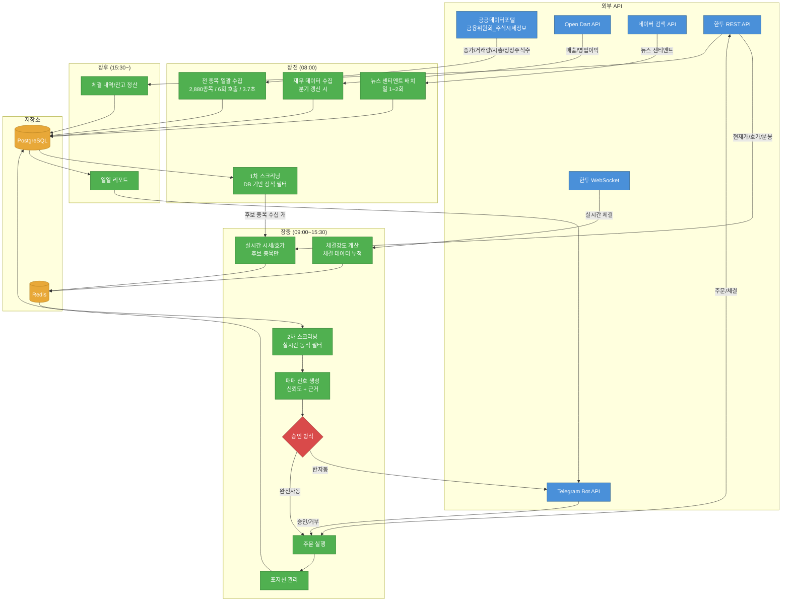
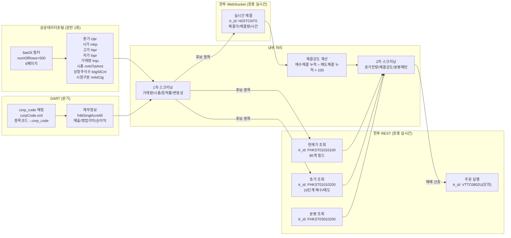
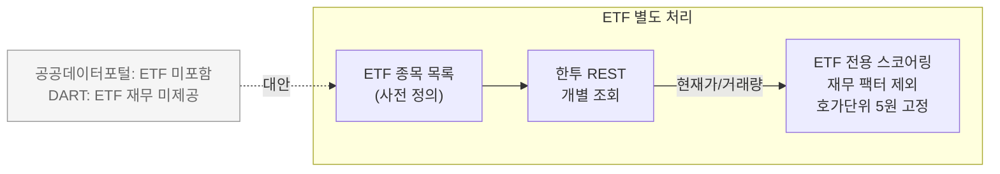
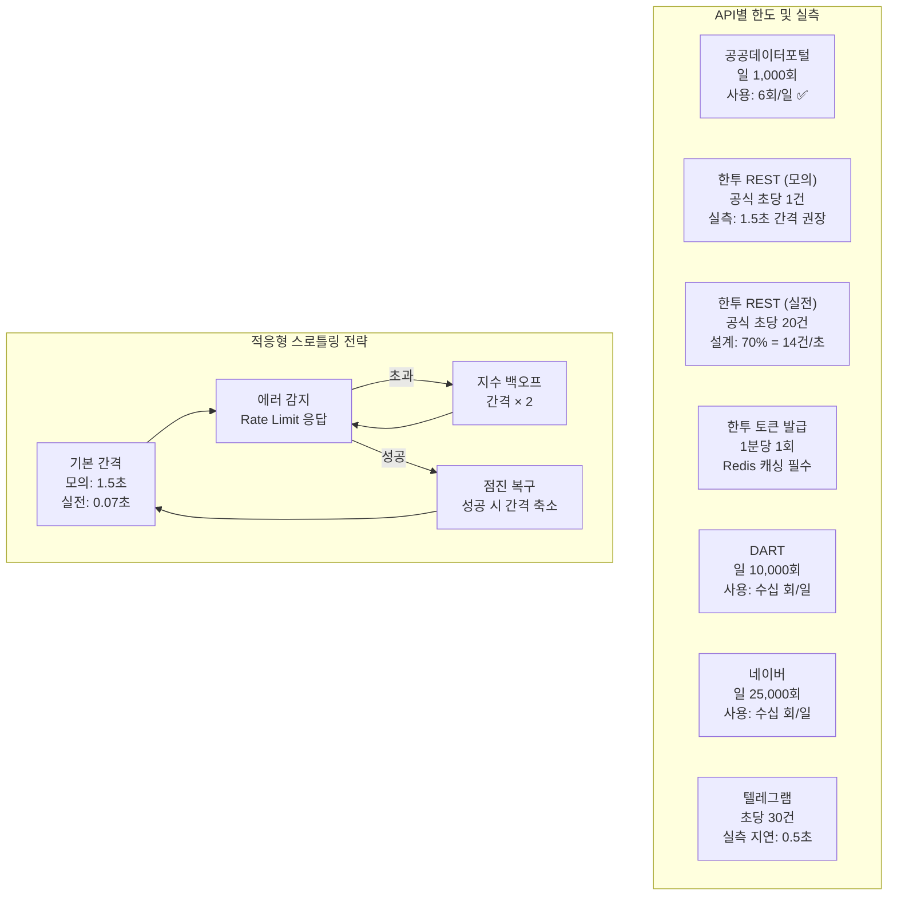

# 데이터 수집 흐름

StockBot의 데이터 수집은 장전/장중/장후 3단계로 구성된다. 자세한 구현은 `backend/modules/collector/` 참조.

## 전체 흐름

```
장전 (08:00)
  공공데이터포털 → 전 종목 2,880개 일괄 수집 (6회 호출 / 3.7초)
  DART → 재무 데이터 (분기 갱신 시)
  네이버 → 뉴스 센티멘트 배치
  → DB 저장 → 1차 스크리닝 → 후보 종목 수십 개 선정

장중 (09:00~15:30)
  한투 REST → 후보 종목 현재가/호가/분봉
  한투 WebSocket → 실시간 체결 스트림
  → Redis 저장 → 2차 스크리닝 → 매매 신호 → 주문 실행

장후 (15:30~)
  한투 REST → 체결 내역/잔고 정산
  → DB 저장 → 일일 리포트 → 텔레그램 발송
```

상세: [[kis-api]], [[websocket-management]], [[public-data-sources]]

## 장전 수집 (08:00)

### 공공데이터포털 일괄 수집
- 금융위원회_주식시세정보 API 사용
- 전 종목(약 2,880개) 종가/시가/고가/저가/거래량/시총/상장주식수
- 6회 API 호출로 일괄 처리 (페이지당 500개 기준)
- ETF는 별도 처리 필요 (공공데이터 API 미포함)

### DART 재무 데이터
- 분기 갱신 시에만 수집 (일상적 수집 아님)
- 매출/영업이익 등 기초 재무 지표
- [[screening-factors|스크리닝 팩터]]의 보조 소스

### 네이버 뉴스 센티멘트
- 일 1~2회 배치 수집
- 보조 팩터로만 활용 (속보 대형주만 유효, 1시간+ 지연)

## 장중 수집 (09:00~15:30)

### 실시간 시세 (REST)
- 1차 스크리닝 통과 종목만 대상
- 현재가, 호가(10단계), 분봉 데이터
- [[redis-usage|Redis]]에 최신 상태 캐시

### 실시간 체결 (WebSocket)
- KIS WebSocket으로 체결 스트림 수신
- 체결강도 실시간 계산 → Redis 저장
- 연결 관리: [[websocket-management]]

### 5분봉 집계
- `volume_aggregator.py`가 체결 틱 → 5분봉 변환
- Phase 7.1 이후 가속도 지표 계산에 활용

## 장후 처리 (15:30~)

- 보유 포지션 일괄 청산 (`eod_liquidator.py`)
- 체결 내역/잔고 REST API로 정산
- `analyzer` 모듈이 일일 성과 기록
- 텔레그램으로 일일 리포트 발송 — [[telegram-integration]]

## 수집 스케줄 구현

`collector/scheduler.py`에서 APScheduler로 관리:
```python
# 예시 크론 표현식
장전_수집: "0 8 * * 1-5"   # 월~금 08:00 KST
장중_수집: "0 9 * * 1-5"   # 월~금 09:00 KST (WebSocket 연결)
장후_정산: "30 15 * * 1-5" # 월~금 15:30 KST
```

스케줄 실행 여부는 [[trading-calendar|거래일 캘린더]]로 검증.

---

## 상세 다이어그램

> Phase 0.5 API 검증 결과 기반. 2단계 수집 전략(장전 일괄 + 장중 실시간).

### 전체 데이터 흐름



### API별 데이터 흐름 상세



### ETF 데이터 흐름 (예외 처리)



### Rate Limit 관리


